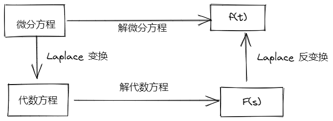
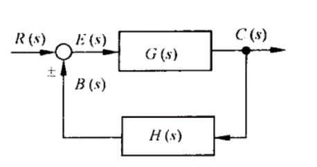
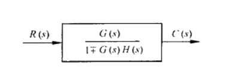
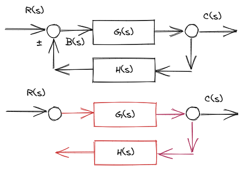
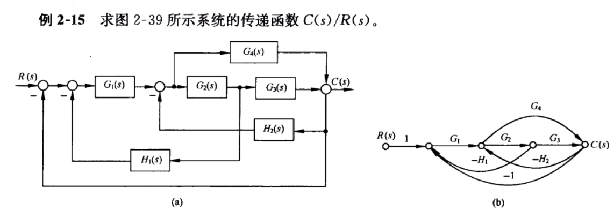
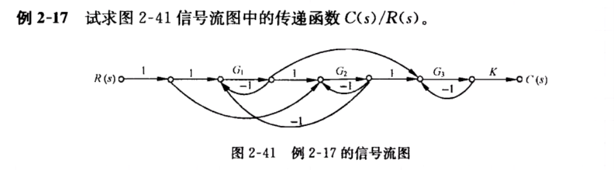
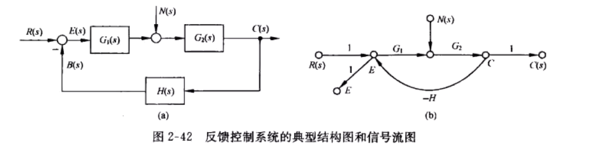

# 2 - 控制系统模型建立

## 微分方程与代数方程的转换

* ​

## 建模与求解的一般方法

* 根据模型建立微分方程, 判断是否有初始条件(初值)
* 符合线性定常, 直接 Laplace 变换到复域
* 在复域中解方程, 最后反变换回时域

## 运动的模态

* 特征根 $\lambda_1, \lambda_2, \lambda_3, \cdots, \lambda_n$
* 对应的模态 $e^{\lambda_1}, e^{\lambda_2}, e^{\lambda_3}, \cdots, e^{\lambda_n}$

## 传递函数

### 定义

* **零初始条件下**, 系统输出量的 Laplace 变换 与输入量的 Laplace 变换 之比

  * 注意是 Laplace 变换结果的比值, 不是时域比值之后再拉氏变换！
* 千万不能忘了这个必要的 前提条件

* 有个 ODE 长这样 $a_0\cfrac{\mathrm{d}^n}{\mathrm{d}t^n}c(t)+a_1\cfrac{\mathrm{d}^{n-1}}{\mathrm{d}t^{n-1}}c(t)+\cdots +a_{n-1}\cfrac{\mathrm{d}}{\mathrm{d}t}c(t)+a_nc(t)=b_0\cfrac{\mathrm{d}^m}{\mathrm{d}t^m}r(t)+b_1\cfrac{\mathrm{d}^{m-1}}{\mathrm{d}t^{m-1}}r(t)+\cdots +b_{m-1}\cfrac{\mathrm{d}}{\mathrm{d}t}r(t)+b_mr(t)$

* 等号左边输入, 右边输出, 右边比上左边的表达式就是传递函数 $G(s)$

* 就长这样 $G(s)= \cfrac{C(s)}{R(s)}= \cfrac{b_{0}s^{m}+b_{1}s^{m-1}+ \cdots +b_{m-1}s+b_{m}}{a_{0}s^{n}+a_{1}s^{n-1}+ \cdots +a_{n-1}s+a_{n}}= \cfrac{M(s)}{N(s)}$

> 例: 求微分方程 $LC \cfrac{\mathrm{d}^{2}u_{0}(t)}{\mathrm{d}t^{2}}+RC \cfrac{\mathrm{d}u_{o}(t)}{\mathrm{d}t}+u_{0}(t)=u_{i}(t)$ 对应的传递函数 $G(s)$

* 对应系数照抄下来 $(LCs^{2}+RCs+1)U_{0}(s)=U_{i}(s)$
* 右边比左边 $G(s)= \cfrac{U_{0}(s)}{U_{i}(s)}= \cfrac{1}{LCs^{2}+RCs+1}$

## 传递函数 $G(s)$ 的性质: $G(s)$ 进行 Laplace 反变换, 得脉冲响应 $g(t)$

* 脉冲函数的 Laplace 变换 $R(s)=\mathcal{L}[\delta(t)]=1$
* 传递函数为输出比输入 $G(s)=\cfrac{C(s)}{R(s)}$ , 输入是 $R(s)$ , 输出响应 $C(s) = G(s)R(s)=G(s)$
* 对输出响应进行 Laplace 反变换得到 $c(t) = \mathcal{L}^{-1}[C(s)]= \mathcal{L}^{-1}[G(s)R(s)]== \mathcal{L}^{-1}[G(s)] = g(t)$

## 传递函数 - 零初始条件

* 输入量是在 $\color{RoyalBlue}t\geqslant 0$ 时才作用于系统, **输入量** 及其 **各阶导数** 都为 $0$
* 输入作用之前 **系统稳定** , 输出为 $0$ 且在 $t=0$ 时候也为 $0$

## 传递函数 - 根轨迹增益

* 把传递函数 $G(s)$ 写成 **首 1 标准型** , 长这样 $G(s)=\cfrac{b_0(s-z_1)(s-z_2)\cdots (s-z_m)}{a_0(s-p_1)(s-p_2)\cdots (s-p_n)}=K^{\ast}\cfrac{\prod\limits_{i=1}^m{\left( s-z_i \right)}}{\prod\limits_{j=1}^m{\left( s-p_j \right)}}$ , 所有 $s$ 的系数均为 $\color{OrangeRed}1$
* 其中 $\cfrac{b_0}{a_0}=K^{\ast}$ , 这个 $K^{\ast}$ 就叫做 **根轨迹增益**

## 传递函数 - 开环增益

* 把传递函数 $G(s)$ 写成 **尾 1 标准型** , 长这样 $G(s)=\cfrac{b_m(\tau _1s+\textcolor{OrangeRed}{1})(\tau _{2}^{2}s^2+2\zeta _2s+\textcolor{OrangeRed}{1})\cdots (\tau _is+\textcolor{OrangeRed}{1})}{a_n(T_1s+\textcolor{OrangeRed}{1})(T_{2}^{2}s^2+2\zeta T_2s+\textcolor{OrangeRed}{1})\cdots (T_js+\textcolor{OrangeRed}{1})}$
* 丢掉所有的 $s$ 项后剩下的常数为 $\color{OrangeRed}1$
* 其中 $\cfrac{b_m}{a_n}=K$ , 这个 $K$ 叫做 **开环增益** \ 传递系数

## 传递函数 - 闭环增益

* 把传递函数 $G(s)$ , 写成闭环传递函数 $\Phi\left(s\right)=\cfrac{G\left( s \right)}{1+G\left( s \right)}$
* 写成 尾 1 标准型 之后, 得到 $\Phi\left(s\right)=\cfrac{b_m(\tau _1s+1)(\tau _{2}^{2}s^2+2\zeta _2s+1)\cdots (\tau _is+1)}{a_n(T_1s+1)(T_{2}^{2}s^2+2\zeta T_2s+1)\cdots (T_js+1)}$
* $\cfrac{b_m}{a_n}=K$, 这个称为闭环增益

## 反馈环节的结构图化简

* 一个反馈环节长这样

  * ​
* 化简之后长这样

  * ​
* 负反馈环节对应的是 $\cfrac{G(s)}{1+G(s)H(s)}$
* 正反馈环节对应的是 $\cfrac{G(s)}{1-G(s)H(s)}$

## 传递函数 - 开环传递函数

* 把一个传递函数的反馈通路断开后, **反馈通路所有的东西乘到一起** 就是开环传递函数
* ​

  * 比如上方红色的部分, 在这条红色的线上的 **所有环节** 全部乘在一起就是开环传递函数 $G(s)H(s)$

## 传递函数 - 闭环传递函数

* 根据上图的回路, 写成一个传递函数的样子就是 $\cfrac{G\left(s\right)}{1+G\left(s\right)H\left(s\right)}$

### 闭环特征方程

* 把闭环传递函数化简之后, 拿出分母, 令分母等于 $0$ , 也就是 $D\left(s\right)=0$

## 信号流图 - 梅森增益公式

* 求 **源** 节点(只出不进)到 **阱** 节点(只进不出)的传递函数, 梅森增益公式 $p = \cfrac{1}{\Delta}\sum\limits_{k=1}^{n}p_k\Delta_k$
* $p=\sum\limits_{k=1}^{n}=\cfrac{p_1\Delta_1 + p_2\Delta_2 + \cdots + p_n\Delta_n}{1 - \sum L_a + \sum L_bL_c  - \sum L_dL_eL_f}$

### 步骤

* 找出所有 **单独** 回路
* 找出所有 **互不接触** 的回路

  * 找两两互不接触的回路
  * 找三三互不接触的回路
  * ……
* 求信号流图的特征式
* 求前向通路及其余因子式

  * 余因子式: 写出一个前向通路, 找出与它 接触的所有回路 , 然后在特征式 $\Delta$ 中直接 删掉 这些回路.
* 代入梅森增益公式

> 例 ​

* 写出梅森增益公式

  * $G(s)=\cfrac{C(s)}{R(s)} = \cfrac{1}{\Delta}\sum\limits_{k-1}^{n}p_k\Delta_k$
  * $\Delta = 1 - \sum L_a + \sum L_bL_c - \sum L_dL_eL_f + \cdots$
* 找单独的回路

  * $L_1 = G_1G_2(-H_1)$
  * $L_2 = G_1G_2G_3(-1)$
  * $L_3 = G_2G_3(-H_2)$
  * $L_4 = G_1G_4(-1)$
  * $L_5 = G_4(-H_2)$
* 找互不接触的回路: 找不到
* 写特征式 $\Delta$

  * $\Delta = 1 - ( L_1 + L_2 + L_3 + L_4 + L_5) =1+G_1G_2H_1+G_1G_2G_3+G_2G_3H_2+G_1G_4+G_4H_2$
  * 因为整个流图中只有 $\sum L_a$ , 其他的全部没有
* 统计前向通路

  * $p_1 = G_1G_4, \Delta_1 = 1$
  * $p_2 = G_1G_2G_3, \Delta_2=1$
* **由梅森增益公式可求** 系统传递函数(这句话一定要在考场上写)

  * $G(s) = \cfrac{C(s)}{R(s)} = \cfrac{1}{\Delta}(p_1\Delta_1+p_2\Delta_2)=\cfrac{G_1G_4+G_1G_2G_3}{1+G_1G_2H_1+G_1G_2G_3+G_2G_3H_2+G_1G_4+G_4H_2}$

> 例 ​

* 写出梅森增益公式

  * $G(s)=\cfrac{C(s)}{R(s)} = \cfrac{1}{\Delta}\sum\limits_{k-1}^{n}p_k\Delta_k$
  * $\Delta = 1 - \sum L_a + \sum L_bL_c - \sum L_dL_eL_f + \cdots$
* 找单独的回路

  * $L_1=G_1(-1)$
  * $L_2 = G_2(-1)$
  * $L_3 = G_1 1 G_2 (-1)$
  * $L_4=G_3(-1)$
  * $\sum L_a = L_1 + L_2+L_3+L_4$
* 找互不接触的回路

  * 两两互不接触

    * $L_1L_2, L_1L_4, L_2L_4, L_3L_4$
    * $\sum L_bL_c = L_1L_2 + L_1L_4 + L_2L_4 + L_3L_4$
  * 三三互不接触: $L_1L_2L_4$

    * $\sum L_dL_eL_f = L_1L_2L_3$
* 写特征式

  * $\Delta = 1 - \sum L_a + \sum L_bL_c - \sum L_dL_eL_f$
* 统计前向通路(顺着线走, 能转弯尽量转弯, 转过弯就别再走了)

  * $p_1=1G_11G_21G_3K, \Delta_1 = 1$
  * $p_2=G_21G_3K, \Delta_2 = 1 + G_1$
  * $p_3=1G_1G_3K, \Delta_3 = 1 + G_2$
  * $p_4 =G_2(-1)G_1G_3K, \Delta_4 = 1$ (这一个比较难以求解, 比较绕)
  * 余因子式是前向通路与哪条回路接触, 就在特征式中 **去掉他们** , 只留下不接触的

    * 如果是和 $L_1$ 接触, 那么就要在两两互不接触, 三三互不接触的回路中把包含 $L_1$ 的项全部划掉
* **由梅森增益公式可求** 系统传递函数(这句话一定要在考场上写)

## 传递函数 - 闭环系统的传递函数

* 给一个系统长这样

  * ​
* 想求系统传递函数 $G(s) = \cfrac{C(s)}{R(s)}$ , 利用 **叠加原理** 与 **反馈环节** 的转化

  * 让扰动输入 $N(s) = 0$ , 输入 $R(s)$ 作用

    * **闭环传递函数** $\Phi(s) = \cfrac{G_1(s)G_2(s)}{1 + G_1(s)G_2(s)H(s)}$
    * 此时系统输出 $C(s) = \Phi(s)R(s) = \cfrac{G_1(s)G_2(s)}{1 + G_1(s)G_2(s)H(s)}R(s)$
  * 让输入 $R(s) = 0$ , 扰动输入 $N(s)$ 作用

    * **闭环传递函数** $\Phi_n(s)  = \cfrac{G_2(s)}{1 + G_1(s)G_2(s)H(s)}$
    * 此时系统输出 $C_n(s) = \Phi_n(s)N(s) = \cfrac{G_2(s)}{1 + G_1(s)G_2(s)H(s)}N(s)$
  * 系统输入 $R(s)$ 与扰动输入 $N(s)$ 同时作用

    * 系统输出 $\sum C(s) = \Phi(s)\cdot R(s) + \Phi_n(s)\cdot N(s) = \cfrac{G_1G_2R(s) + G_2(s)N(s)}{1 + G_1(s)G_2(s)H(s)}$

## 电学模型

* 电阻: $u=i\cdot R$​

  * 复阻抗: $R$
* 电容: $i=C\cdot \cfrac{\mathrm{d}u}{\mathrm{d}t}=C\cdot \dot u$  

  * 复阻抗: $\cfrac{1}{Cs}$
* 电感: $u=L\cdot \cfrac{\mathrm{d}i}{\mathrm{d}t}=L\cdot \dot i$  

  * 复阻抗: $Ls$
* 复阻抗 $Z_1,Z_2$ 并联(口诀: 积下和): $\cfrac{Z_1Z_2}{Z_1+Z_2}$

## 力学模型

* 牛顿第二定律: $F=ma=m\ddot x$
* 弹簧: $F=k\cdot x$
* 阻尼器: $F=f\cdot v=f\cdot \dot x$

‍
