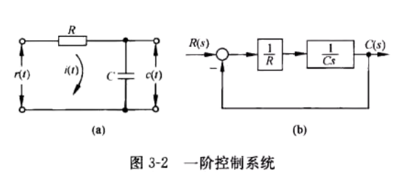
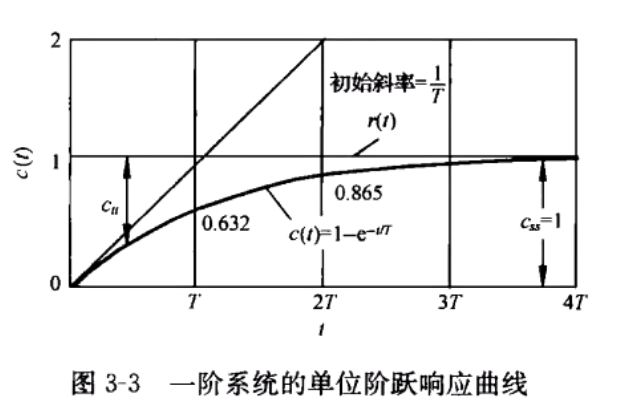
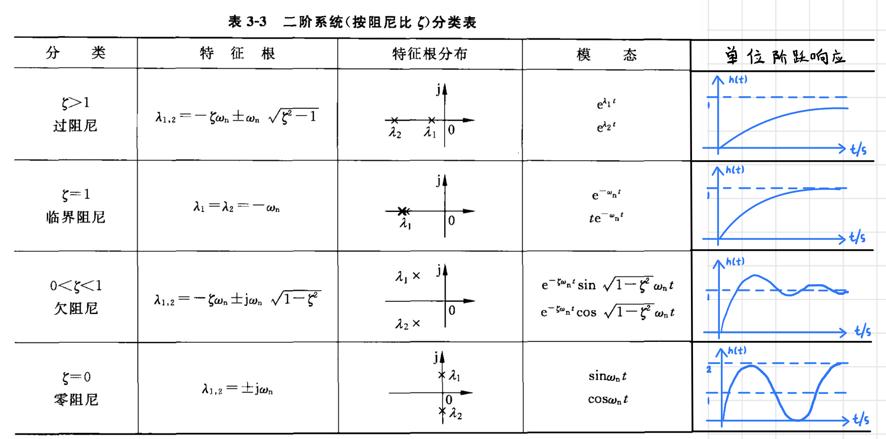
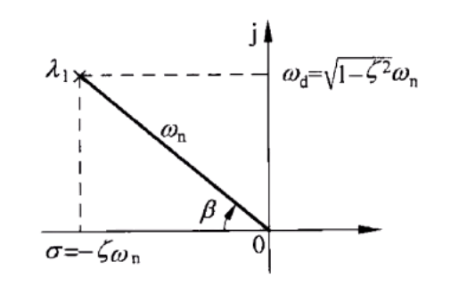
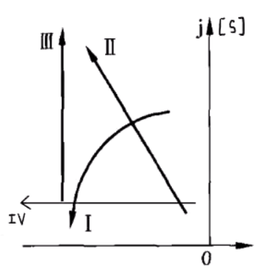
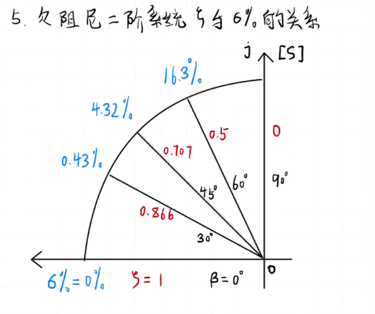
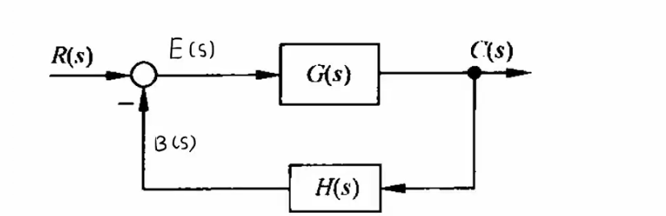
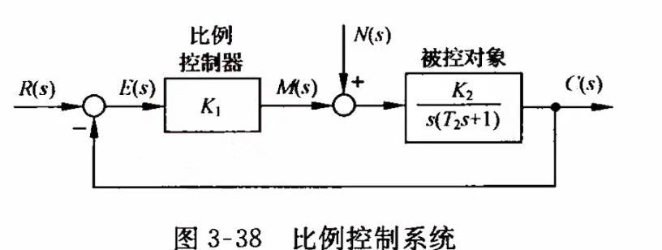

# 3 - 时域分析法

## 典型输入信号

|名称|时域|复域|
| :--------------: | :----: | :----: |
|单位阶跃函数|$1(t),t\geqslant0$​|$\cfrac{1}{s}$​|
|单位斜坡函数|$t, t\geqslant0$​|$\cfrac{1}{s^2}$​|
|单位加速度函数|$\cfrac{1}{2}t^2$​|$\cfrac{1}{s^3}$​|
|单位脉冲函数|$\delta(t), t=0$​|$1$​|
|正弦函数|$A\sin \omega t$​|$\cfrac{A\omega}{s^2+\omega^2}$​|

## 性能指标

### 上升时间 $t_r$

* 响应从终值的 $10\%$ 上升到 $90\%$ 所需要的时间

### 峰值时间 $t_p$

* 响应达到峰值的时间

### 调节时间 $t_s$

* 响应达到并 **始终保持** 在终值附近误差 $\pm 5\%$ 以内所需要的 **最短** 时间

### 超调量 $\sigma \%$

* $\sigma \% =\cfrac{c(t_p)-c(\infty)}{c(\infty)}\times 100\%$ , 峰值减去稳态值后, 占稳态值的百分比(考试别忘了写百分号)
* $c(t_p) < c(\infty)$ 则 **无超调**

## 控制系统

### 一阶控制系统

* ​
* 系统闭环传递函数 $\Phi(s)=\cfrac{C(s)}{R(s)}=\cfrac{1}{Ts+1}$ , **尾 1 型**

  * 如果要求开环增益则要写成 $\Phi(s) = \cfrac{K}{s+K}$ , $K$ 为开环增益, $T=\cfrac{1}{K}$
* 输入信号为单位阶跃函数 $r(t)=1(t)$ 时, 系统的输出 $c(t)=1-e^{-\cfrac{t}{T}}, t \geqslant 0$  

  * ​

#### 特性

* 初始斜率 $\cfrac{1}{T}$
* 当 $t = T$ 时候, $r\left( T \right) =1-e^{-1}=0.632121$
* 调节时间 $t_s = 4T$ , $r\left( 4T \right) =1-e^{-4}=0.981684, \sigma \%=\cfrac{e^{-4}}{1}\times 100=1.83156\%$

### 二阶控制系统

* 闭环传递函数 **标准形式** $\Phi(s)= \cfrac{C(s)}{R(s)}= \cfrac{\omega _{n}^{2}}{s^{2}+2 \zeta \omega _{n}s+ \omega _{n}^{2}}$ **首 1 型** , 即 $s^2$ 的系数是 $1$
* 也可以写成 **尾 1 型** $\Phi(s) = \cfrac{1}{T^2s^2+2T\zeta s+1}$
* 特征式 $D(s) = s^{2}+2 \zeta \omega _{n}s+ \omega _{n}^{2} = 0$

#### 属性

* 自然频率 $\omega_n = \sqrt{\cfrac{K}{T_m}}$
* 阻尼比 $\zeta = \cfrac{1}{2\sqrt{T_mK}}$

#### 特征根 $\color{OrangeRed}\lambda _{1,2}=-\zeta \omega _n\pm \omega _n\sqrt{\zeta ^2-1}$ (重点)

* 按阻尼比的情况进行分类
* ​

#### 稳定性判据

当特征根都位于 **虚轴左边** , 该系统稳定

## 控制系统 - 欠阻尼二阶系统

### 在平面上的分布

* 两个特征根 $\lambda _{1,2}=\sigma \pm j\omega_d=-\zeta \omega _n\pm \omega _n\sqrt{1-\zeta ^2}$

  * ​
  * 要留意实部 $\sigma = \zeta\omega_n$ , 虚部 $w_d = \sqrt{1-\zeta^2}\omega_n$
* 极坐标表示

  * 特征根模长 $\lambda = |\omega_n|$
  * 特征根夹角 $\angle \lambda =\beta$
  * 夹角余弦值 $\color{OrangeRed}\cos \beta = \zeta$ (重点)

### 单位阶跃响应

* $h\left( t \right) =1-\cfrac{e^{-\zeta \omega _nt}}{\sqrt{1-\zeta ^2}}\sin \left( \sqrt{1-\zeta ^2}\omega _nt+\mathrm{arctan} \cfrac{\sqrt{1-\zeta ^2}}{\zeta} \right) \,\,\left( 0\leqslant \zeta <1 \right)$
* 其中特征根夹角 $\beta = \mathrm{arctan} \cfrac{\sqrt{1-\zeta ^2}}{\zeta}$
* 当 $\zeta = 0, \beta=90\degree$ , $h(t) = 1 - \cos \omega_n t$

### 动态性能指标

* 峰值时间 $\color{RoyalBlue}t_p = \cfrac{\pi}{\omega_n\sqrt{1-\zeta^2}} = \cfrac{\pi}{虚部}$
* 调节时间 $\color{RoyalBlue}t_s = \cfrac{3.5}{\zeta \omega_n} = \cfrac{3.5}{|实部|}, \zeta \in (0.3, 0.8), \Delta = 5\%$  

  * 如果需要 $\color{RoyalBlue}\Delta = 2\%$ 的误差带, 则 $t_s = \cfrac{\color{RoyalBlue}4.4}{\omega_n} = \cfrac{\color{RoyalBlue}4.4}{|实部|}$
* 超调量 $\sigma \% = \cfrac{h(t_p) - h(\infty)}{h(\infty)}\times 100\% = \color{RoyalBlue}e^{-\cfrac{\zeta \pi}{\sqrt{1-\zeta^2}}}\times 100\% = e^{\cfrac{\pi实部}{虚部}}$
* 上升时间 $t_r = \cfrac{\pi - \beta}{\omega_d} = \cfrac{\pi - \beta}{\omega_n\sqrt{1-\zeta^2}}$

## 欠阻尼二阶系统动态性能、系统参数与极点分布之间的联系

* ​
* 分别有 $\mathrm{I},\mathrm{II},\mathrm{III}$ 三条路线, 分析极点沿着这三条路线分别运动时候的变化规律

### 列出分析表达式

* 特征根 $\lambda _{1,2}=\sigma \pm j\omega_d=-\zeta \omega _n\pm \omega _n\sqrt{\zeta ^2-1}$
* 峰值时间 $\color{RoyalBlue}t_p = \cfrac{\pi}{\omega_n\sqrt{1-\zeta^2}} = \cfrac{\pi}{虚部}$
* 调节时间 $\color{RoyalBlue}t_s = \cfrac{3.5}{\zeta \omega_n} = \cfrac{3.5}{|实部|}, \zeta \in (0.3, 0.8), \Delta = 5\%$
* 超调量 $\sigma \% = \cfrac{h(t_p) - h(\infty)}{h(\infty)}\times 100\% = \color{RoyalBlue}e^{-\cfrac{\zeta \pi}{\sqrt{1-\zeta^2}}}\times 100\% = e^{\cfrac{\pi实部}{虚部}}$

### 分析

* $\mathrm{I:}\beta \downarrow,\cos\beta \uparrow, |实部|\uparrow, 虚部\downarrow, t_s \downarrow, \zeta \uparrow, \sigma \% \uparrow, t_p \uparrow$
* $\mathrm{II:}\cos \beta 不变, \zeta 不变, \sigma \% 不变, \omega_n \uparrow, t_s \downarrow, t_p \downarrow$
* $\mathrm{III:} \beta \uparrow, \cos \beta \downarrow, \zeta \downarrow, \sigma \% \downarrow, \zeta\omega_n (实部) 不变, t_s 不变, \omega_n \uparrow, t_p \downarrow$
* $\mathrm{IV:}\omega_n\sqrt{\zeta^2 - 1}(虚部)不变, t_s 不变, \beta \downarrow, \cos \beta \uparrow, \zeta \uparrow, |\zeta\omega_n| (|实部|) \uparrow, t_s \downarrow$

## 欠阻尼二阶系统与 $\sigma \%$ 的关系

* ​
* 超调量 $\sigma \%$ 只与阻尼比 $\zeta$ 有关, 即只与 $\cos \beta$ 有关, 推出来就是至于特征根夹角 $\beta$ 有关
* 当 $\beta = 45\degree$ 时候达到阻尼比 $\zeta = \color{OrangeRed}0.707$ , 常用阻尼比
* 当 $\beta = 0\degree, \zeta = \cos\beta  = 1$
* 越往虚轴走, $\beta \uparrow, \zeta \downarrow$

## 线性系统稳定的 **充分必要** 条件

* 闭环系统特征方程的所有根均有 **负实部** , 即所有极点都在 $s$ 左半平面

## 线性系统的稳定性分析 - 定义

* 系统在扰动作用下偏离了原来的位置，当扰动消除后，系统能回到原来的平衡，则称系统稳定；否则系统不稳定
* 对于线性定常系统, 如果 **脉冲响应收敛** , 则系统稳定, 否则不稳定

## 线性系统稳定性判据 - 赫尔维茨判据

* 给出线性系统特征方程 $D(s) = a_0s^n + a_1s^{n-1} + \cdots + a_{n-1}s + a_n = 0$
* 如果系数 **不都是正数** , 有的为 $0$ 或者 $1$ , 则直接判断 **不稳定**

  * 如果所有系数为正, 只是有**可能稳定**, 所以是个必要条件

### 特例: 下面三个是满足 **充要条件** 的

* $n \leqslant 4$ 的系统并且特征方程各项系数为 **正** 的条件下

  * $n=2 \Leftrightarrow$ 稳定
  * $n=3, a_1a_2 - a_0a_3>0 \Leftrightarrow$ 稳定
  * $n = 4,\Delta_2 = a_1a_2 - a_0a_3 > 0, \Delta_2 >\cfrac{a_1^2a_4}{a_3} \Leftrightarrow$ 稳定

## 线性系统稳定性判据 - 劳斯判据

* 线性系统稳定的 **充要条件** : 劳斯表第一列全 大于 0

### 步骤

* 给一个系统的特征方程 $D(s) = a_0s^n + a_1s^{n-1} + \cdots + a_{n-1}s + a_n = 0$  

  * 注意, 要按 $s$ 的阶数 **从高往低** 排列
* 按照以下格式列出劳斯表

  * ||||||
    | :--: | :--: | :--: | :--: | :--: |
    |$s^n$​|$a_0$​|$a_2$​|$a_4$​|$a_6$​|
    |$s^{n-1}$​|$a_1$​|$a_3$​|$a_5$​|$a_7$​|
    |$s^{n-2}$​|$c_{13}= \cfrac{a_{1}a_{2}-a_{0}a_{3}}{a_{1}}$​|$c_{23}= \cfrac{a_{1}a_{4}-a_0 a_{5}}{a_{1}}$​|$c_{33}= \cfrac{a_{1}a_{6}-a_{0}a_{7}}{a_{1}}$​|$c_{43}$​|
    |$s^{n-3}$​|$c_{14}= \cfrac{c_{13}a_{3}-a_{1}c_{23}}{c_{13}}$​|$c_{24}= \cfrac{c_{13}a_{5}-a_{1}c_{33}}{c_{13}}$​|$c_{34}= \cfrac{c_{13}a_{7}-a_{1}c_{43}}{c_{13}}$​|$c_{44}$​|
    |$s^{n-4}$​|$c_{15}= \cfrac{c_{14}c_{23}-c_{13}c_{24}}{c_{14}}$​|$c_{25}= \cfrac{c_{14}c_{33}-c_{13}c_{34}}{c_{14}}$​|$c_{35}= \cfrac{c_{14}c_{43}-c_{13}c_{44}}{c_{14}}$​|$c_{45}$​|
    |$\vdots$​|$\vdots$​|$\vdots$​|$\vdots$​||
    |$s^2$​|$c_{1, n-1}$​|$c_{2, n-1}$​|||
    |$s^1$​|$c_{1, n}$​||||
    |$s^0$​|$c_{1, n+1} = a_n$​||||

* 劳斯表第一列的数, 从上往下数变多少次符号, 代表有多少个正实部根

> 例: 系统特征方程 $D(s) = s^4 + 2s^3 + 3s^2+4s+5=0$ , 用劳斯判据判断稳定性

* 写出特征式格式 $D(s) = a_0s^n + a_1s^{n-1} + \cdots + a_{n-1}s + a_n = 0$
* 列写系统劳斯表

  * |||||
    | :--: | :--: | :--: | :--: |
    ||$a_0$​|$a_2$​|$a_4$​|
    |$s^4$​|$1$​|$3$​|$5$​|
    |$s^3$​|$2$​|$4$​|$0$​|
    |$s^2$​|$\cfrac{3\times 2 - 1\times 4}{2}=1$​|$5$​|$0$​|
    |$s^1$​|$\cfrac{4\times 1 - 2\times 5\ }{1} = -6$​|$0$​|$0$​|
    |$s^0$​|$5$​|$0$​|$0$​|
* 第一列有负数, **不稳定**, 且 $1 \to -6 \to 5$ 变号两次, 有两个正实部根

## 劳斯判据 - 第一列某项为 $0$

* 若遇到第一列出现 $0$ , 用一个 $\epsilon >0$ 代替它们继续往下算

> 例: 判断特征方程 $D(s) = s^3 -3s+2=0$ 的稳定性

* 把特征式列全 $D(s) = s^3 + 0s^2 -3s^1 + 2s^0=0$
* 列劳斯表

  * |||||
    | :--: | :--: | :--: | :--: |
    |$s^3$​|$1$​|$-3$​|$0$​|
    |$s^2$​|$0$​|$2$​|$0$​|
    |$s^1$​|$\cfrac{ (-3)\times 0 - 1\times 2}{0}=\infty$​|||
* 第一次出现为 $0$ 的项, 用 $\epsilon > 0$ 代替它, 重新列劳斯表

  * |||||
    | :--: | :--: | :--: | :--: |
    |$s^3$​|$1$​|$-3$​|$0$​|
    |$s^2$​|$\epsilon > 0$​|$2$​|$0$​|
    |$s^1$​|$\cfrac{(-3)\times \epsilon - 1\times 2}{\epsilon} = \cfrac{-3\epsilon - 2}{\epsilon} \to -\infty$​|$0$​||
    |$s^0$​|$\cfrac{2\times \cfrac{-3\epsilon - 2}{\epsilon} - \epsilon \times 0}{\cfrac{-3\epsilon - 2}{\epsilon}} = 2$​|$0$​||
* $-\infty$ 为负的, **不稳定** , 且 $\epsilon \to -\infty \to 2$ 变号两次, 有两个正实部根

## 劳斯判据 - 全 $0$ 行

* 在全 $0$ 行上一行的系数构造辅助方程 $F(s) = 0$ , 求 $\cfrac{\mathrm{d}F(s)}{\mathrm{d}s}$ , 求的系数代替全 $0$ 行后继续计算

> 例: 判断特征方程 $D(s)=s^{6}+s^{5}-2 s^{4}-3 s^{3}-7 s^{2}-4 s-4=0$ 稳定性

* 列写劳斯表

  * ||||||
    | :--: | :--: | :--: | :--: | :--: |
    |$s^6$​|$1$​|$-2$​|$-7$​|$-4$​|
    |$s^5$​|$1$​|$-3$​|$-4$​|$0$​|
    |$s^4$​|$\cfrac{1\times (-2) - 1\times -3}{1}=1$​|$\cfrac{1\times (-7) - 1\times(-4)}{1}=-3$​|$\cfrac{1\times (-4) - 1\times 0}{1} = -4$​||
    |$s^3$​|$0$​|$0$​|$0$​||

* 出现全 $0$ 行, 利用上一行系数构造辅助方程 $F(s) = s^4 - 3s^2 - 4 = 0$
* 求导 $\cfrac{\mathrm{d}F(s)}{\mathrm{d}s} = 4s^3 - 6s = 0$
* 提取系数 $4, -6, 0$ , 填入全 $0$ 行, 继续列写劳斯表

  * ||||||
    | :--: | :--: | :--: | :--: | :--: |
    |$s^6$​|$1$​|$-2$​|$-7$​|$-4$​|
    |$s^5$​|$1$​|$-3$​|$-4$​|$0$​|
    |$s^4$​|$1$​|$-3$​|$-4$​||
    |$s^3$​|$4$​|$-6$​|$0$​||
    |$s^2$​|$\cfrac{-3 \times 4 - 1\times (-6)}{4}=-\cfrac{3}{2}$​|$\cfrac{4\times (-4) - 1 \times 0}{4}=-4$​|||
    |$s^1$​|$\cfrac{-\cfrac{3}{2}\times \left( -6 \right) -4\times \left( -4 \right)}{-\cfrac{3}{2}}=\cfrac{-50}{3}$​|$0$​|||
    |$s^0$​|$\cfrac{-\cfrac{50}{3}\times (-4) -(-\cfrac{3}{2})\times 0}{-\cfrac{50}{3}}=-4$​||||

* 第一列出现负数, 系统 **不稳定** , $4\to -\cfrac{3}{2}$ 变一次号, 故存在一个正实部根

## 劳斯判据应用 - 距离偏移

* 一般来说系统稳定, 特征根在 $s$ 左半平面
* 要想指定稳定的程度, 让特征根都在 $s=-a$ 垂线左边, 那么广义化 $s^{\ast} = s + a$ , 利用 $s^{\ast} - a$ 替换掉特征方程中的 $s$
* 一般会考察求参数 $K$ 在符合极点在 $s=-a$ 左边时的取值范围, 代入 $s^{\ast} - a$ 后列写劳斯表然后使得第一列全部大于 $0$ 即可

## 线性系统误差

### 前提

* 先 判稳 , 再计算稳态误差

### 误差定义

* 输入端定义

  * ​
  * $E(s) = R(s) - B(s) = R(s) - H(s)C(s)$
  * 如果是单位负反馈, 则为 $E\left( s \right) =R\left( s \right) -C\left( s \right)$

* 给定系统的误差传递函数 $\Phi_e(s) = \cfrac{E(s)}{R(s)} = \cfrac{1}{1 + G(s)H(s)}$
* 如果有理函数 $sE(s)$  

  * 除了原点有唯一的极点
  * 在 **右半平面** 与 **虚轴** 这两个地方 **处处解析**

    * 比如输入信号是 $A\sin \omega t$ , 拉氏变换得 $\cfrac{A\omega^2}{s^2 + \omega^2}$
    * 如果分母等于 $0$ 的时 $s = \pm \omega$ , 在虚轴上有两个极点, 因此 **不是** 在虚轴上处处解析
* 那么由终值定理得 $\color{OrangeRed}e_{ss}(\infty) = \lim\limits_{s\to 0}sE(s) = \lim\limits_{s\to 0}\cfrac{sR(s)}{1+G(s)H(s)}$ (考试优先使用这个)

## 线性系统稳态误差 $e_{ss}$ 的计算 - 终值定理法

* 终值定理 $\color{OrangeRed}e_{ss}(\infty) = \lim\limits_{s\to 0}sE(s) = \lim\limits_{s\to 0}\cfrac{sR(s)}{1+G(s)H(s)}$

  

> ### 终值定理
>
> * $\lim\limits_{t\to\infty}f(t)=\lim\limits_{s\to 0}sF(s)$
> * 当时间趋于无穷的时候, 求系统最终值的办法
> * 计算稳态误差(若终值确实存在)

## 线性系统稳态误差 $e_{ss}$ 的计算 - 系数法

* 给出系统的 **开环传递函数** $G(s)H(s)= \cfrac{K \prod _{i=1}^{m}(\tau_{i}s+1)}{s^{\color{OrangeRed}v}\prod _{j=1}^{n-v}(T_{j}s+1)}$
* $\color{OrangeRed}v$ 为系统型别(粗体字是考试让你反向判断的关键词)

  * $v = 0:$ 称作 $0$ 型系统、**有差系统**
  * $v = 1:$ 称作 $1$ 型系统、**一阶无差系统**
  * $v = 2:$ 称作 $2$ 型系统、**二阶无差系统**
* 根据型别 $v$ 进行判断

|系统型别 $v$​|静态误差系数|||阶跃输入 $r\left( t \right) =A\times 1\left( t \right)$​|斜坡输入 $r\left( t \right) =At$​|加速度输入 $r\left( t \right) =\cfrac{A}{2}t^2$​|
| :-----------: | :------------: | :--: | :-----------: | :-----------: | :-----------: | :-------------: |
||$K_p$​|$K_v$​|$K_a$​|位置误差 $e_{ss}=\cfrac{A}{1+K_p}$​|速度误差 $e_{ss}=\cfrac{A}{K_v}$​|加速度误差 $e_{ss}=\cfrac{A}{K_a}$​|
|$0$​|$K$​|$0$​|$0$​|$\cfrac{A}{1+K}$​|$\infty$​|$\infty$ |
|$1$​|$\infty$​|$K$​|$0$​|$0$ |$\cfrac{A}{K}$​|$\infty$​|
|$2$​|$\infty$​|$\infty$​|$K$​|$0$​|$0$​|$\cfrac{A}{K}$​|

* 静态位置误差系数 $K_p = \lim\limits_{s\to 0}G(s)H(s) = \cfrac{K}{s^v}$
* 静态速度误差系数 $K_v = \lim\limits_{s\to 0}sG(s)H(s)= \cfrac{K}{s^{v-1}}$
* 静态加速度误差系数 $K_a = \lim\limits_{s\to 0}s^2G(s)H(s)=\cfrac{K}{s^{v-2}}$

## 线性系统误差计算 - 动态误差系数法

* 给定误差传递函数 $\Phi _e(s)=\cfrac{E(s)}{R(s)}=1-\Phi \left( s \right) =\cfrac{1}{1+G\left( s \right)}$
* 在 $s=0$ 处展开: $\Phi_{e}(s)= \Phi _{e}(0)+ \cfrac{1}{1!}\Phi _{e}^{\prime}(0)s+ \cfrac{1}{2!}\Phi _{e}^{\prime \prime}(0)s^{2}+ \cdots + \cfrac{1}{l!}\Phi _{e}^{(1)}(0)s^{l}+\cdots$
* 定义动态误差系数 $C_i = \cfrac{1}{i!}\Phi_{e}^{(i)}(s), i = 0, 1, 2, \cdots$
* 换下来写成 $\Phi_e(s) = C_0 + C_1s + C_2s^2 + \cdots$
* 进行反变换后得 $e_s(t) = C_0r(t) + C_1r^{\prime}(t) + C_2r^{\prime\prime}(t) + \cdots$

## 减小或者消除稳态误差的措施

### 增大系统开环增益

* 可能会使系统不稳定

### 增加扰动点前向通路的增益

* ​
* 比如上图的 $K_1$ 就是在扰动点之前

### 前向通道串联积分环节

* 提高系统的 型别  $v$
* 增大可能会 更难控
