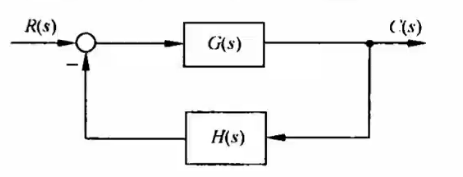
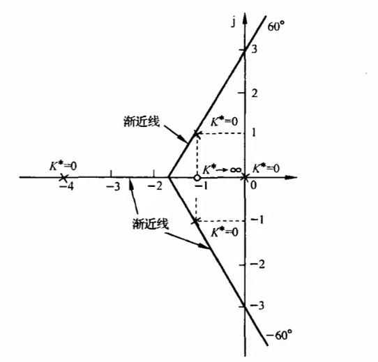
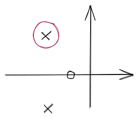
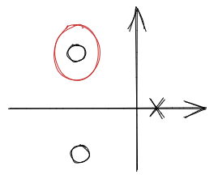
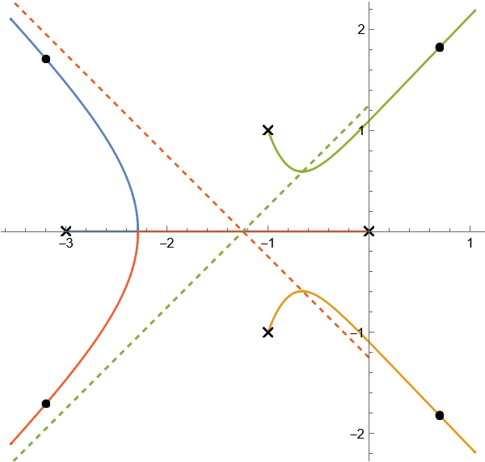
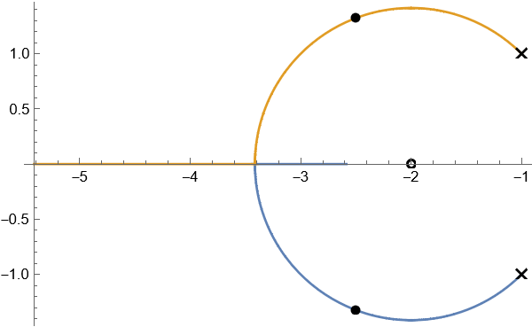
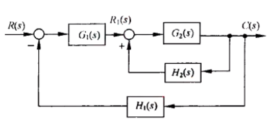
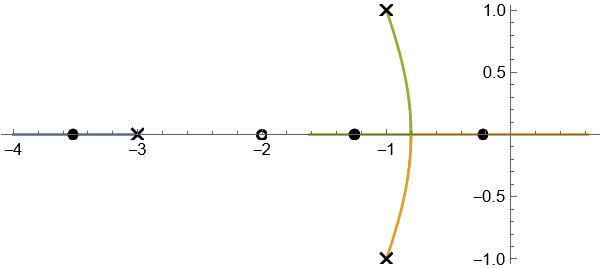
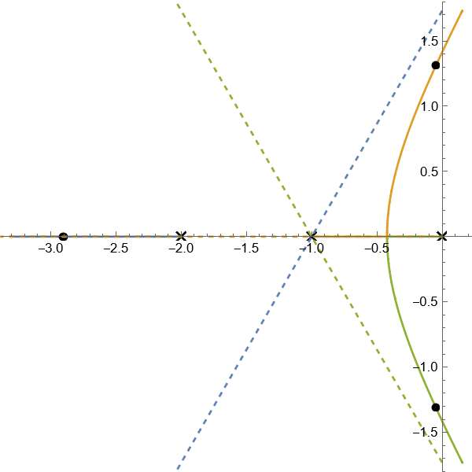
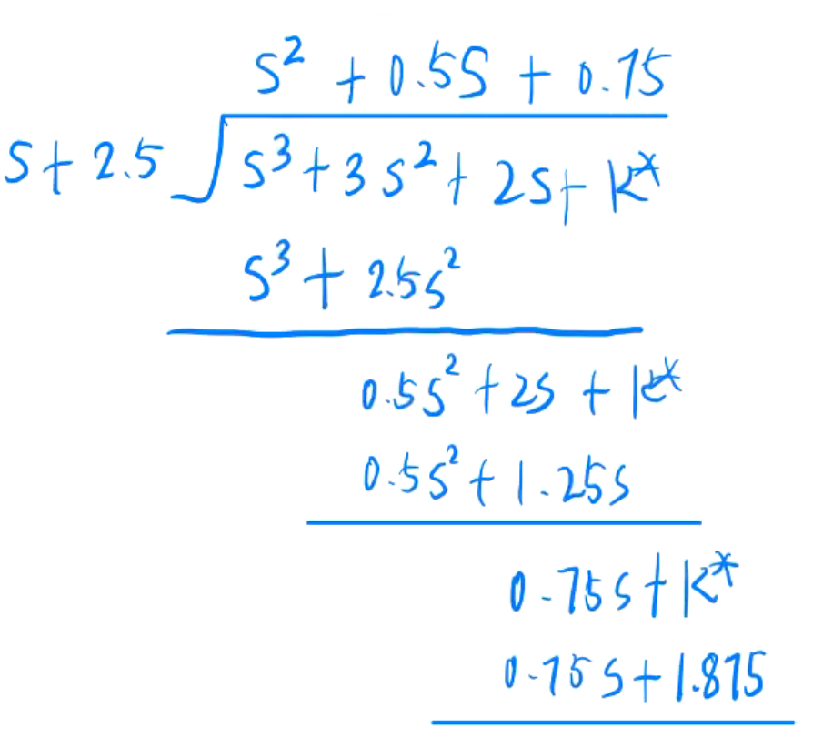

# 4 - 根轨迹法

## 根轨迹定义

* **开环系统** 的某一个参数从 $0\to\infty$ 时, 闭环系统特征方程的 根 在 $s$ 平面变化的 轨迹
* 参数通常都是 传递函数 - 根轨迹增益[^1] 或者 传递函数 - 开环增益[^2]

## 根轨迹法 - 开环传递函数

* ​
* 上面这个系统的开环传递函数 $G(s)H(s)=K^{\ast}\cfrac{\prod _{i=1}^{n}(s-z_{i})\prod _{i=1}^{i}(s-z_{j})}{\prod _{i=1}^{n}(s-p_{i})\prod _{j=1}^{h}(s-p_{j})}$

## 根轨迹方程

* 写出上图的闭环传递函数 $\Phi(s)=\cfrac{G(s)}{1+G(s)H(s)}$
* 令分母等于 $0$ , 则 $1+G(s)H(s) = 0\Rightarrow G(s)H(s) = -1$
* 则等价于

  * $K^{\ast} \cfrac{\prod\limits_{j=1}^{m}(s-z_{i})}{\prod _{i=1}^{n}(s-p_{i})}=-1$

    * $z_i:$ **开环** 零点
    * $p_i:$ **开环****​ ​**极点
* 此时的根轨迹研究的是 $K^{\ast}:0\to\infty$ 变化时系统连续的根轨迹

## 根轨迹方程 - 向量方程

* 从根轨迹方程推出向量方程 $-1=1e^{j(2k+1)\pi};k=0, \pm 1, \pm 2,\cdots$
* 针对根轨迹方程, 可以描述出 **相角条件****​ ​**如下

  * $\color{OrangeRed}\sum\limits_{j=1}^{m}\angle(s-z_{j})- \sum _{i=1}^{n}\angle(s-p_{i})=(2k+1)\pi$ , $k=0, \pm 1, \pm 2,\cdots$
* **模值条件** - 求根轨迹增益 $K^{\ast}$  

  * $\color{OrangeRed}K^{*}= \cfrac{\prod _{i=1}^{m}|s-p_{i}|}{\prod _{j=1}^{n}|s-z_{j}|}$

## 根轨迹绘制 - 基本法则 1 : 根轨迹起于 **开环极点** , 终止于 **开环零点****​ ​**或 **无穷远** (无穷零点)

## 根轨迹绘制 - 基本法则 2 : 根轨迹的分支数

* 分支数为 $\max\{m,n\}$
* 其中 $m$ 为 零点 个数, $n$ 为 极点 个数

## 根轨迹绘制 - 基本法则 3 : 根轨迹渐近线

* 当 $n>m$ , 有 $n-m$ 条根轨迹趋向于无穷远
* 与实轴夹角 $\color{OrangeRed}\varphi_a = \cfrac{(2k+1)\pi}{n-m}, k=0,1,2,\cdots,n-m-1$
* 交点 $\color{OrangeRed}\sigma_a = \cfrac{\sum\limits_{i=1}^n p_i - \sum\limits_{j=1}^n z_j}{n-m}$

> 例: 开环传递函数 $G(s)= \cfrac{K^{\ast}(s+1)}{s(s+4)(s^{2}+2s+2)}$ , 绘制根轨迹渐近线

* 因为开环传递函数 $G(s)H(s)=G(s)$ , 那么 $H(s) = 1$
* 确定根轨迹类型: 普通根轨迹
* 确定零极点:

  * $z_1 = -1$
  * $p_1 = 0, p_2 = -4, p_{3,4} = -1\pm j$
* 确定分支数: $\max\{m,n\}=4$
* 确定根轨迹渐近线

  * 渐近线数量: $n - m = 3$
  * 渐近线交点 $\sigma_a = \cfrac{0-4-1+j-1-j- (-1)}{n-m}=-\cfrac{5}{3}=-1.67$
  * 渐近线夹角 $\varphi_a = \cfrac{(2k+1)\pi}{n-m}=\cfrac{\pi}{3}, \cfrac{3\pi}{3}, \cfrac{5\pi}{3}\Rightarrow \varphi = \cfrac{\pi}{3}, \pi, -\cfrac{1}{3}\pi$
* 画出渐近线

  * ​

‍

## 根轨迹绘制 - 基本法则 4 : 右往左数零极点序号, 从第 奇数**​ ​**到第 **偶数****​ ​**的零极点区域内存在根轨迹

## 根轨迹绘制 - 基本法则 5 : 根轨迹的分离点与分离角

### 分离点 $\sum\limits_{j=1}^{m}\cfrac{1}{d-z_j}=\sum\limits_{i=1}^{m}\cfrac{1}{d-p_i}$

* 方法1: 用计算器求 $\sum\limits_{j=1}^{m}\cfrac{1}{d-z_j}=\sum\limits_{i=1}^{m}\cfrac{1}{d-p_i}$
* 方法2: $N^{\prime}(s)M(s) - N(s)M^{\prime}(s) = 0$  

  * 开环传函转化 $G(s)H(s) = K^{\ast}\cfrac{M(s)}{N(s)}$

### 分离角 $\cfrac{(2k+1)\pi}{l}$

* $l:$ 有多少条分支相汇聚于分离点

> 例: 绘制开环传递函数 $G(s)H(s)= \cfrac{K^{\ast}(s+1)}{s(s+2)(s+3)}$ 标出分离点

* 计算零极点

  * $z_1 = -1$
  * $p_1 = 0, p_2 = -2, p_3 = -3$
* 计算 $\cfrac{1}{d+1}\textcolor{OrangeRed}{=} \cfrac{1}{d} +\cfrac{1}{d+2}+\cfrac{1}{d+3}$  

  * $d = -2.465571232$
* 运用方法 2 计算

  * $M(s) = s+1, N(s) = s(s+2)(s+3)$
  * $N^{\prime}(s)M(s) - N(s)M^{\prime}(s) = s^5 + 30s^4 + 352s^3 + 2016s^2 + 4608s = 0$
  * 可以约掉一个 $s$ , 然后用计算器按四次方程求解, 约掉的 $s=0$ 也是一个分离点

## 根轨迹绘制 - 基本法则 6 : 根轨迹的起始角与终止角

### 前提

* 在复数域中存在 不处于轴线 上的零极点

### 相角条件

* 相角条件 $\sum\limits_{i=1}^{m}\varphi _{i}- \sum _{j=1}^{n}\theta _{j}=(2k+1)\pi\quad (k=0,\pm 1, \pm 2, \cdots)$
* 简而言之 $\sum \varphi - \sum \theta = (2k+1)\pi$  

  * 意思是该**点到所有零点**的夹角求和-该**点到所有极点**的角度求和= $(2k+1)\pi$

### 解释

* 求极点出射角

  * ​
  * 求红圈中的极点的出射角

    * 求这个极点到所有零点的夹角之和, 给 $\sum \varphi_i$
    * 求这个极点到所有极点的夹角之和, 给 $\sum \theta_i$
    * 设出射角的角度为 $\theta$ , 放入 $\sum \theta_i$
    * 解方程 $\sum \varphi - \sum \theta = (2k+1)\pi$
* 求零点入射角

  * ​
  * 求红圈中零点的入射角

    * 求这个极点到所有 零点 的夹角之和, 给 $\sum \varphi_i$
    * 求这个极点到所有 极点 的夹角之和, 给 $\sum \theta_i$
    * 设入射角的角度为 $\varphi$ , 放入 $\sum \varphi_i$
    * 解方程 $\sum \varphi - \sum \theta = (2k+1)\pi$

> 例: 系统开环传递函数 $G(s)H(s)= \cfrac{K^{\ast}(s+1.5)(s+2+j)(s+2-j)}{s(s+2.5)(s+0.5+1.5j)(s+0.5-1.5j)}$ , 绘制大概的根轨迹

* $3$ 个零点 $:z_1 = -1.5, z_2 = -2-j, z_3 = -2+j$
* $4$ 个极点 $:p_1 = 0, p_2 = -2.5, p_3 = -0.5-1.5j, p_4 = -0.5+1.5j$
* 实轴根轨迹 $: (-\infty, -2.5], [-1.5,0]$
* 写出根轨迹方程 $1+G(s)H(s)$  

  * 整理方程 $G(s)H(s)= \cfrac{K^{\ast}(s+1.5)(s+2+j)(s+2-j)}{s(s+2.5)(s+0.5+1.5j)(s+0.5-1.5j)} = -1$
  * 求出射角 $\theta_{p_2}$  

    * 由极点 $p_2 = -0.5+1.5j$ 产生, 把分母中的 $s+0.5-1.5j$ 移动到等式右边, $-1$ 等式左边
    * $- \cfrac{K^{\ast}(s+1.5)(s+2+j)(s+2-j)}{s(s+2.5)(s+0.5+1.5j)}=s+0.5-1.5j$
    * 切换复数模式, 输入 $-0.5+1.5i$ 然后按" $=$ "
    * 输入 $- \cfrac{(Ans+1.5)(Ans+2+i)(Ans+2-i)}{Ans(Ans+2.5)(Ans+0.5+1.5i)}$
    * 最后在考场上写" 根据相角条件得 "然后写角度
  * 求入射角 $\varphi_2$  

    * 写出 $G(s)H(s)= \cfrac{K^{\ast}(s+1.5)(s+2+j)(s+2-j)}{s(s+2.5)(s+0.5+1.5j)(s+0.5-1.5j)} = -1$
    * 把 $s+2-j$ 移到等式右边, 剩下的移到左边

      * $-\cfrac{s(s+2.5)(s+0.5+1.5j)(s+0.5-1.5j)}{(s+1.5)(s+2+j)}=s+2-j$
    * 让 $s = -2+j$ 代入上面, 一样切换复数模式然后计算即可
    * 最后在考场上写" 根据相角条件得 "然后写角度

## 根轨迹绘制 - 基本法则 7 : 根轨迹与虚轴的交点

* 得到闭环特征方程[^3] $D(s)$ , 令 $\color{OrangeRed}s = j\omega$ , 分离出实部虚部
* 虚轴交点处的 $K$  

  * 使得 **实部**, **虚部** 同时**等于** $\color{OrangeRed}0$ , 列出两个方程组, 解出来后得到 $K$
* 实轴分离点处的 $K$  

  * 根据计算得到的分离点, 将分离点 $s=d$ 代入 $D\left(s\right)$ 算出 $K$

> 例: 系统开环传递函数 $G(s)H(s)= \cfrac{K^{\ast}}{s(s+3)(s^{2}+2s+2)}$ , 画大概的根轨迹

* 确定零极点 $:p_0 = 0, p_1= -3, p_{2,3} = -1\pm j$
* 分支数 $\max \{n,m\} = 4$
* 渐近线条数 $n-m = 4$  

  * 渐近线夹角 $\varphi_a = \cfrac{(2k+1)\pi}{4} = \cfrac{\pi}{4}, \cfrac{3}{4}\pi, \cfrac{5}{4}\pi, \cfrac{7}{4}\pi$
  * 渐近线交点 $\sigma_a = \cfrac{0-3-1-1}{4}=-\cfrac{5}{4}$
* 根轨迹区域 $[-1,0], [-3,-1]\Rightarrow[-3,0]$ 为根轨迹
* 分离点方程 $\cfrac{1}{d}+\cfrac{1}{d+3}+\cfrac{1}{d+1-j}+\cfrac{1}{d+1+j}=0$  

  * 实数模式下计算器没有 $j$ , 变形成 $\cfrac{1}{d}+\cfrac{1}{d+3}+\cfrac{2\left( d+1 \right)}{d^2+2d+2}=0$
  * 算得 $d \approx -2.3$
* 有在复域平面上的点 $p_{2,3}= -1\pm j$ , 求起始角 $\theta$  

  * 整理方程得 $\cfrac{K^{\ast}}{s\left( s+3 \right) \left( s+1-j \right) \left( s+1+j \right)}=-1$
  * 把要求的点右移 $-\cfrac{1}{s\left( s+3 \right) \left( s+1+j \right)}=s+1-j$
  * 切换复数模式, 按下 $-1+j$ 然后按" $=$ "
  * 输入 $-\cfrac{1}{Ans\left( Ans+3 \right) \left( Ans+1+j \right)}$ 然后按" $=$ "
  * 解得 $\angle -71.5650$
  * 则 $\theta =-71.6\degree$
* 求与虚轴的交点

  * 列闭环特征方程 $D(s)=$ 分母 $+$ 分子 $=s^4+5s^3+8s^2+6s+K^{\ast}$
  * 方法1: 劳斯判据

    * 列写劳斯表

      * |||||
        | :--: | :--: | :--: | :--: |
        |$s^4$​|$1$​|$8$​|$K^{\ast}$​|
        |$s^3$​|$5$​|$6$​||
        |$s^2$​|$\cfrac{34}{5}$​|$K^{\ast}$​||
        |$s^1$​|$\cfrac{204-25K^{\ast}}{34}$​|||
        |$s^0$​|$K^{\ast}$​|||
    * 令第一列为 $0$ , 则 $\cfrac{204-25K^{\ast}}{34} = 0$ 解出 $K^{\ast} = 8.16$
    * 拿出 $s^2$ 行列辅助方程 $\cfrac{34}{5}s^2 + K^{\ast} = 0, s = j\omega$  

      * $\omega = \pm 1.1$
  * 方法2: $s = j\omega$ 替换法

    * 直接把 $s = j\omega$ 代入 $D(s)$ 中得 $D(j\omega) = 0$ , 分出虚部和实部

      * $D(j\omega) = \omega^4-8 \omega^2 + K^{\ast} + j \left(6 \omega-5 \omega^3\right)$
    * 令 $D(j\omega)$ 实部与虚部都等于 $0$  

      * $\omega^{4}-8 \omega ^{2}+K^{*}=0$
      * $-5 \omega ^{3}+6 \omega =0$
    * 解出 $\omega = 0$ 为原点, 舍去, 剩下的就是 $\omega = \pm 1.1$
    * 如果算不出, 或者有矛盾, 则没有交点
* 画出根轨迹

  * ​​
  * 上图说明了根轨迹与渐近线也**可能存在交点**

## 根轨迹绘制 - 基本法则 8 : 根之和

* 当 $n-m\geqslant 2$ , 开环 $n$ 个 极点之和 总是等于 闭环方程 $n$ 个 根之和
* $\sum\limits_{i}^n s_i = \sum\limits_{i=1}^np_i$

## 根轨迹绘制 - 求指定点的根轨迹增益 $K^{\ast}$

### 方法

* 利用模值条件 $K^{\ast} = \cfrac{\prod\limits_{i}^m |s-p_i|}{\prod\limits_{j}^{n}|s-z_j|}$
* 将指定点坐标代入 $D(s)=0$
* 计算器法

> 例: 绘制开环传递函数 $G(s)H(s)= \cfrac{K^{\ast}(s+1)}{s(s+2)(s+3)}$ , 求分离点 $d=-2.466$ 处的根轨迹增益 $K^{\ast}$

* 模值条件法

  * $K^{\ast} = \cfrac{|-2.47 - (-3)||-2.47 - (-2)||-2.47 - 0|}{|-2.47 - (-1)|} = \cfrac{\left( 3-2.47 \right) \left( 2.47-2 \right) \left( 2.47 \right)}{2.47-1}=0.418556$
* 闭环特征方程法

  * $D(s) = s(s+2)(s+3) + K^{\ast}(s+1) = 0$ , 即分子+分母=0
  * 代入 $s = -2.47$ 求得 $K^{\ast}$
* 计算器法

  * 根据根轨迹方程 $1+G(s)H(s) = 0$ 求得 $\cfrac{K^{\ast}(s+1)}{s(s+2)(s+3)} = -1$
  * 整理成 $K^{\ast} = -\cfrac{s(s+2)(s+3)}{s+1}$
  * 输入 $-2.466$ 然后按下" $=$ "键
  * 利用 $\mathrm{Ans}$ 存储器代入到 $s$ 中计算 $K^{\ast}=-\cfrac{Ans\left( Ans+2 \right) \left( Ans+3 \right)}{Ans+1}$

## 根轨迹绘制 - 圆形轨迹

* 由**两****个**​**极点**和**一****个有限**​**零点**组成的开环系统, 有限零点没有位于两个极点之间
* 那么根轨迹存在一个半径为零点到极点的分离点\汇合点的距离的圆

> 例: 开环传递函数为 $G(s)= \cfrac{K(0.5s+1)}{0.5s^{2}+s+1}$ , 绘制闭环系统根轨迹

* 写为零极点标准型 $G(s)= \cfrac{K^{\ast}(s+2)}{(s+1+j)(s+1-j)}$
* 两个极点一个零点, 存在一个 $r = \sqrt{(-2-(-1))^2 + 1^1} = \sqrt{2}$ 的圆形
* 分离点 $d=-2-\sqrt{2}=-3.41421$
* ​​

## 根轨迹绘制 - 步骤 (没有对应的步骤就继续往下考虑)

* 判断是 $180\degree$ 根轨迹, $0\degree$ 根轨迹还是参数根轨迹, 注意变形
* 列写所有开环零极点
* 判断实轴上的根轨迹
* 求渐近线与实轴的夹角 $\varphi_a$ 与交点 $\sigma_a$
* 求所有根轨迹的分离点 $d$
* 求根轨迹与虚轴的交点和对应的 $K^{\ast}$
* 求根轨迹的入射角与出射角
* 根据法则绘制图像

## 广义根轨迹

* 除了根轨迹增益 $K^{\ast}$ 变化以外其他参数变化所绘制的根轨迹
* 零点数 $m$ 大于极点数 $n$

## 广义根轨迹 - 参数根轨迹

* 不是开环增益 的可变参数变化时绘制的根轨迹叫参数根轨迹
* 参数根轨迹与上面 8 大法则一毛一样

### 操作步骤

* 根据系统的 开环传递函数 列出系统闭环特征方程 $1+G(s)H(s) = 0$
* 变形为 $\color{OrangeRed}A\cfrac{P(s)}{Q(s)}=-1$ , $A$ 为所变化的参数

  * 注意 $P(s),Q(s)$ 都不包含参数 $A$

> 例: 开环传递函数 $G(s)H(s)= \cfrac{5(1+T_{a}s)}{s(1+5s)}$ , 求 $T_a$ 变化时的参数根轨迹

* $1+G(s)H(s) = 0\Rightarrow T_a=\cfrac{-s-5s^2-5}{5s}$
* 变为 $\color{OrangeRed}A\cfrac{P(s)}{Q(s)}=-1$ , 得 $T_a\cfrac{5s}{-s-5s^2-5}=1\Rightarrow T_a\cfrac{s}{s^2+0.2s+1}=-1$
* 则等效开环传递函数为 $G_1(s)H_1(s) = T_a\cfrac{s}{s^2+0.2s+1}$

## 增加零极点对开环与闭环系统的影响

### 对 **闭环** 系统

* 增加 **极点** $\Rightarrow \sigma \% \downarrow,t_p \uparrow$, 并且越靠近虚轴越明显
* 增加 **零点** $\Rightarrow \sigma \% \uparrow, t_p \downarrow$

### 对 **开环****​ ​**系统

* 增加 **极点** $\Rightarrow$ 根轨迹向右靠拢于虚轴, **不利于** 系统的动态性能
* 增加 **零点** $\Rightarrow$ 根轨迹向左靠拢, 使得系统动态性能 **变好**

## 广义根轨迹 - 零度根轨迹

* 与之前不同, 这个研究的是**单位正反馈系统**

  * ​
* 传递函数 $\cfrac{C(s)}{R_{1}(s)}= \cfrac{G_{2}(s)}{1-G_{2}(s)H_{2}(s)}$
* 令分母为 $0$ 得特征方程
* 与常规根轨迹相比, 相角条件发生变化, 原因是 $1-G(s)H(s)=0\Rightarrow G(s)H(s)=1$

### 法则变化

* 渐近线 $\varphi_a = \cfrac{\color{OrangeRed}2k\pi}{n-m}(k=0,1,\cdots,n-m-1)$
* 起始角度与终止角度 $\sum\limits_{i=1}^{m}\varphi _{i}- \sum _{j=1}^{n}\theta _{j}=\textcolor{OrangeRed}{2k\pi} \quad (k=0,\pm 1, \pm 2, \cdots)$
* 右往左数零极点序号, 从第 **偶数****​ ​**到第 **奇数****​ ​**的零极点区域内存在根轨迹

  * 从 $0\to 1$ 是存在根轨迹的, 也算是从**偶**到**奇**

> 例: **正**反馈系统的传递函数 $G(s)= \cfrac{K^{*}(s+2)}{(s+3)(s^{2}+2s+2)}, H(s)=1$ , 绘制系统根轨迹

* **正** 反馈 $\Rightarrow 1- G(s)H(s) = 0 \Rightarrow$ 绘制零度根轨迹
* 开环零极点

  * $z_1 = -2, m = 1$
  * $p_1 = -3, p_{2,3} = -1 \pm j, n=3$
* 根轨迹区域: $\color{OrangeRed}[-1,+\infty],[-2,-1],[-\infty, -3]\Rightarrow [-\infty, -3], [-2,+\infty]$
* 渐近线

  * $n-m=2$
  * $\varphi_a = \cfrac{\color{OrangeRed}2k\pi}{2}=0,\pi$
  * $\sigma_a = \cfrac{-3-1+j-1-j-(-2)}{2}=-\cfrac{3}{2}$
* 分离点

  * $\cfrac{1}{d+2}=\cfrac{1}{d+3}+\cfrac{1}{d+1+j}+\cfrac{1}{d+1-j}$
  * $d \approx -0.802570663$
* 出射角

  * $\cfrac{(s+2)}{(s+3)(s+1+j)}=\textcolor{OrangeRed}{1}\left( s+1-j \right)$
  * 输入 $-1+i$ 然后按" $=$ "
  * 按出表达式 $\cfrac{(Ans+2)}{(Ans+3)(Ans+1+i)}$
  * 求得角度 $-71.56505\degree$
* 根据法则画出根轨迹

  * ​

## 最小相位系统

* 一个系统它的开环零极点 **都****​ ​**在 $s$ 左半平面, 称为 最小相位 系统

  * 有 任意一个 开环零极点在 $s$ 右半平面都是 **非最小相位** **系统**

## 根轨迹参数: 使系统稳定时候 $K$ 的范围

> ## 线性系统稳定的 **充分必要** 条件
>
> * 闭环系统特征方程的所有根均有 **负实部** , 即所有极点都在 $s$ 左半平面

* 要使得系统稳定 $\Rightarrow$ 根必须在 $s$ 左半平面 $\Rightarrow$ 计算 $K$ 使得系统的特征根在 $s$ 左半平面
* 一般是计算临界点, 即根轨迹与虚轴的交点处 $K$ 的取值范围

> * 得到闭环特征方程[^3] $D(s)$ , 令 $\color{OrangeRed}s = j\omega$ , 分离出实部虚部
> * 虚轴交点处的 $K$
>
>   * 使得 **实部**, **虚部** 同时**等于** $\color{OrangeRed}0$ , 列出两个方程组, 解出来后得到 $K$
> * 实轴分离点处的 $K$
>
>   * 根据计算得到的分离点, 将分离点 $s=d$ 代入 $D\left(s\right)$ 算出 $K$

## 根轨迹参数: 绘制参数 $K$ 变化范围为 $(-\infty, +\infty)$ 时的根轨迹

* 分为两个部分

  * $0<K<+\infty$ 为绘制常规的 $180\degree$ 的根轨迹
  * $-\infty < K < 0$ 为绘制零度根轨迹
* 意思是把一个传递函数的这 **两个根轨迹** 都绘制到一个图中

## 根轨迹绘制: 非 **首 1 型**

* 例: 单位反馈系统开环传递函数 $G(s)= \cfrac{K^{\ast}(1-s)}{s(s+2)}$ , 绘制它的根轨迹

  * 题目没说正反馈那 默认是负反馈 , 列写闭环特征方程 $1+G(s)H(s)=0$
  * 因为是单位反馈, $H(s) = 1$
  * 注意, 分子 $1-s$ 并非 **首 1 型**, 所以最后的结果是

    * $G(s)=\cfrac{K^{\ast}(1\textcolor{OrangeRed}-s)}{s(s+2)}=\cfrac{\textcolor{OrangeRed}-K^{\ast}\left( s-1 \right)}{s\left( s+2 \right)}=-1\Rightarrow \cfrac{K^{\ast}\left( s-1 \right)}{s\left( s+2 \right)}=\color{OrangeRed}1$
  * 此时就变成了绘制参数 $K^{\ast}$ 的 **零度根轨迹**

## 闭环系统零极点对时间响应性能的影响

* 闭环极点全部位于 $s$ 左半平面, 系统稳定

  * 因为根轨迹是 $K^{\ast}$ 变化的时候根的运动轨迹
  * 题目要求 $K^{\ast}$ 取啥范围的时候系统稳定, 那就取 $s$ 平面左边时候的根对应于 $K^{\ast}$ 的值
* 闭环极点都为实轴上的极点, 时间响应 **单调** ; 复数极点 一般 **震荡**

## 主导极点 - $s$ 左半平面 **最靠近虚轴** 的 **闭环** **复数 ​**​极点

* 比主导极点实部大 $3$ 到 $6$ 倍的极点可以忽略

## 偶极子

* 零极点距离非常近, 比他们的模值的距离小一个数量级, 可以互相抵消

## 根轨迹 - 复合题型

> 例: 单位反馈系统的开环传递函数 $G\left( s \right) =\cfrac{K}{s\left( s+1 \right) \left( 0.5s+1 \right)}$ , 求
>
> 1. 欠阻尼状态下 **开环增益****​ ​** $K$ 的范围
> 2. 计算阻尼比 $\zeta = 0.5$ 时的 $K$ 与闭环极点
> 3. 如果闭环极点 $\lambda_3 = -2.5$ 时, 求 $\lambda_1, \lambda_2$
> 4. 估算系统动态性能指标和稳态速度

### 解

* 单位反馈 $\Rightarrow$ **负** 反馈, 反馈通道 $H(s) = 1$
* 开环传递函数 $G(s)$ 中 $s$ 的系数都为 **正** $\Rightarrow$ 无需变号, 正常根轨迹
* 化为 **首 1 型** : $G(s) = \cfrac{2K}{s(s+1)(s+2)} = \cfrac{K^{\ast}}{s(s+1)(s+2)}$ , 根轨迹增益 $\color{RoyalBlue}K^{\ast} = 2K$
* 零极点

  * $p_1= 0, p_2 = -1, p_3 = -2, n=3$
  * $m=  0$
* 根轨迹范围: $[-1, 0], [-\infty,-2]$
* 渐近线

  * $n - m = 3$
  * 渐近线夹角 $\varphi_a = \cfrac{(2k+1)\pi}{3} = \cfrac{\pi}{3}, \pi, \cfrac{5}{3}\pi$
  * 渐近线交点 $\sigma_a = \cfrac{0-1-2-0}{3}=-1$
* 分离点

  * $\cfrac{1}{d} + \cfrac{1}{d+1} + \cfrac{1}{d+2} = 0$
  * $d = -0.42264973$
* 与虚轴交点

  * 闭环特征方程 $D(s)=(s)(s+1)(s+2)+K^{\ast}=0$

    * 令 $s=j\omega$ 代入求解后令实部虚部等于 $0$
    * $K^{\ast}-3\omega^2 = 0, 2\omega - \omega^3 = 0$
    * $\omega = \pm\sqrt{2}, K^{\ast} = 6$
* 入射角与出射角

  * 极点都在实轴上, 因此为 $0\degree$
* 画出根轨迹

  * ​​
* (1) 欠阻尼状态下的 $K^{\ast}\Rightarrow$ 从分离点开始到虚轴交点结束 $K^{\ast}$ 的取值范围

  * $K^{\ast} \in (0.4, 6)$
  * $K\in (0.2, 3)$  

    * $D(d)=D(-0.42)=d(d+1)(d+2)+K^{\ast}=0$
    * $K^{\ast}=0.42264973\left( -0.42264973+1 \right) \left( -0.42264973+2 \right) =0.3849 \approx 0.4$
* (2) $\zeta = 0.5 \Rightarrow \cos \beta = \cfrac{1}{2} \Rightarrow \beta = \cfrac{\pi}{3}$  

  * 设 $\beta = \pm\cfrac{\pi}{3}$ 的一条线交与根轨迹上

    * 此时闭环系统有两个特征根 $\lambda_1, \lambda_2$ , 还有一个特征根在实轴上, 设为 $\lambda_3$
    * 利用三角函数的对应关系继续算
  * 根据三角函数的关系, 设未知数

    * $\lambda_1 = -\zeta\omega_n + j\omega_n\sqrt{1-\zeta^2}$
    * $\lambda_2 = -\zeta\omega_n - j\omega_n\sqrt{1-\zeta^2}$
    * $\lambda_3 = p_1 + p_2 + p_3 - \lambda_1 - \lambda_2 = -3 - \lambda_1 - \lambda_2$  

      * 此处用了 根轨迹绘制 - 基本法则 8 : 根之和[^4] , 即开环极点根之和等于闭环极点根之和
  * 列写闭环特征方程 $D(s) = (s-\lambda_1)(s-\lambda_2)(s-\lambda_3)$  

    * 整理得 $D(s) = s^3 + (\omega_n - \lambda_3)s^2 + (\omega_n^2 - \lambda_3\omega_n)s-\lambda_3\omega_n^2$
    * 对比系数 $D(s) = s(s+1)(s+2) + K^{\ast}$  

      * $\left\{ \begin{aligned}	\omega _n-\lambda _3&=3\\	\omega _{n}^{2}-\lambda _3\omega _n&=2\\	-\lambda _3\omega _{n}^{2}&=K^2\\\end{aligned} \right.$
    * 解得

      * $\left\{ \begin{aligned}	\omega _n&=\frac{2}{3}\\	\lambda _3&=-2.33\\	K^*&=1.04\\\end{aligned} \right.$
* (3) $\lambda_3 = -2.5$  

  * $D(s) = s(s+1)(s+2) + K^{\ast}$
  * 分解因式 $D(s) = (s+2.5)(as^2 + bs + c)$
  * 使用长除法

    * ​​
    * 目的是设 $K^{\ast}$ 为 **自适应** 参数
    * 长除法除到最后还剩一个常数的时候, 直接让 $K^{\ast}=$ 最后的常数, 从而达到 **凑巧达成完美整除** 的目的

[^1]: ## 传递函数 - 根轨迹增益

    * 把传递函数 $G(s)$ 写成 **首 1 标准型** , 长这样 $G(s)=\cfrac{b_0(s-z_1)(s-z_2)\cdots (s-z_m)}{a_0(s-p_1)(s-p_2)\cdots (s-p_n)}=K^{\ast}\cfrac{\prod\limits_{i=1}^m{\left( s-z_i \right)}}{\prod\limits_{j=1}^m{\left( s-p_j \right)}}$ , 所有 $s$ 的系数均为 $\color{OrangeRed}1$
    * 其中 $\cfrac{b_0}{a_0}=K^{\ast}$ , 这个 $K^{\ast}$ 就叫做 **根轨迹增益**

[^2]: ## 传递函数 - 开环增益

    * 把传递函数 $G(s)$ 写成 **尾 1 标准型** , 长这样 $G(s)=\cfrac{b_m(\tau _1s+\textcolor{OrangeRed}{1})(\tau _{2}^{2}s^2+2\zeta _2s+\textcolor{OrangeRed}{1})\cdots (\tau _is+\textcolor{OrangeRed}{1})}{a_n(T_1s+\textcolor{OrangeRed}{1})(T_{2}^{2}s^2+2\zeta T_2s+\textcolor{OrangeRed}{1})\cdots (T_js+\textcolor{OrangeRed}{1})}$
    * 丢掉所有的 $s$ 项后剩下的常数为 $\color{OrangeRed}1$
    * 其中 $\cfrac{b_m}{a_n}=K$ , 这个 $K$ 叫做 **开环增益** \ 传递系数

[^3]: ### 闭环特征方程

    * 把闭环传递函数化简之后, 拿出分母, 令分母等于 $0$ , 也就是 $D\left(s\right)=0$

[^4]: ## 根轨迹绘制 - 基本法则 8 : 根之和
