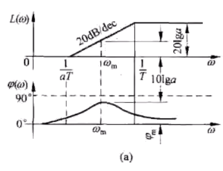
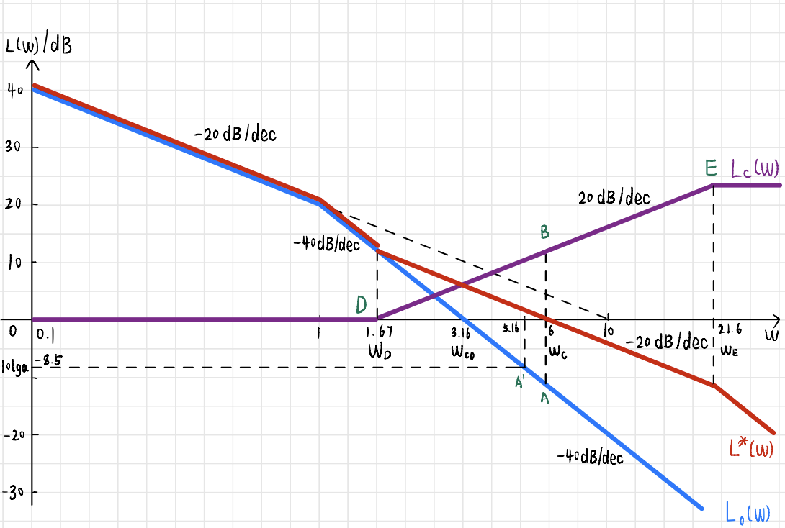
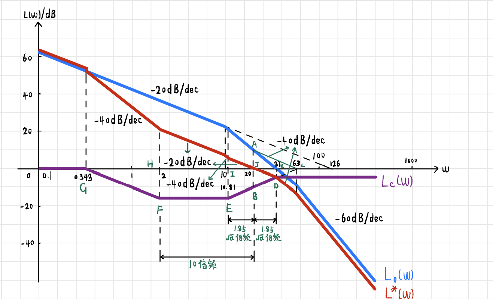

# 6 - 线性系统校正

## 校正适用的系统条件: 单位反馈 最小相角 系统

## 基本控制规律

### 比例 (P)

* 实质上是个 可调**放大器**
* 只对 幅值 有影响, 对相角不影响
* 可以 提高开环增益 , 减小系统稳态误差
* 会 降低相对稳定性 , 可能造成闭环系统不稳定

### 比例-微分 (PD)

* 能反映输入信号的变化趋势, 产生有效的 早期修正信号
* 增加 系统的 阻尼程度, 改善系统稳定性

> 例: 试着分析比例、积分、微分控制对系统性能的影响(重点)

1. 比例(P)控制的优点: 能使控制量朝着 **减小误差的方向** **变化**. 缺点是有时会导致 **动态性能变坏**, 甚至使 **闭环不稳定**
2. 积分(I)控制的优点: 能对误差进行记忆并积分, 有利于 **消除静差**. 缺点是 具有**滞后性** , 有时会使系统 **动态性能变差** , 以至于使系统不稳定
3. 微分(D)控制的优点: 能对误差进行微分, 预先知道误差的变化趋势, **可 ​**​**加快系统响应** , **超调量减少**, **增加系统稳定性**. 缺点是 **对干扰同样敏感** , 使系统 **抑止高频干扰能力降低** .

## 三频段理论

### $L(\omega)$ 低频

* 根据开环增益 $K$ 和系统型别 $v$ 确定系统稳态误差 $e_{ss}$  

  * $G_o\left( s \right) =\cfrac{K}{s^v}$
  * $20\lg |G_o|=20\lg K-v\cdot 20\lg \omega$
  * $\angle G_o=-v\cdot 90\degree$
* 期望

  * 陡、高

### $L(\omega)$ 中频

* 以 $-20\mathrm{dB/dec}$ 穿过 $0\mathrm{dB}$ 线
* 期望

  * 缓、宽

### $L(\omega)$ 高频

* 系统 抗高频噪声 的能力
* 期望

  * 陡、低

## 相角超前校正

### 实质

* 将超前网络最大超前叫补在矫正系统开环频率特性的截止频率处
* 提升校正后系统的相角裕度和截止频率
* 改善系统动态性能

### Bode 图

​

### 影响

* 相角 超前

  * 可以使得最大超前角频率 $\omega_m$ 置于校正后系统截止频率 $\omega_c$ 处
  * 有效 增加 系统的 相角裕度
  * 提高系统的 相对稳定性
* 幅值增加

  * 使得原系统截止频率 $\omega_c$ 右移
  * 有利于 提高 系统的 快速性

### 步骤

* 根据给定稳态误差确定 $\color{RoyalBlue}e^{\ast}_{ss}$ 的要求确定 $\color{RoyalBlue}K$  

  * 根据稳态误差 $e_{ss}$ 确定 $K$
  * > |系统型别 $v$​|静态误差系数|||阶跃输入 $r\left( t \right) =A\times 1\left( t \right)$​|斜坡输入 $r\left( t \right) =At$​|加速度输入 $r\left( t \right) =\cfrac{A}{2}t^2$​|
    > | :---------: | :----------: | :-: | :---------: | :---------: | :---------: | :-----------: |
    > ||$K_p$​|$K_v$​|$K_a$​|位置误差 $e_{ss}=\cfrac{A}{1+K_p}$​|速度误差 $e_{ss}=\cfrac{A}{K_v}$​|加速度误差 $e_{ss}=\cfrac{A}{K_a}$​|
    > |$0$​|$K$​|$0$​|$0$​|$\cfrac{A}{1+K}$​|$\infty$​|$\infty$ |
    > |$1$​|$\infty$​|$K$​|$0$​|$0$ |$\cfrac{A}{K}$​|$\infty$​|
    > |$2$​|$\infty$​|$\infty$​|$K$​|$0$​|$0$​|$\cfrac{A}{K}$​|
    >
* 根据确定了的开环增益 $K$ , 绘制出 未校正系统 的 对数幅频 曲线, 求出截止频率 $\omega_{c0}$ 和相角裕度 $\gamma_0$  

  * 检查适用情况

    * $\omega_{c0}\leqslant \omega_c^{\ast}, \gamma_0 \leqslant \gamma^{\ast}$  

      * $\omega_{c0}:$ 未校正系统的截止频率
      * $\gamma_0:$ 未校正系统的相角裕度
      * $\omega_c^{\ast}:$ 校正后所期望的截止频率
      * $\gamma^{\ast}:$ 校正后所期望的相角裕度
  * > * 相角裕度 $\color{OrangeRed}\gamma = 180\degree + \angle G(j\omega_c)$
    >
    >   * $\angle G(j\omega_c) = 分子-分母$
    >
  * 当 $\omega_{c0} < \omega_c^{\ast}, \gamma < \gamma^{\ast}$ 时 **优先考虑超前校正**
* 根据 $\gamma^{\ast}$ , 计算校正装置所提供的最大相角超前量 $\varphi_m$  

  * $\varphi_m = \gamma^{\ast} - \gamma_0 + \color{RoyalBlue}(5\degree \sim 15\degree)$  

    * $5\degree \sim 15\degree$ 是留足余量, 补偿因校正后截止频率增大导致的, 导致矫正前系统相角裕度的损失量
    * 如果 $\omega_{c0}$ 处的斜率为 $\color{RoyalBlue}-40\mathrm{dB/dec}$ 并且 **不再往下转折** , 取 $\color{RoyalBlue}5\degree \sim 8\degree$
    * 如果斜率从 $-40\mathrm{dB/dec}$ 继续折到 $-60\mathrm{dB/dec}$ , 甚至折得更狠得时候, 应该取更大一点, $15\degree$ 也不是不行
  * 算出的 $\color{OrangeRed}\varphi_m > 60\degree$ , 用一级超前校正 **不能达到** $\gamma^{\ast}$ 的要求, 要换方法
* 根据最大超前角 $\varphi_m$ 求 $a$  

  * $\color{RoyalBlue}a = \cfrac{1+\sin \varphi_m}{1-\sin \varphi_m}$
* 选定 校正后 系统的截止频率 $\omega_c$  

  * 在 $-10\lg a$ 处作水平线, 与未校正前系统 $L_0(\omega)$ 交于频率为 $\omega_A^{\prime}$
  * 取校正后系统的截止频率 $\color{RoyalBlue}\omega_c = \max \{\omega_A^{\prime}, \omega_c^{\ast}\}$  

    * 与期望的截止频率 $\omega_c^{\ast}$ 进行对比, 取较大者
* 以下两个方法自行选择

  * 直接法

    * 如果题目给了要求的 $\omega_c$ 是多少, 那么就用题目给的来反向推算 $a$!利用未校正前的 $\omega_c$ 进行等比例计算.
    * 由最终截止频率 $\omega_c = \cfrac{1}{T\sqrt{a}}$ , 确定 $T$ 值
    * 得到校正装置传递函数 $G\left(s\right)=\cfrac{aTs+1}{Ts+1}$
  * 几何法

    * 在选定的 $\omega_c$ 处作 垂线 , 与 $L_0(\omega)$ 交于点 $A$
    * 对 $A$ 关于 $0\mathrm{dB}$ 线画 对称点 $B$
    * 过点 $B$ 作 $+20\mathrm{dB/dec}$ 直线

      * 直线与 $0\mathrm{dB}$ 于点 $D$ , 对应频率 $\omega_D$
    * 在 $BD$ 作反向延长线, 长度为 $|BD|$ , 延长线 末端 定为点 $E$
    * 在 $E$ 处, 曲线拉平
    * 对应的超前装置传递函数为 $\color{RoyalBlue}G_c(s) = \cfrac{\cfrac{s}{\omega_D}+1}{\cfrac{s}{\omega_E}+1}$

### 效果

* 保持低频段

  * 满足 **稳态精度** $e_{ss}$
* 改善中频段

  * $\omega_c \uparrow, \gamma \uparrow,$ **动态性能提高**
* 抬高高频段

  * **抗高频干扰** 能力 **降低**

> 例: 设单位反馈系统的开环传递函数 $G_0(s)=\cfrac{K}{s(s+1)}$ , 试设计校正装置 $G_c(s)$ 使得校正后系统满足以下指标
>
> 1. 当 $r(t)=t$ 时, 稳态误差 $e^{\ast}_{ss} \leqslant 0.1$
> 2. 开环系统截止频率 $\omega_c^{\ast} \geqslant 6 \mathrm{rad/s}$
> 3. 相角裕度 $\gamma^{\ast} \geqslant 60\degree$ ; 幅值裕度 $h^{\ast} \geqslant 10 \mathrm{dB}$

#### 解

* 根据 $e^{\ast}_{ss}$ 确定 $K$ , 使用终值定理

  * $r(t)=t,R(s)=\cfrac{1}{s^2},e_{ss}^{\ast}=\lim\limits_{s\rightarrow 0} \cfrac{sR(s)}{1+G(s)H(s)}=\cfrac{s\cfrac{1}{s^2}}{1+\cfrac{K}{s\left( s+1 \right)}}=\cfrac{s\cfrac{1}{s^2}s\left( s+1 \right)}{s\left( s+1 \right) +K}=\cfrac{s+1}{s\left( s+1 \right) +K}=\cfrac{1}{K}$
  * 要求 $\cfrac{1}{K}\leqslant 0.1 \Rightarrow K\geqslant 10$ , 取 $K=10$
* 计算 $\omega_{c0}, \gamma_0$  

  * 用舍小取大法, $G\left( j\omega _{c0} \right) =\cfrac{10}{\omega _{c0}\omega _{c0}} = 1\Rightarrow \omega _{c0}=\sqrt{10}=3.16228$
  * $\gamma_0 = 180\degree-90\degree-\arctan 3.16=17.5603\degree$

    * 相角裕度 $\color{OrangeRed}\gamma = 180\degree + \angle G(j\omega_c)$
  * $\omega_{c0} < \omega_c^{\ast}, \gamma_0 < \gamma^{\ast}$
* 计算 $\varphi_m$  

  * $\omega_{c0}$ 处的斜率为 $-40\mathrm{dB/dec}$ , 并且后续不继续往下折, 余量取 $5\degree$
  * $\varphi_m = \gamma^{\ast} - \gamma_{c0} + 5\degree = 60\degree - 17.6\degree + 5\degree = 47.4\degree < 60\degree$ , 符合要求
* 计算超前网络参数 $a$  

  * $a=\cfrac{1+\sin \varphi _m}{1-\sin \varphi _m}=\cfrac{1+\sin 47.5\degree}{1-\sin 47.5\degree}=6.61259\approx 7$
  * $10\lg a=8.5\mathrm{dB}$
* 利用比例的关系算出 $\omega_A^{\prime}$  

  * $40=\cfrac{8.5}{\lg {\omega _A}^{\prime}-\lg \omega _{c0}}=\cfrac{8.5}{\lg {\omega _A}^{\prime}-\lg 3.16}\Rightarrow \omega _{A}^{\prime}=5.16$
* 取目标截止频率 $\omega_c$  

  * $\omega_c = \max \{\omega_A^{\prime}, \omega_c^{\ast}\} = 6$
* 计算 $L(\omega_c)$  

  * $40=\cfrac{L\left( \omega _c \right) -8.5}{\lg \omega _c-\lg \omega _{A}^{\prime}}=\cfrac{L\left( \omega _c \right) -8.5}{\lg 6-\lg 5.16}\Rightarrow L\left( \omega _c \right) =11.12\mathrm{dB}$
* 计算 $\omega_D, \omega_E$  

  * $20=\cfrac{L\left( \omega _c \right)}{\lg \omega _c-\lg \omega _D}=\cfrac{11.12}{\lg 6-\lg \omega _D}\Rightarrow \omega _D=1.67$
  * $\lg \omega _E-\lg \omega _c=\lg \omega _c-\lg \omega _D \Rightarrow \omega_E=21.6$  

    * 根据几何关系得到的
  * 注意

    * 因为是对数图, 横坐标只是 标的 是 $\omega$ 的值, 但是计算一定要以 $\color{OrangeRed}\lg\omega$ 进行计算
* 确定矫正系统传递函数 $G_c$  

  * $G_c(s)=\cfrac{\cfrac{s}{1.67}+1}{\cfrac{s}{21.6}+1}$
* 确定校正后系统参数是否满足要求

  * $G(s)=G_c(s)G_0(s)=\cfrac{10\left( \cfrac{s}{1.67}+1 \right)}{s\left( s+1 \right) \left( \cfrac{s}{21.6}+1 \right)}$
  * $\omega_c = 6 \mathrm{rad/s} = \omega_c^{\ast}$
  * $\gamma (\omega _c)=180\degree+\arctan \cfrac{6}{1.67}-90\degree-\arctan \cfrac{6}{1}-\arctan \cfrac{6}{21.6}=68.3846\degree>60\degree$
  * $h \to \infty > 10\mathrm{dB}$
  * 满足要求
* 最终图像

  * ​

## 相角滞后校正

### 实质

* 低通 滤波器
* 利用 幅值衰减 特性, 将系统的 中频段压低
* 校正后系统 截止频率减小 , 挖掘系统自身的相角储备, 满足校正后系统的相角裕度

### Bode 图

​

### 影响

* 利用 幅值衰减 的特性
* 使低频段保持不变, 满足稳态精度的要求
* 使中频段降低, 截止频率 $\omega_c$ 减小, 相角裕度 $\gamma$ 变大
* 压低高频段, 提高了系统抗高频干扰的能力

### 步骤

* 根据稳态误差 $\color{RoyalBlue}e^{\ast}_{ss}$ 确定 $\color{RoyalBlue}K$
* 根据确定了的开环增益 $K$ , 绘制出 未校正系统 的 对数幅频 曲线, 求出截止频率 $\omega_{c0}$ 和相角裕度 $\gamma_0$
* 检查适用情况

  * $\color{RoyalBlue}\omega_{c0} > \omega_c^{\ast}, \gamma_0 < \gamma^{\ast}, \gamma_0(\omega_c^{\ast}) = 180\degree + \angle G_0(j\omega_c^{\ast})\geqslant \gamma^{\ast} + 6\degree$

    * 原系统截止频率比目标截止频率大
    * 原系统相角裕度比目标相角裕度小
* 确定校正后系统的截止频率 $\omega_{c}$  

  * 计算满足条件的 $\color{RoyalBlue}\gamma_0(\omega_{c1}) = \gamma^{\ast} + 6\degree$ 的频率 $\color{RoyalBlue}\omega_{c1}$

    * 也就是"目标相角裕度$+6\degree = 180\degree+\angle G\left(j\omega_c\right)$"
    * 用计算器的 SOLVE 法来解
  * 根据情况选择 $\omega_c$ , 使得 $\omega_c$ 满足 $\omega_{c}^{\ast} \leqslant \omega_c \leqslant \omega_{c1}$
  * **建议** **取** $\color{RoyalBlue}\omega_c = \omega_{c1}$ 以便做题
* 以下两个方法二选一

  * 直接法

    * 计算方程  
      ​$\left\{ \begin{array}{c}	L\left( \omega _c \right) +20\lg b=0\\	\cfrac{1}{bT}=0.1\omega _c\\\end{array} \right.$
    * 算出最终的 $b,T$ 之后, 得到校正装置传递函数 $G_c\left( s \right) =\cfrac{1+bTs}{1+Ts}$
  * 几何法

    * 在校正后截止频率 $\omega_c$ 处作 垂线 , 交 $L_0(\omega)$ 于点 $A$
    * 对 $A$ 作 $0\mathrm{dB}$ 线的对称 镜像点  $B$
    * 过点 $B$ 作水平线, 在 $\omega_D = 0.1\omega_c$ 处确定点 $D$
    * 过点 $D$ 作 $-20\mathrm{dB/dec}$ 的直线交 $0\mathrm{dB}$ 于点 $E$ , 对应频率为 $\omega_E$
    * 校正后系统传递函数 $G_c(s)=\cfrac{\cfrac{s}{\omega_D}+1}{\cfrac{s}{\omega_E}+1}$

### 效果

* 对相角是没有贡献的
* 挖掘原系统自身的相角储备量

> 例: 设单位反馈系统的开环传递函数 $G_0(s)=\cfrac{K}{s\left( \cfrac{s}{5}+1 \right) \left( \cfrac{s}{10}+1 \right)}$ ,试设计校正装置 $G_c(s)$ , 使得校正后系统满足以下指标
>
> 1. 速度误差系数 $K^{\ast}_v =30$
> 2. 开环系统截止频率 $\omega_c^{\ast} \geqslant 2.3 \mathrm{rad/s}$
> 3. 相角裕度 $\gamma^{\ast} \geqslant 40\degree$ ; 幅值裕度 $h^{\ast}\geqslant 10\mathrm{dB}$

#### 解

* 计算 $K$  

  * $e_{ss}=\lim\limits_{s\rightarrow 0} \cfrac{sR\left( s \right)}{1+G\left( s \right) H\left( s \right)}=\lim\limits_{s\rightarrow 0} \cfrac{s\cfrac{1}{s^2}}{1+\cfrac{K}{s\left( \cfrac{s}{5}+1 \right) \left( \cfrac{s}{10}+1 \right)}}=\cfrac{1}{K}=\cfrac{1}{K_v}$
  * $K=30$
* 计算 $\omega_{c0}, \gamma_0(\omega_{c0})$

  * 猜测 $\omega_{c0}$  

    * 如果落在 $(0, 5)$ 时, $\omega_{c0} = \cfrac{30}{1}=30 > 5$ , 不符合假设
    * 如果落在 $(5,10)$ 时, $\cfrac{30}{\omega \cfrac{\omega}{5}\cdot 1}=1\Rightarrow \omega =\sqrt{150}=12.2474 > 10$ , 不符合假设
    * 如果落在 $(10, +\infty)$ 时, $\cfrac{30}{\omega \cfrac{\omega}{5}\cfrac{\omega}{10}}=1\Rightarrow \omega ^3=1500\Rightarrow \omega =\sqrt[3]{1500}=11.4471$ , 符合假设
    * $\omega_{c0} = 11.45$
  * $\gamma _0(\omega _{c0})=180\degree-90\degree-\arctan \cfrac{11.45}{5}-\arctan \cfrac{11.45}{10}=-25.28\degree\ll \gamma ^{\ast} = 40\degree$
* 检查适用情况

  * $\omega_{c0} = 11.45 > \omega_c^{\ast} = 2.3, \gamma_0 =-25.28\degree \ll \gamma^{\ast} = 40\degree$ , 符合滞后校正要求
  * 计算原系统在校正后的截止频率处的相角储备量 $\gamma_0(\omega_c^{\ast})$  

    * $\gamma _0(\omega _{c}^{\ast})=180\degree-90\degree-\arctan \cfrac{2.3}{5}-\arctan \cfrac{2.3}{10}=52.3448\degree>\gamma ^{\ast}+6\degree=46\degree$
* 计算 $\gamma_0(\omega_{c1})$ , 求期望的截止频率上限

  * $\gamma _0\left( \omega _{c1} \right) =46\degree=180\degree+\angle G_0\left( j\omega _{c1} \right) =180\degree-90\degree-\arctan \cfrac{\omega _{c1}}{5}-\arctan \cfrac{\omega _{c1}}{10}$  

    * 用计算器的SOLVE求解 $\omega_{c1} =2.7$
* 取 $\omega_c = \omega_{c1} = 2.7$ , 确定校正装置传递函数 $G_c(s)$  

  * 确定 $\omega_0$  

    * > * **基准线** **及其 ​**​**延长线****​ ​**与 $0\mathrm{dB}$ 线的交点为 $\omega_0$
      >
      >   * $K = \omega_0^v, \omega_0=K^{\frac{1}{v}}$
      >

    * $\omega_0 = K=30$
  * 在 $\omega_c$ 作垂线确定点 $A$ , 计算 $L(\omega_c)$  

    * $-20=\cfrac{L\left( \omega _c \right) -0}{\lg \omega _c-\lg \omega _0}=\cfrac{L\left( \omega _c \right)}{\lg 2.7-\lg 30}\Rightarrow L\left( \omega _c \right) =20.915149\approx 21\mathrm{dB}$
  * 对 $A$ 作 $0\mathrm{dB}$ 作对称点 $B$
  * 过点 $B$ 作水平线, $\omega_D = 0.1\omega_c = 0.27$ , 确定点 $D$
  * 过点 $D$ 作 $-20\mathrm{dB/dec}$ 的直线交 $0\mathrm{dB}$ 于点 $E$ , 确定 $\omega_E$  

    * $-20=\cfrac{0-\left( -21 \right)}{\lg \omega _E-\lg \omega _D}=\cfrac{21}{\lg \omega _E-\lg 0.27}\Rightarrow \omega _E=0.02406$
* 滞后校正传递函数 $G_c\left( s \right) =\cfrac{\cfrac{s}{\omega _D}+1}{\cfrac{s}{\omega _E}+1}=\cfrac{\cfrac{s}{0.27}+1}{\cfrac{s}{0.0243}+1}$
* 验证校正后的系统

  * $G\left( s \right) =G_c\left( s \right) G_0\left( s \right) =\cfrac{30\left( \cfrac{s}{0.27}+1 \right)}{s\left( \cfrac{s}{5}+1 \right) \left( \cfrac{s}{10}+1 \right) \left( \cfrac{s}{0.0243}+1 \right)}$
  * $\omega_c = 2.7 \mathrm{rad/s} > \omega_c^{\ast} = 2.3$
  * $\gamma(\omega_c)=41.3\degree > 40\degree = \gamma^{\ast}$
  * $\omega_g = 6.8, h = -20\lg|G(j\omega_g)| = 14.228\mathrm{dB} > h^{\ast} = 10\mathrm{dB}$

## 滞后-超前校正

### 适用情况

* 超前校正所需要的最大超前角 $\varphi _m>60\degree$
* 滞后校正在 $\omega _{c}^{\ast}$ 处又 没有足够 的相角储备量

### 实质

* 综合利用相交超前特性和滞后网络的幅值衰减特性
* 校正装置传递函数为 $G_c\left( s \right) =\left( \cfrac{bT_2s+1}{T_2s+1} \right) \left( \cfrac{aT_1s+1}{T_1s+1} \right)$
* 当 $a>1,b<1$ 时

  * $\cfrac{bT_2s+1}{T_2s+1}$ 为滞后校正装置
  * $\cfrac{aT_1s+1}{T_1s+1}$ 为超前部分装置

### 设计指标

* 稳态误差 $e_{ss}^{\ast}$
* 截止频率 $\omega _{c}^{\ast}$
* 相角裕度 $\gamma ^{\ast}$
* 幅值裕度 $h^{\ast}$

### 影响

* 使系统截止频率 ​$\omega_cωc$​ 增大, 提高系统响应速度
* 增大的系统稳定裕度(超前部分)
* 改善系统的稳态性能(滞后部分)
* 系统动态性能变好
* 抗高频干扰能力降低
* 系统的快速性下降

### 矫正方法

* 根据稳态误差 $e_{ss}^{\ast}$ 的要求确定 $K$
* 计算未矫正系统的频率指标，决定校正方式

  * 由 $K$ 绘制未校正系统对数幅频特性 $L_{0}\left(\omega\right)$, 确定系统的 $\omega_{c0}, \gamma_0(\omega_{c0})$
  * 当超前校正所需要的最大超前角 $\varphi_{m}>60\degree$
  * 滞后校正在 $\omega_{c}^{\ast}$ 处系统又没有足够的相角储备量时, 即 $\gamma _0\left( \omega _{c}^{\ast} \right) =180\degree+\angle G_0\left( \omega _{c}^{\ast} \right) <\gamma ^{\ast}+6\degree$
  * 因而使用超前或滞后均不能满足要求
* 分别使用超前、滞后校正均不能达到要求的时候, 考虑使用滞后超前
* 选择校正后系统的截止频率 $\omega_c=\omega_c^{\ast}$ , 并计算此处系统需要的最大超前角

  * $\varphi_m\left(\omega_c\right)=\gamma^{\ast}-\gamma_0 \left(\omega_c\right)+6\degree$
  * $6\degree$是为了补偿矫正网络滞后部分造成的相角损失
* 计算超前部分参数 $a=\cfrac{1+\sin \varphi _m}{1-\sin \varphi _m}$
* 在 $\omega_c$ 处作一条垂线交 $L\left(\omega\right)$ 于点 $A$
* 确定 $A$ 关于 $0\mathrm{dB}$ 的镜像点 $B$
* 以点 $B$ 为中心作斜率为 $+20\mathrm{dB/dec}$ 的直线, 分别交 $\omega = \sqrt{2}\omega_c$ 与 $\omega = \cfrac{\omega_c}{\sqrt{a}}$ 的两条垂线于点 $D$ 和 $E$  

  * 对应的频率为 $\omega _D=\sqrt{2}\omega _c,\omega _E=\cfrac{\omega _c}{\sqrt{a}}$
* 从点 $D$ 向右作水平线, 从点 $E$ 向左作水平线
* 在过点 $E$ 的水平线上确定 $\omega_F=0.1\omega_E$ 的点 $F$
* 过点 $F$ 作斜率为 $-20\mathrm{dB/dec}$ 的直线交 $0\mathrm{dB}$ 线于点 $G$ , 对应频率为 $\omega_G$
* 以上内容利用几何知识可以计算, 最后得到校正装置传递函数 $G_{c}\left(s\right)$  

  * $G_c\left( s \right) =\underbrace{\cfrac{\cfrac{s}{\omega _F}+1}{\cfrac{s}{\omega _G}+1}}_{\text{滞后}}\cdot\underbrace{\cfrac{\cfrac{s}{\omega _E}+1}{\cfrac{s}{\omega _D}+1}}_{\text{超前}}$
* 最后验算指标

> 例: 设单位反馈系统的开环传递函数 $G_0\left( s \right) =\cfrac{K}{s\left( \frac{s}{10}+1 \right) \left( \frac{s}{60}+1 \right)}$
>
> 试设计校正装置 $G_c\left( s \right)$ 使得校正后系统满足如下指标
>
> 1. 当 $r\left( t \right) =t$ 时, 稳态误差 $e_{ss}^{\ast}\leqslant \frac{1}{126}$
> 2. 开环系统截止频率 $\omega _{c}^{\ast}\geqslant 20\mathrm{rad}/\mathrm{s}$
> 3. 相角裕度 $\gamma ^{\ast}\geqslant 35\degree$​

#### 解

* 计算 $K$  

  * 使用查表法得到 $K=126$
* 计算 $\omega_{c0}, \gamma_0(\omega_{c0})$  

  * $\omega_{c0}=35.5>\omega_{c}^{\ast}=20, \gamma_0(\omega_{c0})=-14.9\degree<\gamma^{\ast}=35\degree$
  * $\gamma _0\left( \omega _{c}^{\ast} \right) =8.13\degree<\gamma ^{\ast}+6\degree=41\degree$
* 取 $\omega_c = \omega_{c}^{\ast}=20$
* 超前部分应该提供的最大超前角 $\varphi_m$  

  * $\varphi _m=\gamma ^{\ast}-\gamma _0\left( \omega _{c}^{\ast} \right) +6\degree=35\degree-8.13\degree+6\degree=32.87\degree$
* 超前部分的参数 $a$  

  * $a=\cfrac{1+\sin \varphi _m}{1-\sin \varphi _m}=\cfrac{1+\sin 32.87\degree}{1-\sin 32.87\degree}=3.37383\approx 3.4$
  * $\sqrt{a}=\sqrt{3.4}=1.84391\approx 1.85$
* 计算频率点

  * $\begin{aligned}	\omega _B&=\omega _c=20\\	\omega _D&=\sqrt{a}\omega _B=37\\	\omega _E&=\frac{\omega _B}{1.85}=10.81\\	\omega _F&=0.1\omega _B=2\\\end{aligned}$
* 利用等距等比 $JK=LK$  

  * $\omega _K=\omega _{c0}=35.5\degree\Rightarrow \cfrac{\omega _L}{\omega _K}=\cfrac{\omega _K}{\omega _J}\Rightarrow \omega _L=63$
* 利用全等三角形 $\bigtriangleup FGH\cong \bigtriangleup ELI$  

  * $GH=LI\Rightarrow \cfrac{\omega _H}{\omega _G}=\cfrac{\omega _L}{\omega _I}\Rightarrow \omega _G=0.343$
* 代入计算滞后-超前校正装置传递函数 $G_{c}\left(s\right)$  

  * $G_c\left( s \right) =\cfrac{\cfrac{s}{\omega _F}+1}{\cfrac{s}{\omega _G}+1}\cdot \cfrac{\cfrac{s}{\omega _E}+1}{\cfrac{s}{\omega _D}+1}=\cfrac{\cfrac{s}{2}+1}{\cfrac{s}{0.343}+1}\cdot \cfrac{\cfrac{s}{10.81}+1}{\cfrac{s}{37}+1}$
* 画出 Bode 图

  * ​​

‍
