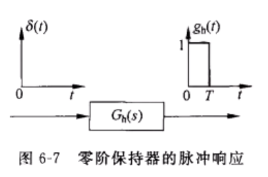
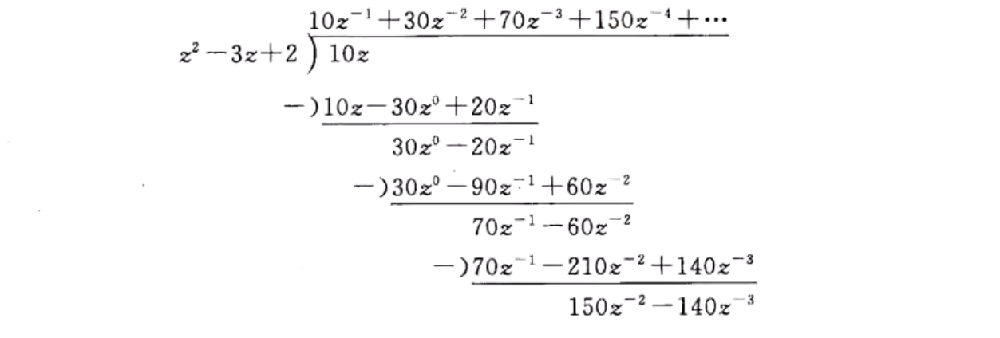
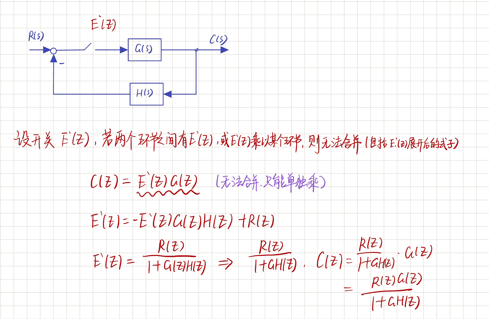
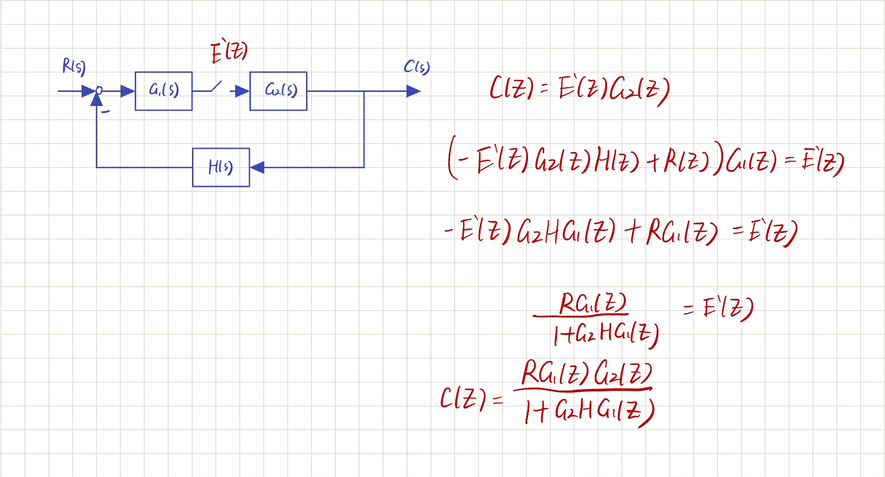
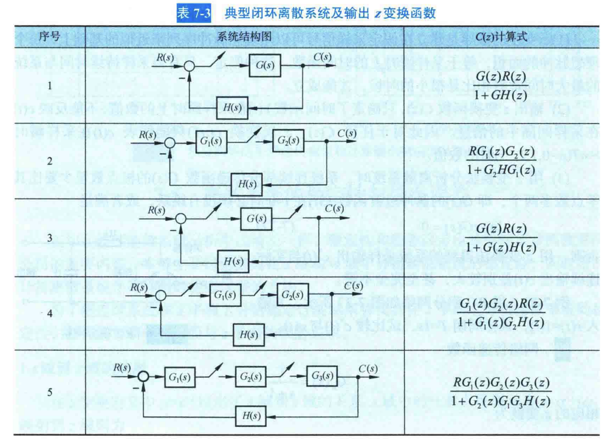
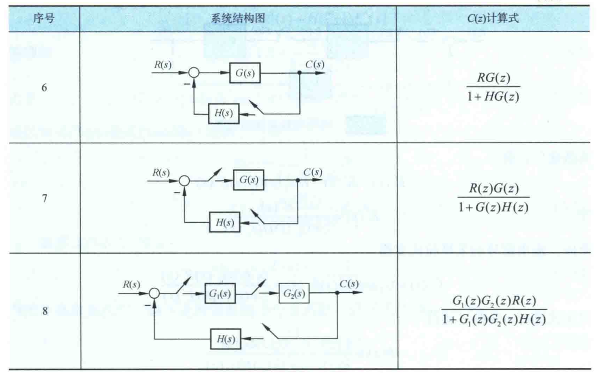
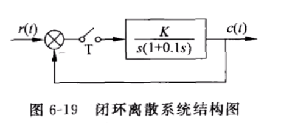
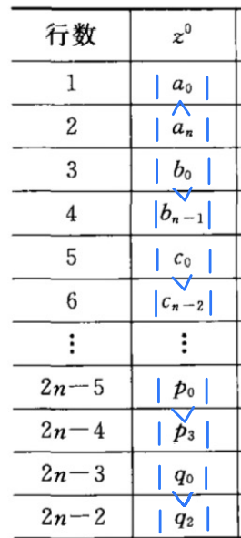
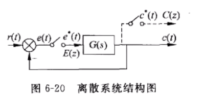
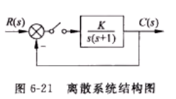

# 7 - 离散系统

## 信号采样: 把一个连续函数 $e(t)$ 采样变成一个断续的脉冲序列 $e^{\ast}(t)$

* $\begin{aligned}e^{\ast}(t)&=e(0)\delta (t)+e(T)\delta (t-T)+\cdots +e(nT)\delta (t-nT)\\&=\sum\limits_{n=0}^{\infty}{e}(nT)\delta (t-nT)\\&=e(t)\sum\limits_{n=0}^{\infty}{\delta}(t-nT)\\&=e\left( t \right) \delta _T\left( t \right)\\\end{aligned}$

## 香农采样定理

* 当采样频率 **大于** **或 ​**​**等于** 信号所含 最高频率 **两倍****​ ​**时, 才**有可能**通过理想滤波器把原信号完整地恢复出来, 否则会发生频率混叠

  * $\color{OrangeRed}\omega_s \geqslant 2\omega_h$ 或 $T \leqslant \cfrac{\pi}{\omega_h}$

    * $\omega_h:$ 信号所含的最高频率
    * $\omega_s:$ 采样频率

## 零阶保持器 ZOH

* $g_h\left( t \right) =1\left( t \right) -1\left( t-T \right)$
* 输入脉冲信号的结果

  * ​
  * 其实就是叠加了两个矩形脉冲
* 传递函数 $G_h\left( s \right) =\cfrac{1}{s}-\cfrac{e^{-Ts}}{s}=\cfrac{1-e^{-Ts}}{s}$

  * 此处运用了 实位移定理[^1]
* ZOH 与其他环节串联后的处理方式

  * $\mathcal{Z} \left[ \cfrac{1-e^{-sT}}{s}G\left( s \right) \right] =\mathcal{Z} \left[ 1-e^{-sT} \right] \mathcal{Z} \left[ \cfrac{G\left( s \right)}{s} \right] =\left( 1-z^{-1} \right) \mathcal{Z} \left[ \cfrac{G\left( s \right)}{s} \right] =\left( \cfrac{z-1}{z} \right) \mathcal{Z} \left[ \cfrac{G\left( s \right)}{s} \right]$
* 有时间的滞后, 滞后 $\cfrac{T}{2}$ 的延迟环节

## $z$ 变换

### 定义

* $E^{\ast}\left( s \right) =\mathcal{L} \left[ e^{\ast}\left( t \right) \right] =\sum\limits_{n=0}^{\infty}{e\left( nT \right) \mathcal{L} \left[ \delta \left( t-nT \right) \right] =\sum\limits_{n=0}^{\infty}{e\left( nT \right) e^{-nTs}}}$

  * $e^{\ast}(t)$ 是连续信号 $e(t)$ 进行采样后的结果

    * $e^{\ast}\left( t \right) =\sum\limits_{n=0}^{\infty}{e\left( nT \right) \delta \left( t-nT \right)}$
  * 对离散的信号采样后的 Laplace 变换, 只需要变化和时间有关系的量 $\delta(t-nT)$
  * 运用 实位移定理[^1] 得出结果
* 引入 $\color{RoyalBlue}z = e^{Ts}$ 以避免直接运算超越函数

  * $T:$ 采样周期
* 替换后得到 $E\left( z \right) =E^{\ast}\left( s \right) |_{s=\frac{1}{T}\ln z}=\sum\limits_{n=0}^{\infty}{e\left( nT \right) z^{-n}}$
* 定义 $E(z)$ 为采样信号 $e^{\ast}(t)$ 的 $\color{OrangeRed}z$ **变换**
* 也可以写成

  * $E\left( z \right) =\mathcal{Z} \left[ e^{\ast}\left( t \right) \right] =\mathcal{Z} \left[ e\left( t \right) \right] =\mathcal{Z} \left[ E\left( s \right) \right]$
* 都表示对离散信号 $e^{\ast}(t)$ 进行 $z$ 变换

### 注意

* $E(z)$ 只对应 **唯一的**  $e^{\ast}(t)$ , 不对应唯一的 $e(t)$

## $z$ 变换法

### 级数求和法

* $E(z) = e(0) + e(T)z^{-1} + e(2T)z^{-2} + \cdots + e(nT)z^{-n}$
* 写成闭合形式

### 部分分式法 (查表法)

* 对连续信号 $e(t)$ 进行 Laplace 变换后得 $E(s)$
* 把 $E(s)$ 拆成部分分式和
* 查表得到 $z$ 变换表达式

  * > |$E(s)$|$e(t)$|$E(z)$|
    > | :-: | :-: | :-: |
    > |$\color{RoyalBlue}1$|$\delta (t)$|$\color{yellowgreen}1$|
    > |$\color{RoyalBlue}\cfrac{1}{s}$|$1(t)$|$\color{yellowgreen}\cfrac{z}{z-1}$|
    > |$\color{RoyalBlue}\cfrac{1}{s^2}$|$t$|$\color{yellowgreen}\cfrac{Tz}{(z-1)^2}$|
    > |$\color{RoyalBlue}\cfrac{1}{s^3}$|$\cfrac{1}{2}t^2$|$\color{yellowgreen}\cfrac{T^2 z(z+1)}{2(z-1)^3}$|
    > |$\color{RoyalBlue}\cfrac{1}{s+a}$|$e^{-at}$|$\color{yellowgreen}\cfrac{z}{z-e^{-aT}}$|
    > |$\color{RoyalBlue}\cfrac{1}{(s+a)^2}$|$te^{-at}$|$\color{yellowgreen}\cfrac{Tze^{-aT}}{(z-e^{-aT})^2}$|
    > |$\color{RoyalBlue}\cfrac{1}{s-\cfrac{1}{T}\ln a}$|$a^{\frac{t}{T}}$|$\color{yellowgreen}\cfrac{z}{z-a}$|
    >

> 例: 求 $E(s)= \cfrac{s(2s+3)}{(s+1)^{2}(s+2)}$ 对应的 $z$ 变换 $E(z)$

* $E(s)=\cfrac{s(2s+3)}{(s+1)^2(s+2)}=\cfrac{c_1}{s+1}+\cfrac{c_2}{\left( s+1 \right) ^2}+\cfrac{c_3}{s+2}$
* $c_3=\lim\limits_{s\rightarrow -2} \left( s+2 \right) E\left( s \right) =\lim\limits_{s\rightarrow -2} \cfrac{s\left( 2s+3 \right)}{\left( s+1 \right) ^2}=\cfrac{-2\left( 2\times \left( -2 \right) +3 \right)}{\left( -2+1 \right) ^2}=2$
* $c_2=\lim\limits_{s\rightarrow -1} \left( s+1 \right) ^2E\left( s \right) =\lim\limits_{s\rightarrow -1} \cfrac{s\left( 2s+3 \right)}{s+2}=\cfrac{-1\left( 2\times \left( -1 \right) +3 \right)}{-1+2}=-1$
* $c_1=\lim\limits_{s\rightarrow -1} \cfrac{\mathrm{d}\left[ \left( s+1 \right) ^2E\left( s \right) \right]}{\mathrm{d}s}=\cfrac{\left( 4s+3 \right) \left( s+2 \right) -s\left( 2s+3 \right)}{\left( s+2 \right) ^2}=\cfrac{\left( -4+3 \right) \left( -1+2 \right) -\left( -1 \right) \left( -2+3 \right)}{\left( -1+2 \right) ^2}=0$
* $E\left( s \right) =-\cfrac{1}{\left( s+1 \right) ^2}+\cfrac{2}{s+2}$
* 查表

  * > |$E(s)$|$e(t)$|$E(z)$|
    > | :-: | :-: | :-: |
    > |$\color{RoyalBlue}1$|$\delta (t)$|$\color{yellowgreen}1$|
    > |$\color{RoyalBlue}\cfrac{1}{s}$|$1(t)$|$\color{yellowgreen}\cfrac{z}{z-1}$|
    > |$\color{RoyalBlue}\cfrac{1}{s^2}$|$t$|$\color{yellowgreen}\cfrac{Tz}{(z-1)^2}$|
    > |$\color{RoyalBlue}\cfrac{1}{s^3}$|$\cfrac{1}{2}t^2$|$\color{yellowgreen}\cfrac{T^2 z(z+1)}{2(z-1)^3}$|
    > |$\color{RoyalBlue}\cfrac{1}{s+a}$|$e^{-at}$|$\color{yellowgreen}\cfrac{z}{z-e^{-aT}}$|
    > |$\color{RoyalBlue}\cfrac{1}{(s+a)^2}$|$te^{-at}$|$\color{yellowgreen}\cfrac{Tze^{-aT}}{(z-e^{-aT})^2}$|
    > |$\color{RoyalBlue}\cfrac{1}{s-\cfrac{1}{T}\ln a}$|$a^{\frac{t}{T}}$|$\color{yellowgreen}\cfrac{z}{z-a}$|
    >
* $E\left( z \right) =\cfrac{-Tze^{-aT}}{\left( z-e^{-aT} \right) ^2}+\cfrac{2z}{z-e^{-2T}}$

### 留数法

* 列出 $E(s)$ 全部的极点 $s_i$ , 使用留数计算

  * $E(z)= \sum\limits _{i=1}^{l}\left[ \mathrm{Res} E(s)\cfrac{z}{z-e^{T_{s}}}\right] _{y-x}$
* 如果 $s_i$ 为单极点

  * $\mathrm{Res}\left[ E\left( s \right) \cfrac{z}{z-e^{Ts}} \right] _{s\rightarrow s_i}=\lim\limits_{s\rightarrow s_i} \left[ \left( s-s_i \right) E\left( s \right) \cfrac{z}{z-e^{Ts}} \right]$
* 如果 $s_i$ 为 $m$ 重极点

  * $\mathrm{Res}\left[ E(s)\cfrac{z}{z-e^{Ts}} \right] _{s\rightarrow s_i}=\cfrac{1}{(m-1)!}\lim\limits_{s\rightarrow s_i} \cfrac{\mathrm{d}^{m-1}}{\mathrm{d}s^{m-1}}\left[ (s-s_i)^mE(s)\cfrac{z}{z-e^{Ts}} \right]$

> 例: 求 $E(s)= \cfrac{s(2s+3)}{(s+1)^{2}(s+2)}$ 对应的 $z$ 变换 $E(z)$

* $s_{1,2} = -1$ (二重极点), $s_3 = -2$
* $E\left( z \right) =\cfrac{1}{\left( 2-1 \right) !}\lim\limits_{s\rightarrow -1} \cfrac{\mathrm{d}^{2-1}}{\mathrm{d}s^{2-1}}\left[ \left( s+1 \right) ^2\cfrac{s\left( 2s+3 \right)}{\left( s+1 \right) ^2\left( s+2 \right)}\cfrac{z}{z-e^{Ts}} \right] +\lim\limits_{s\rightarrow -2} \left[ \left( s+2 \right) \cfrac{s\left( 2s+3 \right)}{\left( s+1 \right) ^2\left( s+2 \right)}\cfrac{z}{z-e^{-2T}} \right] =\cfrac{-Tze^{-T}}{z\left( z-e^{-T} \right) ^2}+\cfrac{2z}{z-e^{-2T}}$

## $z$ 反变换法

### 幂级数法 (长除法)

> 例: 求 $E\left( z \right) =\cfrac{10z}{\left( z-1 \right) \left( z-2 \right)}$ 反变换 $e^{\ast}(t)$ 或 $e(nT)$

* 写成 $E\left( z \right) =\cfrac{10z}{\left( z-1 \right) \left( z-2 \right)}=\cfrac{10z}{z^2-3z+2}$
* 分子除以分母

  * ​
* $E(z)=0z^0+10z^{-1}+30z^{-2}+70z^{-3}+150z^{-4}+\cdots$
* 根据定义得 $e^{\ast}\left( t \right) =10\delta \left( t-T \right) +30\delta \left( t-2T \right) +70\delta \left( t-3T \right) +150\delta \left( t-4T \right) +\cdots$

### 部分分式法 (查表法)

> 例: 求 $E\left( z \right) =\cfrac{10z}{\left( z-1 \right) \left( z-2 \right)}$ 反变换 $e^{\ast}(t)$ 或 $e(nT)$

* 分解因子得 $E(z)=\cfrac{10z}{(z-1)(z-2)}=\cfrac{-10z}{z-1}+\cfrac{10z}{z-2}$
* 查表进行反变换 $\mathcal{Z} ^{-1}\left[ \cfrac{z}{z-1} \right] =1,\mathcal{Z} ^{-1}\left[ \cfrac{z}{z-2} \right] =2^n$

  * > |$E(s)$|$e(t)$|$E(z)$|
    > | :-: | :-: | :-: |
    > |$\color{RoyalBlue}1$|$\delta (t)$|$\color{yellowgreen}1$|
    > |$\color{RoyalBlue}\cfrac{1}{s}$|$1(t)$|$\color{yellowgreen}\cfrac{z}{z-1}$|
    > |$\color{RoyalBlue}\cfrac{1}{s^2}$|$t$|$\color{yellowgreen}\cfrac{Tz}{(z-1)^2}$|
    > |$\color{RoyalBlue}\cfrac{1}{s^3}$|$\cfrac{1}{2}t^2$|$\color{yellowgreen}\cfrac{T^2 z(z+1)}{2(z-1)^3}$|
    > |$\color{RoyalBlue}\cfrac{1}{s+a}$|$e^{-at}$|$\color{yellowgreen}\cfrac{z}{z-e^{-aT}}$|
    > |$\color{RoyalBlue}\cfrac{1}{(s+a)^2}$|$te^{-at}$|$\color{yellowgreen}\cfrac{Tze^{-aT}}{(z-e^{-aT})^2}$|
    > |$\color{RoyalBlue}\cfrac{1}{s-\cfrac{1}{T}\ln a}$|$a^{\frac{t}{T}}$|$\color{yellowgreen}\cfrac{z}{z-a}$|
    >
* 对应时域的最终结果

  * $\begin{aligned}e\left( nT \right) &=10\left( 2^n-1 \right)\\e^{\ast}\left( t \right) &=\sum\limits_{n=0}^{\infty}{e\left( nT \right) \delta \left( t-nT \right)}\\&=\sum\limits_{n=0}^{\infty}{10\left( 2^n-1 \right) \delta \left( t-nT \right) \quad n=0,1,2,\cdots}\\\end{aligned}$

### 留数法

* 列出 $E(z)$ 所有的极点 $z_i$
* 如果 $z_i$ 为单极点

  * $\mathrm{Res}\left[ E\left( z \right) z^{n-1} \right] _{z\rightarrow z_i}=\lim\limits_{z\rightarrow z_i} \left[ \left( z-z_i \right) E\left( z \right) z^{n-1} \right]$
* 如果 $z_i$ 为 $m$ 重极点

  * $\mathrm{Res}\left[ E\left( z \right) z^{n-1} \right] _{z\rightarrow z_i}=\cfrac{1}{\left( m-1 \right) !}\left\{ \cfrac{\mathrm{d}^{m-1}}{\mathrm{d}z^{m-1}}\left[ \left( z-z_i \right) ^mE\left( z \right) z^{n-1} \right] \right\} _{z\rightarrow z_i}$

> 例: 求 $E\left( z \right) =\cfrac{10z}{\left( z-1 \right) \left( z-2 \right)}$ 的 $z$ 反变换 $e^{\ast}(t)$ 或 $e(nT)$

* $\lim\limits_{z\rightarrow 1} \left[ \left( z-1 \right) E\left( z \right) z^{n-1} \right] =\cfrac{10}{\left( 1-2 \right)}=-10$
* $\lim\limits_{z\rightarrow 2} \left[ \left( z-2 \right) E\left( z \right) z^{n-1} \right] =\cfrac{10\times 2}{2-1}2^{n-1}=10\cdot 2^n$
* $e\left( nT \right) =-10+10\times 2^n$

> 例: 求 $E\left( z \right) =\cfrac{z^3}{\left( z-1 \right) \left( z-5 \right) ^2}$ 的 $z$ 反变换

* 列出极点 $z_1,z_{2,3}=5$
* $\mathrm{Res}\left[ E\left( z \right) z^{n-1} \right] _{z\rightarrow z_1}=\lim\limits_{z\rightarrow 1} \left[ \left( z-1 \right) E\left( z \right) z^{n-1} \right] =\lim\limits_{z\rightarrow 1} \cfrac{z^{n+2}}{\left( z-5 \right) ^2}=\cfrac{1}{16}$
* $\begin{aligned}\mathrm{Res}\left[ E\left( z \right) z^{n-1} \right] _{z\rightarrow z_2}&=\cfrac{1}{\left( m-1 \right) !}\left\{ \cfrac{\mathrm{d}^{m-1}}{\mathrm{d}z^{m-1}}\left( z-5 \right) ^2E\left( z \right) z^{n-1} \right\} _{z\rightarrow 5}\\&=\cfrac{1}{\left( 2-1 \right) !}\left\{\cfrac{\mathrm{d}^{2-1}}{\mathrm{d}z^{2-1}}\left[ \left( z-5 \right) ^2\cfrac{z^{n+2}}{\left( z-1 \right) \left( z-5 \right) ^2} \right] \right\} _{z\rightarrow 5}\\&=\cfrac{\left( 4n+3 \right) 5^{n+1}}{16}\\\end{aligned}$
* $e\left( nT \right) =\sum\limits_{i=1}^2{\mathrm{Res}\left[ E\left( z \right) z^{n-1} \right] _{z\rightarrow z_i}}=\cfrac{1}{16}+\cfrac{1}{16}\left( 4n+3 \right) 5^{n+1}$
* $e^{\ast}\left( t \right) =\sum\limits_{n=0}^{\infty}{e\left( nT \right) \delta \left( t-nT \right) =\sum\limits_{n=0}^{\infty}{\cfrac{\left( 4n+3 \right) 5^{n+1}+1}{16}\delta \left( t-nT \right) =\delta \left( t \right) +11\delta \left( t-1 \right) +86\delta \left( t-2 \right) +\cdots}}$

## $z$ 变换基本定理

### 线性定理

* $\begin{aligned}\mathcal{Z} \left[ ae_1\left( t \right) \pm be_2\left( t \right) \right] &=\sum\limits_{n=0}^{\infty}{\left[ ae_1\left( nT \right) \pm be_2\left( nT \right) \right] z^{-n}}\\&=aE_1\left( z \right) \pm bE_2\left( z \right)\\\end{aligned}$

### 实数位移定理

* 滞后定理: $\mathcal{Z} \left[ e\left( t-kT \right) \right] =z^{-k}E\left( z \right)$

  * 例: 利用实数位移定理计算滞后函数 $\left( t-5T \right) ^3$ 的 $z$ 变换

    * $E\left( t^3 \right) =3!E\left( \cfrac{t^3}{3!} \right) =3!\lim\limits_{a\rightarrow 0} \cfrac{\left( -1 \right) ^3}{3!}\cfrac{\partial ^3}{\partial a^3}\left( \cfrac{z}{z-e^{-aT}} \right) =\cfrac{T^3\left( z^2+4z+1 \right)}{\left( z-1 \right) ^4}$
    * $E\left[ \left( t-5T \right) ^3 \right] =z^{-5}E\left( t^3 \right) =\cfrac{T^3\left( z^2+4z+1 \right) z^{-5}}{\left( z-1 \right) ^4}$
* 超前定理: $\mathcal{Z} \left[ e\left( t+kT \right) \right] =z^k\left[ E\left( z \right) -\sum\limits_{n=0}^{k-1}{e\left( nT \right) z^{-n}} \right]$

### 复数位移定理

* $\mathcal{Z} \left[ a^{{\color{OrangeRed} \mp }bt}e\left( t \right) \right] =E\left( za^{{\color{RoyalBlue} \pm }bT} \right)$
* 例: 利用复数位移定理计算函数 $t^2e^{at}$ 的 $z$ 变换

  * $\mathcal{Z} \left[ t^2 \right] =\cfrac{T^2z\left( z+1 \right)}{\left( z-1 \right) ^3}$
  * $\mathcal{Z} \left[ e^{{\color{OrangeRed} +}at}t^2 \right] =E\left( ze^{{\color{RoyalBlue} -}aT} \right) =\cfrac{T^2ze^{{\color{RoyalBlue} -}aT}\left( ze^{{\color{RoyalBlue} -}aT}+1 \right)}{\left( ze^{{\color{RoyalBlue} -}aT}-1 \right) ^3}=\cfrac{T^2ze^{aT}\left( z+e^{aT} \right)}{\left( z-e^{aT} \right) ^3}$

### 初值定理

* $\lim\limits_{t\rightarrow 0} e^{\ast}\left( t \right) =\lim\limits_{z\rightarrow \infty} \color{RoyalBlue}E\left( z \right)$
* 例: $z$ 变换函数为 $E\left( z \right) =\cfrac{z^3}{\left( z-1 \right) \left( z^2-z+0.5 \right)}$ , 求 $e(nT)$ 的初值

  * $e\left( 0 \right) =\lim\limits_{z\rightarrow \infty} E\left( z \right) =\lim\limits_{z\rightarrow \infty} \cfrac{z^3}{\left( z-1 \right) \left( z^2-z+0.5 \right)}=1$

### 终值定理

* $\lim\limits_{n\rightarrow \infty} e(nT)=\lim\limits_{z\rightarrow 1} \textcolor{RoyalBlue}{\left( z-1 \right)} E\left( z \right)$
* 例: $z$ 变换函数为 $E\left( z \right) =\cfrac{z^3}{\left( z-1 \right) \left( z^2-z+0.5 \right)}$ , 求 $e(nT)$ 的终值

  * $e\left( \infty \right) =\lim\limits_{z\rightarrow 1} \left( z-1 \right) E\left( z \right) =\lim\limits_{z\rightarrow 1} \cfrac{z^3}{z^2-z+0.5}=2$

## 差分方程

* 连续函数 $e(t)$ , 采样后为 $e(kT)$ , 记为 $e(k)$

### 一阶前向差分

* $\Delta e\left( k \right) =e\left( k+1 \right) -e\left( k \right)$

### 二阶前向差分

* $\begin{aligned}\Delta ^2e\left( k \right) &=\Delta \left[ \Delta e\left( k \right) \right]\\&=\Delta \left[ e\left( k+1 \right) -e\left( k \right) \right]\\&=\Delta e\left( k+1 \right) -\Delta e\left( k \right)\\&=e\left( k+2 \right) -2e\left( k+1 \right) +e\left( k \right)\\\end{aligned}$

### 一阶后向差分

* $\Delta e\left( k \right) =e\left( k \right) -e\left( k-1 \right)$

### 二阶后向差分

* $\begin{aligned}\Delta ^2e\left( k \right) &=\Delta \left[ \Delta e\left( k \right) \right]\\&=\Delta e\left( k \right) -\Delta e\left( k-1 \right)\\&=e\left( k \right) -2e\left( k-1 \right) +e\left( k-2 \right)\\\end{aligned}$

## 闭环系统脉冲传递函数

### 常见的形式

​​

​​

​​

​​

​​

​​

​

* 例: 写出以下系统的闭环脉冲传递函数
  ​​

  * $C\left( z \right) =E\left( z \right) G\left( z \right)$
  * $E\left( z \right) =R\left( z \right) -B\left( z \right)$
  * $B\left( z \right) =E\left( z \right) GH\left( z \right)$
  * $E\left( z \right) =R\left( z \right) -E\left( z \right) GH\left( z \right) \Rightarrow \left( 1+GH\left( z \right) \right) E\left( z \right) =R\left( z \right)$
  * $E\left( z \right) =\cfrac{R\left( z \right)}{1+GH\left( z \right)}=\cfrac{C\left( z \right)}{G\left( z \right)}$
  * $\cfrac{C\left( z \right)}{R\left( z \right)}=\cfrac{G\left( z \right)}{1+GH\left( z \right)}$

## $z$ 域稳定性分析

* 系统稳定的 **充要条件** : 系统闭环脉冲传递函数 **全部极点** 均位于 $z$ 平面 **单位圆** 内
* 或者说是系统 所有特征根 的 模小于 $1$

## $z$ 域判稳法 - 劳斯判据

* 写出系统闭环脉冲传递函数 $\Phi (z)$
* 取出分母得到特征方程 $D(z)=0$
* 替换 $z=\cfrac{\omega +1}{\omega -1}$ , 化简得到最后的 $D(\omega) = 0$
* 列劳斯表, 第一列全部大于 $0$

> * ||||||
>   | :-: | :-: | :-: | :-: | :-: |
>   |$s^n$​|$a_0$​|$a_2$​|$a_4$​|$a_6$​|
>   |$s^{n-1}$​|$a_1$​|$a_3$​|$a_5$​|$a_7$​|
>   |$s^{n-2}$​|$c_{13}= \cfrac{a_{1}a_{2}-a_{0}a_{3}}{a_{1}}$​|$c_{23}= \cfrac{a_{1}a_{4}-a_0 a_{5}}{a_{1}}$​|$c_{33}= \cfrac{a_{1}a_{6}-a_{0}a_{7}}{a_{1}}$​|$c_{43}$​|
>   |$s^{n-3}$​|$c_{14}= \cfrac{c_{13}a_{3}-a_{1}c_{23}}{c_{13}}$​|$c_{24}= \cfrac{c_{13}a_{5}-a_{1}c_{33}}{c_{13}}$​|$c_{34}= \cfrac{c_{13}a_{7}-a_{1}c_{43}}{c_{13}}$​|$c_{44}$​|
>   |$s^{n-4}$​|$c_{15}= \cfrac{c_{14}c_{23}-c_{13}c_{24}}{c_{14}}$​|$c_{25}= \cfrac{c_{14}c_{33}-c_{13}c_{34}}{c_{14}}$​|$c_{35}= \cfrac{c_{14}c_{43}-c_{13}c_{44}}{c_{14}}$​|$c_{45}$​|
>   |$\vdots$​|$\vdots$​|$\vdots$​|$\vdots$​||
>   |$s^2$​|$c_{1, n-1}$​|$c_{2, n-1}$​|||
>   |$s^1$​|$c_{1, n}$​||||
>   |$s^0$​|$c_{1, n+1} = a_n$​||||

> 例: 闭环离散系统如图所示, 采样周期 $T=0.1s$ , 试确定使系统稳定的 $K$ 值范围 
>
> ​

* $G\left( z \right) =\mathcal{Z} \left[ \cfrac{K}{s\left( 0.1s+1 \right)} \right] =\cfrac{0.632Kz}{z^2-1.368z+0.368}$
* $D\left( z \right) =\text{分子}+\text{分母}=1+G\left( z \right) =z^2+\left( 0.632K-1.368 \right) z+0.368=0$
* 替换 $z=\cfrac{\omega +1}{\omega -1}$ , 化简

  * $\left(\cfrac{w+1}{\omega -1}\right)^2+(0.632K-1.368)\left(\cfrac{w+1}{w-1}\right)+0.368=0$
* 得到 $D(\omega)=0.632K\omega ^2+1.264\omega +(2.736-0.632K)=0$
* 列写劳斯表

  * ||||
    | :-: | :-: | :-: |
    |$\omega^2$​|$0.632K$​|$2.736-0.632K$​|
    |$\omega^1$​|$1.264$​|$0$​|
    |$\omega^0$​|$2.736-0.632K$​||
* 使得第一列全部大于 $0$

  * $\left\{ \begin{aligned}	0.632K&>0\\	2.736-0.632K&>0\\\end{aligned} \right.$
* 最终 $K$ 的范围为 $0<K< \cfrac{2.736}{0.632}=4.33$

## $z$ 域判稳法 - 朱利判据

* 写出系统闭环脉冲传递函数 $\Phi (z)$
* 取出分母得到特征方程 $D(z)=0$
* 对 $D(z)$ **升幂** 排序, 写成 $D\left( z \right) =a_0+a_1z+a_2z+\cdots +a_nz^n=0$

  * 同时要 **保证** $\color{OrangeRed}a_n > 0$
* 列写朱利表

  * |行数|$z^0$​|$z^1$​|$z^2$​|$z^3$​|$\cdots$​|$z^{n-2}$​|$z^{n-1}$​|$z^n$​|
    | :--: | :-: | :-: | :-: | :-: | :-: | :-: | :-: | :-: |
    |$1$​|$a_0$​|$a_1$​|$a_2$​|$a_3$​|$\cdots$​|$a_{n-2}$​|$a_{n-1}$​|$a_n$​|
    |$2$​|$a_n$​|$a_{n-1}$​|$a_{n-2}$​|$a_{n-3}$​|$\cdots$​|$a_2$​|$a_1$​|$a_0$​|
    |$3$​|$b_0$​|$b_1$​|$b_2$​|$b_3$​|$\cdots$​|$b_{n-2}$​|$b_{n-1}$​||
    |$4$​|$b_{n-1}$​|$b_{n-2}$​|$b_{n-3}$​|$b_{n-4}$​|$\cdots$​|$b_1$​|$b_0$​||
    |$5$​|$c_0$​|$c_1$​|$c_2$​|$c_3$​|$\cdots$​|$c_{n-2}$​|||
    |$6$​|$c_{n-2}$​|$c_{n-3}$​|$c_{n-4}$​|$c_{n-5}$​|$\cdots$​|$c_0$​|||
    |$\vdots$​|$\vdots$​|$\vdots$​|$\vdots$​|$\vdots$​|$\vdots$​||||
    |$2n-5$​|$p_0$​|$p_1$​|$p_2$​|$p_3$​|||||
    |$2n-4$​|$p_3$​|$p_2$​|$p_1$​|$p_0$​|||||
    |$2n-3$​|$q_0$​|$q_1$​|$q_2$​||||||
    |$2n-2$​|$q_2$​|$q_1$​|$q_0$​||||||
  * $b_k=\left| \begin{matrix}a_0&		a_{n-k}\\a_n&		a_k\\\end{matrix} \right|\quad \left( k=0,1,\cdots ,n-1 \right)$

    * $b_0=\left| \begin{matrix}a_0&		a_n\\a_n&		a_0\\\end{matrix} \right|,b_1=\left| \begin{matrix}a_0&		a_{n-1}\\a_n&		a_1\\\end{matrix} \right| \cdots$
    * 其实就行列式第一列的两个数固定, 右边一列就在朱利表 从右到左 依次 替换 后计算
  * 算出第三行, 再把这一行 **倒着写** 到下一行, 拿这两行算 $c$ 这一行, 后面就以此类推
  * 写到最后 **只剩三列**
* 离散系统稳定的**充要条件**, 下面三条必须**全部满足**才稳定

  * 代入 $z=1$ 到 $D(z)$ , 检查 $\color{OrangeRed}D(1)>0$ 是否成立
  * 代入 $z=-1$ 到 $D(z)$ , 检查 $\color{OrangeRed}D\left( -1 \right) \begin{cases}>0,\quad n\text{为偶数}\\<0,\quad n\text{为奇数}\\\end{cases}$ 是否成立
  * 检查朱利表第一列

    * 检查前两行, 看 $|a_0|\textcolor{OrangeRed}<|a_n|$ 是否成立. 即, 取绝对值, 检查 下面 是否大于 上面
    * 后面所有行按照 每两行 进行检查, 看 $|b_0|\textcolor{OrangeRed}>|b_{n-1}|, |c_0|\textcolor{OrangeRed} > |c_{n-2}|,\cdots$ . 即, 取绝对值, 检查 上面​ ​是否大于​ 下面

      * ​

> 例: 离散系统特征方程 $D(z)=z^{4}+0.2z^{3}+z^{2}+0.36z+0.8=0$ , 用朱利判据判断系统是否稳定

* 升幂排列 $D(z) = 0.8 + 0.36z + z^2 + 0.2z^3 + z^4$
* 检查 $D(1)>0$ 是否成立

  * $D\left( 1 \right) =1+0.2+1+0.36+0.8=3.36>0$ , 条件成立
* 观察 $n=4$, 偶数, 检查 $D(-1)>0$ 是否成立

  * $D\left( -1 \right) =\left( -1 \right) ^4+0.2\left( -1 \right) ^3+\left( -1 \right) ^2+0.36\left( -1 \right) +0.8=2.24>0$ , 条件成立
* 列朱利表

  * $b_0=\left| \begin{array}{c}a_0\quad a_4\\a_4\quad a_0\\\end{array} \right|=-0.36, b_1=\left| \begin{array}{c}a_0\quad a_3\\a_4\quad a_1\\\end{array} \right|=0.088$
  * $b_2=\left| \begin{array}{c}a_0\quad a_2\\a_4\quad a_2\\\end{array} \right|=-0.2,b_3=\left| \begin{array}{c}a_0\quad a_1\\a_4\quad a_3\\\end{array} \right|=-0.2$
  * $c_0=\left| \begin{matrix}b_0&		b_3\\b_3&		b_0\\\end{matrix} \right|=0.0896,c_1=\left| \begin{matrix}b_0&		b_2\\b_3&		b_1\\\end{matrix} \right|=-0.07168,c_2=\left| \begin{matrix}b_0&		b_1\\b_3&		b_2\\\end{matrix} \right|=0.0896$
  * 列写朱利表

    |行数|$z^0$​|$z^1$​|$z^2$​|$z^3$​|$z^4$​|
    | :--: | :-: | :-: | :-: | :-: | :-: |
    |$1$​|$0.8$​|$0.36$​|$1$​|$0.2$​|$1$​|
    |$2$​|$1$​|$0.2$​|$1$​|$0.36$​|$0.8$​|
    |$3$​|$-0.36$​|$0.088$​|$-0.2$​|$-0.2$​||
    |$4$​|$-0.2$​|$-0.2$​|$0.088$​|$-0.36$​||
    |$5$​|$0.0896$​|$-0.07168$​|$0.0896$​|||
    |$6$​|$0.0896$​|$-0.07168$​|$0.0896$​|||
* 判断约束条件是否满足

  * $|a_0| = 0.8 < |a_4| = 1$ , 成立
  * $|b_0| = 0.36 > |b_3| = 0.2$ , 成立
  * $\color{OrangeRed}|c_0| = 0.0896 = |c_2|$ , **不满足**
* 该离散系统不稳定

## 离散系统 - 静态误差系数法

* 静态位置误差系数: $\color{OrangeRed}K_p=\lim\limits_{z\rightarrow 1} \left[ 1+G\left( z \right) \right]$
* 静态速度误差系数法: $\color{RoyalBlue}K_v=\lim\limits_{z\rightarrow 1} [(z-1)G(z)]$
* 静态加速度误差系数法: $\color{YellowGreen}K_a=\lim\limits_{z\rightarrow 1} \left[ \left( z-1 \right) ^2G\left( z \right) \right]$

### 汇总表格

|型别|$K_p=\lim\limits_{z\rightarrow 1} \left[ 1+G\left( z \right) \right]$​|$K_v=\lim\limits_{z\rightarrow 1} [(z-1)G(z)]$​|$K_a=\lim\limits_{z\rightarrow 1} \left[ \left( z-1 \right) ^2G\left( z \right) \right]$​|位置误差 $r(t)=A\times 1(t)$​|速度误差 $r(t)=At$​|加速度误差 $r(t)=At^2$​|
| :--: | :-: | :-: | :-: | :---------: | :---------: | :-----------: |
|$0$​|$K_p$​|$0$​|$0$​|$\cfrac{A}{1+K_p}$​|$\infty$​|$\infty$​|
|$1$​|$\infty$​|$K_v$​|$0$​|$0$​|$\cfrac{AT}{K_v}$​|$\infty$​|
|$2$​|$\infty$​|$\infty$​|$K_a$​|$0$​|$0$​|$\cfrac{AT^2}{K_a}$​|

## 离散系统 - 稳态误差计算​

* **先判稳**, 再计算稳态误差

### 方法

#### 终值定理

* ​
* 以上系统误差脉冲传递函数 $\Phi_e (z) = \cfrac{E(z)}{R(z)} = \cfrac{1}{1+G(z)}$
* $E(z) = \Phi_e(z)R(z) = \cfrac{R(z)}{1+G(z)}$
* 计算 $e\left( \infty \right) =\lim\limits_{z\rightarrow 1} \left( z-1 \right) \Phi _e\left( z \right) R\left( z \right) =\lim\limits_{z\rightarrow 1} \left( z-1 \right) E\left( z \right)$

> 例: 上图的 $G\left( s \right) =\cfrac{1}{s\left( s+1 \right)}$ , 采样周期 $T=1\mathrm{s}$ , 求输入分别为 $r(t)=1(t), r(t)=t$ 时候系统的稳态误差

* 开环脉冲传递函数 $G\left( z \right) =\mathcal{Z} \left[ G\left( s \right) \right] =\cfrac{z\left( 1-e^{-1} \right)}{\left( z-1 \right) \left( z-e^{-1} \right)}$
* 误差脉冲传递函数 $\Phi _e\left( z \right) =\cfrac{1}{1+G\left( z \right)}=\cfrac{(z-1)(z-0.368)}{z^2-0.736z+0.368}$
* $z_{1,2}=0.368 \pm j0.482, |z| = \sqrt{0.368^2+0.482^2}=0.606422<1$ , 闭环极点均落在 $z$ 平面单位圆内, 系统稳定
* $r(t)=1(t), R(z) = \cfrac{z}{z-1}$

  * $e(\infty )=\lim\limits_{x\rightarrow 1} \cfrac{z(z-1)(z-0.368)}{z^2-0.736z+0.368}=0$
* $r(t) = t, R(z) = \cfrac{Tz}{(z-1)^2}$

  * $e(\infty) = \cfrac{Tz(z-0.368)}{z^2 - 0.736z + 0.368}=T=1$

#### 查表法

> ### 汇总表格
>
> |型别|$K_p=\lim\limits_{z\rightarrow 1} \left[ 1+G\left( z \right) \right]$​|$K_v=\lim\limits_{z\rightarrow 1} [(z-1)G(z)]$​|$K_a=\lim\limits_{z\rightarrow 1} \left[ \left( z-1 \right) ^2G\left( z \right) \right]$​|位置误差 $r(t)=A\times 1(t)$​|速度误差 $r(t)=At$​|加速度误差 $r(t)=At^2$​|
> | :--: | :-: | :-: | :-: | :---------: | :---------: | :-----------: |
> |$0$​|$K_p$​|$0$​|$0$​|$\cfrac{A}{1+K_p}$​|$\infty$​|$\infty$​|
> |$1$​|$\infty$​|$K_v$​|$0$​|$0$​|$\cfrac{AT}{K_v}$​|$\infty$​|
> |$2$​|$\infty$​|$\infty$​|$K_a$​|$0$​|$0$​|$\cfrac{AT^2}{K_a}$​|

> 例: 离散系统如图所示
> ​​
>
> 1. 系统要稳定, $K$ 和 $T$ 要满足什么条件
> 2. 当 $T=1, r(t)=t$ 时, 求系统最小稳态误差

###### 解

* $\cfrac{1}{s^v}$ 中 $v=1$ , 系统为 $1$ 型系统
* 写出脉冲传递函数

  * $G\left( z \right) =\mathcal{Z} \left[ \cfrac{K}{s\left( s+1 \right)} \right] =K\mathcal{Z} \left[ \cfrac{1}{s}-\cfrac{1}{s+1} \right] =\cfrac{K\left( 1-e^{-T} \right) z}{\left( z-1 \right) \left( z-e^{-T} \right)}$
* 写出闭环特征式 $D(z)$

  * $\begin{aligned}D\left( z \right) &=\left( z-1 \right) \left( z-e^{-T} \right) +K\left( 1-e^{-T} \right) z\\&=z^2+\left[ \left( 1-e^{-T} \right) K-1-e^{-T} \right] z+e^{-T}\\&=0\\\end{aligned}$
* 利用朱利判据

  * $D\left( 1 \right) =\left( 1-e^{-T} \right) K>0$
  * $n=2,$ 偶数 $,D\left( -1 \right) =2\left( 1+e^{-T} \right) -\left( 1-e^{-T} \right) K>0$
  * 列朱利表

    * 升幂排序 $D(z)=e^{-T}+\left[ \left( 1-e^{-T} \right) K-1-e^{-T} \right] z+z^2$

    |行数|$z^0$​|$z^1$​|$z^2$​|
    | :--: | :-: | :-: | :-: |
    |$1$​|$e^{-T}$​|$(1-e^{-T})K-1-e^{-T}$​|$1$​|
    |$2$​|$1$​|$(1-e^{-T})K-1-e^{-T}$​|$e^{-T}$​|

    * $|a_0| =e^{-T}< |a_2|=1$ , 成立
* 得到最终结果 $0<K<\cfrac{2\left( 1+e^{-T} \right)}{1-e^{-T}}\quad T>0$
* $1$ 型系统, 输入为单位斜坡 $r(t)$ , 稳态误差 $e(\infty) = \cfrac{T}{K_v}$

  * $K_v=\lim\limits_{z\rightarrow 1} (z-1)G(z)=\lim\limits_{z\rightarrow 1} \cfrac{K\left( 1-e^{-T} \right) z}{\left( z-e^{-T} \right)}|_{T=1}=K$
  * $e_{ss}=\cfrac{AT}{K_v}=\cfrac{1}{K}$
* 当 $T=1$ 时, $K$ 的取值范围为

  * $0<K<\cfrac{2\left( 1+e^{-T} \right)}{1-e^{-T}}=\cfrac{2\left( 1+e^{-1} \right)}{1-e^{-1}}=4.32791$
* $e_{ss}=\cfrac{1}{K}>\cfrac{1}{4.32791}=0.231058$

‍

[^1]: ### 实位移定理

    * $\mathcal{L} \left[ f\left( t-T \right) 1\left( t-T \right) \right] =e^{-Ts}F\left( s \right) $
    * 利用左加右减, 时域往右延时 $T$ 个单位, 复数域对应乘以 $e^{-Ts}$
