# 8 - 非线性系统

## 非线性系统特点

* 不满足 叠加原理
* 稳定性

  * 与 自身结构参数 有关
  * 与 输入、初始条件 有关
  * 平衡点可能 不唯一
* 正弦响应

  * 跳频响应，倍/分频响应，组合振荡
* 自振（自持振荡）

## 相平面法

* 相平面

  * 研究 $(x, \dot{x})$ 构成的描述系统状态的坐标平面
* 相轨迹

  * $(x,\dot{x})$ 随着时间 $t$ 变化所描绘出的轨迹
* 相平面图

  * 相平面和相轨迹曲线簇构成相平面图

## 相轨迹性质

### 相轨迹斜率

* 相轨迹在 $(x,\dot{x})$ 处的斜率为 $\cfrac{\mathrm{d}\dot{x}}{\mathrm{d}x}=\cfrac{\cfrac{\mathrm{d}\dot{x}}{\mathrm{d}t}}{\cfrac{\mathrm{d}x}{\mathrm{d}t}}=\cfrac{-f\left( x,\dot{x} \right)}{\dot{x}}$
* 普通点

  * $\dot{x}$ 与 $f(x,\dot{x})$ 不同时等于 $0$ 的点

### 相轨迹的奇点 (平衡点) : $\dot{x}=0, f(x,\dot{x})=0$ 同时满足的点

* 导数项全部为 $0$

### 相轨迹运动方向: 顺时针方向

* 上半平面: $\color{RoyalBlue}\dot{x} > 0$  

  * 递增, 相轨迹点沿着相轨迹向 $x$ 轴 正方向 移动, 箭头 朝右
* 下平面: $\color{YellowGreen}\dot{x} < 0$  

  * 递减, 相轨迹点沿着相轨迹向 $x$ 轴 负方向 移动, 箭头 向左

### 相轨迹通过 $x$ 轴的方向: 垂直方向

* $\left\{ \begin{aligned}	f\left( x,\dot{x} \right) &\ne 0\\	\dot{x}&=0\\\end{aligned} \right. \Rightarrow \cfrac{\mathrm{d}\dot{x}}{\mathrm{d}x}\rightarrow \infty \Rightarrow$ 相轨迹以 $90\degree$ 穿过 $x$ 轴

## 相轨迹绘制

### 解析法

* $\ddot{x}+f\left( x,\dot{x} \right) \xRightarrow{\text{消去}\ddot{x}}F\left( x,\dot{x} \right) \xRightarrow{\text{画图}}$ 得到相轨迹
* 适用于较为简单的情形

### 等倾斜线法

* 写出系统二阶微分方程 $\ddot{x}+f\left( x,\dot{x} \right) =0$
* 导出相轨迹斜率 $\cfrac{\mathrm{d}\dot{x}}{\mathrm{d}x}=\cfrac{-f\left( x,\dot{x} \right)}{\dot{x}}$
* 取斜率 $\cfrac{\mathrm{d}\dot{x}}{\mathrm{d}x}=\alpha$
* 导出 $\alpha =\cfrac{-f\left( x,\dot{x} \right)}{\dot{x}}$ 表达式
* 转化为等倾线方程 $\dot{x} = f(x)$, 包含 $a$ 项

> 例: 系统微分方程 $\ddot{x}+\dot{x}+x=0$ , 用等倾斜线法绘制系统的相平面图

* $\ddot{x}=-\dot{x}-x$
* 推导常数 $\cfrac{\mathrm{d}\dot{x}}{\mathrm{d}x}=\cfrac{\ddot{x}}{\dot{x}}=\cfrac{-\left( x+\dot{x} \right)}{\dot{x}}=\alpha$
* $\cfrac{x}{-\alpha -1}=\dot{x}$ , 得出 $(x,\dot{x})$ 的斜率表达式 $\cfrac{-1}{1+\alpha}$
* 取不同的斜率

  * |||||||||||
    | :--: | :--: | :--: | :--: | :--: | :--: | :--: | :--: | :--: | :--: |
    |$\alpha$​|$-6.68$​|$-3.75$​|$-2.73$​|$-2.19$​|$-1.84$​|$-1.58$​|$-1.36$​|$-1.18$​|$-1.00$​|
    |$\cfrac{-1}{1+\alpha}$​|$0.18$​|$0.36$​|$0.58$​|$0.84$​|$1.19$​|$1.73$​|$2.75$​|$5.67$​|$\infty$​|
    |$\beta = \arctan \cfrac{-1}{1+\alpha}$​|$10\degree$​|$20\degree$​|$30\degree$​|$40\degree$​|$50\degree$​|$60\degree$​|$70\degree$​|$80\degree$​|$90\degree$​|
* 画出对应斜率的斜线, 在斜线上标记斜率为 $a$ 的小斜线

  * 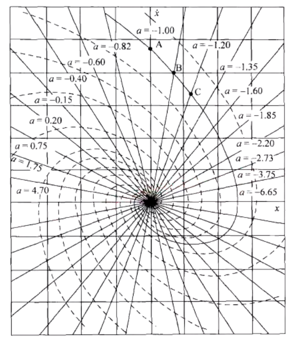​

## 二阶系统相轨迹

* $\ddot{x}+2\zeta \omega _n\dot{x}+{\omega _n}^2x=0$
* $\cfrac{\mathrm{d}\dot{x}}{\mathrm{d}x}=-\cfrac{{\omega _n}^2x+2\zeta \omega _n\dot{x}}{\dot{x}}$
* ​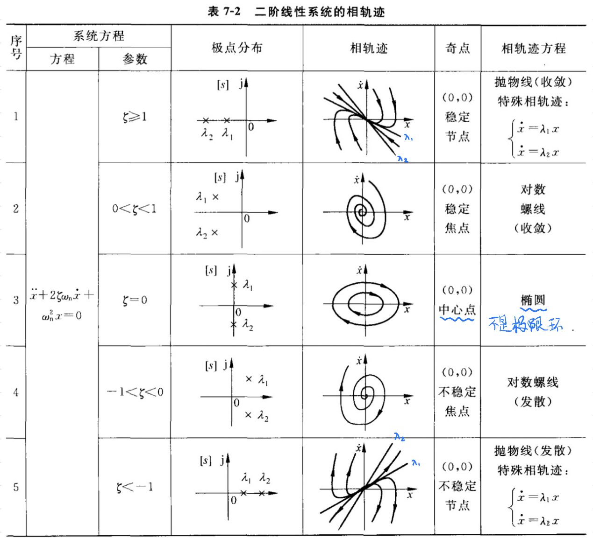​

  * $\lambda_2$ 绝对值更大，它更陡
  * 二阶零阻尼线性系统的相轨迹虽然是封闭椭圆，但它 **不是极限环**
  * 上图 重点记忆
* ​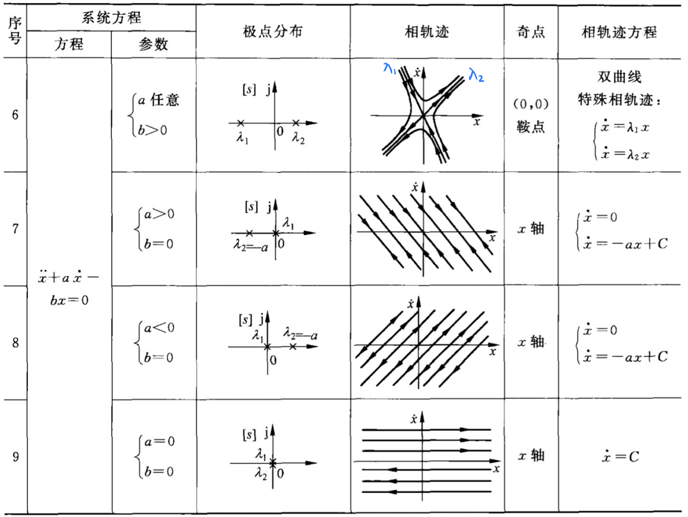​

  * 鞍点的记忆法

    * 在原点画两条交叉线
    * 在 $(x,\dot{x})$ 上半平面是 从左往右 指, 因为 $\dot{x}>0, x$ 递增
    * 在 $(x,\dot{x})$ 下半平面是 从右往左 指, 因为 $\dot{x}<0, x$ 递减

## 非本质非线性系统的相平面分析 (连续型非线性)

* 即 $(x,\dot{x})$ 是处处连续, 没有间断或分隔分区的

### 步骤

* 平衡点分析

  * 令导数项为 $0$ , 求 $x_e$
* 在平衡点处对系统进行线性化处理(略去高次项, 通常只保留一次项)

  * $x = \Delta x + x_e$
* 根据特征根分析平衡点处相轨迹

> 例: 试确定二阶非线性系统 $\ddot{x} - (1-x^2)\dot{x} + x-x^2=0$ 的平衡点和类型

* 平衡点分析, 令导数项为 $0$ , 求 $x_e$  

  * 令 $\dot{x}=\ddot{x} = 0, x-x^2 = 0\Rightarrow x_{e1} = 0, x_{e2} = 1$
* 在平衡点处进行线性化

  * 平衡点 $x_{e1} = 0$  

    * 令 $x = \Delta x + x_{e1}=\Delta x,$ 代入原方程得 $\Delta \ddot{x}-\left( 1-\left( \Delta x^2 \right) \right) \Delta \dot{x}+\Delta x-\Delta x^2=0$
    * $\Delta \ddot{x}-\Delta \dot{x}+\Delta x^2\Delta \dot{x}+\Delta x-\Delta x^2=0\xRightarrow{\text{略去高次项}}\Delta \ddot{x}-\Delta \dot{x}+\Delta x=0$
    * 对应特征方程 $r^2 - r + 1=0\Rightarrow \lambda_{1,2}=\cfrac{1}{2}\pm j\cfrac{\sqrt{3}}{2}$
    * 有正实部的复根, 对应不稳定焦点
  * 平衡点 $x_{e2} = 1$  

    * 令 $x=\Delta x + x_{e2} = \Delta x + 1$
    * $\Delta \ddot{x}-\left( 1-\left( \Delta x+1 \right) ^2 \right) \Delta \dot{x}+\Delta x+1-\left( \Delta x+1 \right) ^2=0$
    * $\Delta \ddot{x}-\Delta \dot{x}+\left( \Delta x^2+2\Delta x+1 \right) \Delta \dot{x}+\Delta x+1-\Delta x^2-2\Delta x-1=0$
    * $\Delta \ddot{x}-\Delta \dot{x}+\left( 2\Delta x+1 \right) \Delta \dot{x}+\Delta x+1-2\Delta x-1=0$
    * $\Delta \ddot{x}+2\Delta x\Delta \dot{x}-\Delta x=0$
    * $\Delta \ddot{x}-\Delta x=0$  

      * 略去高次项指的是只保留 $a\Delta \ddot{x} + b\Delta \dot{x} + c\Delta x = 0$ 的形式
      * 以便凑特征方程 $ar^2 + br + c= 0$
      * 无关的项全部略掉
    * 特征方程 $r^2 - 1 = 0\Rightarrow r_1 = 1, r_2 = -1$
    * 一正一负纯实根, 对应鞍点

## 本质非线性系统的相平面分析 (有不连续不光滑的地方)

* $(x,\dot{x})$ 是有分隔有分区的

### 步骤

* 根据开关线进行分段描述
* 在各个区域用线性的微分方程描述
* 分别绘制各个线性区域的相平面图
* 相邻区间的相轨迹衔接成连续的曲线

> 例: 试着确定下列方程的奇点及其类型, 绘制出奇点附近相轨迹大致图像.
>
> 1.  $\ddot{x} + x + \mathrm{sgn} \dot{x} = 0$​
> 2.  $\ddot{x} + |x| = 0$

#### (1)

* 根据开关线进行分段描述

  * $\begin{cases}\ddot{x}+x+1=0,\qquad \dot{x}>0\\\ddot{x}+x=0,\qquad \qquad \dot{x}=0\\\ddot{x}+x-1=0,\qquad \dot{x}<0\\\end{cases}$
* 对 $\dot{x} > 0$  

  * 求平衡点, 令导数项为 $\ddot{x}=0$  

    * $x_{e1} = -1$
  * 令 $x = \Delta x + x_{e1} = \Delta x - 1$  

    * $\Delta \ddot{x}+\Delta x-1+1=0$
    * 求特征方程 $r^2 + 1 = 0 \Rightarrow r = \pm j$
    * 纯虚根, 对应椭圆
* 对 $\dot{x} = 0$  

  * 在 $x$ 轴上
* 对 $\dot{x} < 0$  

  * 求平衡点, 令导数项 $\ddot{x} = 0$  

    * $x_{e2} = 1$
  * 令 $x=\Delta x + x_{e2} = \Delta x + 1$  

    * $\Delta \ddot{x}+\Delta x+1-1=0$
    * 求特征方程 $r^2 + 1 = 0 \Rightarrow r = \pm j$
    * 纯虚根, 对应椭圆
* 画出相平面图

  * 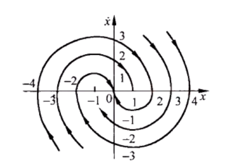​

#### (2)

* 分段描述

  * $\begin{cases}\ddot{x}+x=0\quad x\geqslant 0\\\ddot{x}-x=0\quad x\leqslant 0\\\end{cases}$
* 对 $x\geqslant 0$  

  * 求平衡点, 令导数项 $\ddot{x} = 0$  

    * $x_{e1}=0$
  * 令 $x = \Delta x + x_{e1} = \Delta x$  

    * $\Delta \ddot{x} + \Delta x = 0$
    * 特征方程 $r^2 + 1  = 0\Rightarrow r = \pm j$
    * 纯虚根, 椭圆, 中心点在 $(0,0)$
* 对 $x\leqslant 0$  

  * 求平衡点, 令导数项 $\ddot{x} = 0$  

    * $x_{e1}=0$
  * 令 $x = \Delta x + x_{e1} = \Delta x$  

    * $\Delta \ddot{x} - \Delta x = 0$
    * 特征方程 $r^2 - 1  = 0\Rightarrow r = \pm 1$
    * 一正一负纯实根, 鞍点
* 画出相平面图

  * 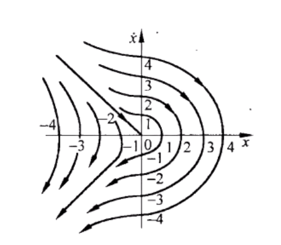​

## 非线性系统的相平面分析

* 根据线性环节、非线性环节、比较点, 列写各个变量数学关系
* 消去中间变量, 求相变量描述的系统方程
* 用**本质**非线性系统的相平面法分析

> 例: 系统结构图如图所示, 试着用等倾斜线法做出系统的 $x-\dot{x}$ 相平面图。系统参数 $K=T=M=h=1$  
> ​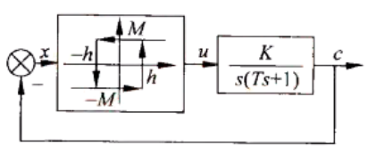​

* 对线性环节, 求输入与输出比

  * $\cfrac{C\left( s \right)}{U\left( s \right)}=\cfrac{K}{s\left( Ts+1 \right)}$
  * $\left( Ts^2+s \right) C\left( s \right) =KU\left( s \right)$
  * 变回微分方程 $T\ddot{c}+\dot{c}=Ku$
* 得到非线性环节的输入与输出关系

  * 根据回路部分 $x=-c$ 替换掉微分方程中的 $c$
  * $-T\ddot{x}-\dot{x}=Ku$
  * 整理得 $T\ddot{x} + \dot{x} = -Ku$
* 对非线性环节进行分段表达

  * $u=\begin{cases}M\begin{cases}x>h\\x>-h,\dot{x}<0\\\end{cases}\\-M\begin{cases}x<-h\\x<h,\dot{x}>0\\\end{cases}\\\end{cases}$
  * 在图上画出对应的分区, 并且分开表达

    * $T\ddot{x}+\dot{x}=-KM\quad \begin{cases}x>h\\x>-h,\dot{x}<0\\\end{cases}$
    * $T\ddot{x}+\dot{x}=KM\quad \begin{cases}x<-h\\x>h,\dot{x}>0\\\end{cases}$
  * 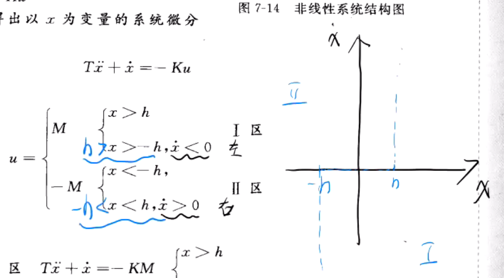​
  * 像上图一样分区
* 变换为 $\cfrac{\mathrm{d}\dot{x}}{\mathrm{d}x}=\alpha$  

  * 对(I)区而言

    * $T\ddot{x}+\dot{x}=T\frac{\mathrm{d}\dot{x}}{\mathrm{d}x}\dot{x}+\dot{x}=\left( T\frac{\mathrm{d}\dot{x}}{\mathrm{d}x}+1 \right) \dot{x}=-KM$
    * 令 $\cfrac{\mathrm{d}\dot{x}}{\mathrm{d}x}=\alpha$ 得 $\dot{x}=\cfrac{-KM}{T\alpha +1}$
* 作一个特殊的倾斜线即可, 即 $\alpha = 0$  

  * 对(I)区而言, $\alpha = 0, \dot{x} = -1$
  * 对(II)区而言, $\alpha = 0, \dot{x} = 1$
  * 上半平面的话 $x$ 往右走, 下班平面 $x$ 往左走
* 画出最终形态

  * ​

## 常见描述函数 $N\left(A\right)$ ( 重点记忆 部分)

|类型|非线性特性|描述函数 $N(A)$|负倒描述函数曲线 $\cfrac{-1}{N(A)}$|
| :------------------------------------------: | :----------------------------------------------------: | :---------: | :----------------------------------------------------: |
|饱和特性|​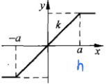​|$\cfrac{2k}{\pi}\left[ \,\, \arcsin \cfrac{\alpha}{A}+\cfrac{\alpha}{A}\sqrt{1-\left( \cfrac{a}{A} \right) ^2}\,\, \right] \quad (A\geqslant a)$|​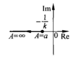​|
|理想继电器|​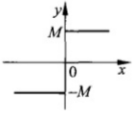​|$\cfrac{4M}{\pi A}$|​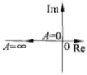​|
|死区继电特性|​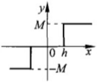​|$\cfrac{4M}{\pi A}\sqrt{1-\left(\cfrac{h}{A}\right) ^2} \quad (A\geqslant h)$|​​|
|滞环继电特性|​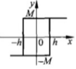​|$\cfrac{4M}{\pi A}\sqrt{1-\left( \cfrac{h}{A} \right) ^2}-j\cfrac{4Mh}{\pi A^2}\quad (A\geqslant h)$ |​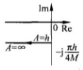​|

## 描述函数法应用条件

* 非线性系统结构图可以化为以下形式典型形式

  * 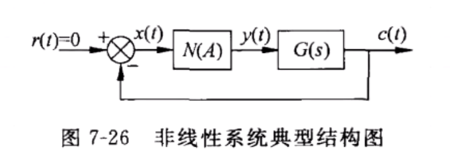​
  * 拿到题目 必须要化成以上形式 才能继续做题
* 非线性环节的输入输出特性

  * 奇对称 $y(-x) = -y(x)$
  * 正弦信号作用下的输出不包含常值分量
  * 基波分量幅值占优
* 线性部分具有良好的 低通滤波 性能

## 非线性系统稳定性分析

* 若 $G(j\omega)$ 不包围 $\cfrac{-1}{N(A)}$ 曲线, 则非线性 系统稳定
* 如果 $G(j\omega)$ 包围 $\cfrac{-a}{N(A)}$ 曲线, 则系统 不稳定
* 系统如果有包围的部分也有不包围的部分, 那就是不包围的部分是稳定的, 包围的部分是不稳定的
* 如果 $G(j\omega)$ 与 $\cfrac{-1}{N(A)}$ 有交点, 满足 $1+N(A)G(j\omega)=0$ 交点处非线性系统等幅周期运动

  * 如果能稳定持续下去, 那就是系统的自振

## 绘制 $\cfrac{-1}{N(A)}$ 曲线

* 以 $N(A) = \cfrac{4M}{\pi A}$ 为例

  * 写出负倒描述函数表达式 $\cfrac{-1}{N(A)} = \cfrac{-\pi A}{4M}$
  * 当 $A=0\to \infty$ 进行变化时, 逐点描绘 $-\cfrac{1}{N(A)}$
  * 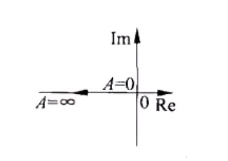​

## 自振分析

* 最小相角系统
* 对于 $\cfrac{-1}{N(A)}$ , 当 $A \uparrow$  

  * 穿入 $G(j\omega)$  

    * 不是自振点
  * 穿出 $G(j\omega)$  

    * 是自振点
  * 相切 $G(j\omega)$  

    * 对应半稳定的周期运动

## 求自振点模值和频率

* 自振条件 $N(A)G(j\omega) = -1$

> 例: 如图所示非线性系统, $M=1, K=10,$ 试分析系统的稳定性, 如果系统存在自振, 确定自振参数  
> ​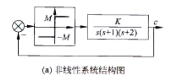​

* 传递函数 $G\left( s \right) =\cfrac{10}{s\left( s+1 \right) \left( s+2 \right)}$
* 理想继电器特性描述函数 $N(A) = \cfrac{4M}{\pi A} = \cfrac{4}{\pi A}$
* 画出 $G(j\omega)$ 曲线与 $\cfrac{-1}{N(A)}$ 曲线

  * 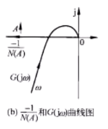​
* 自振分析

  * 当 $A$ 增大时候 $\cfrac{-1}{N(A)}$ 穿出 $G(j\omega)$
  * 是自振点
* 自振条件 $N(A)G(j\omega) = -1$  

  * $\cfrac{4}{\pi A}\cfrac{10}{j\omega \left( j\omega +1 \right) \left( j\omega +2 \right)}=-1$
  * $\frac{40}{\pi A}=-j\omega \left( 1+j\omega \right) \left( 2+j\omega \right) =3\omega ^2-j\omega \left( 2-\omega ^2 \right)$
  * 左右对比实部和虚部得到

    * $3\omega^2 = \cfrac{40}{\pi A}$
    * $-\omega (2-\omega^2) = 0$
  * 解得 $\omega = \sqrt{2}, A = \cfrac{40}{3\pi \omega^2} = \cfrac{20}{3\pi} =2.12207$

> 例: 如图所示非线性系统, $M=1$ ,要使系统产生 $\omega=1, A=4$ 的周期信号, 求参数 $K,\tau$  
>
> 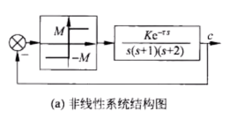​

* 自振条件 $N\left( A \right) G\left( j\omega \right) =-1\Rightarrow N\left( A \right) G\left( j\omega \right) e^{-j\tau \omega}=-1$
* 分离虚部和实部

  * $\cfrac{4M}{\pi A}\cfrac{Ke^{-j\omega \tau}}{j\omega \left( 1+j\omega \right) \left( 2+j\omega \right)}=-1$
  * $\cfrac{4MKe^{-j\omega \tau}}{\pi A}=3\omega ^2-j\omega \left( 2-\omega ^2 \right)=\omega \sqrt{4+5\omega ^2+\omega ^4}\angle \left( -\mathrm{arc}\tan \frac{2-\omega ^2}{3\omega} \right)$
* 代入参数 $M=1, A=4, \omega = 1$ , 对比 模 和 相角

  * $\begin{aligned}\frac{K}{\pi}&=\sqrt{10}\\\tau &=\arctan \frac{1}{3}\\ \end{aligned}$

‍
