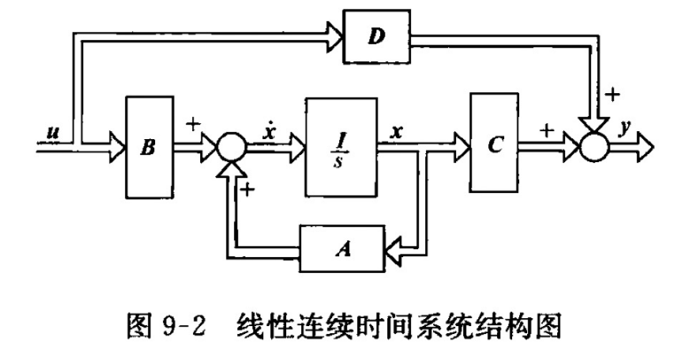
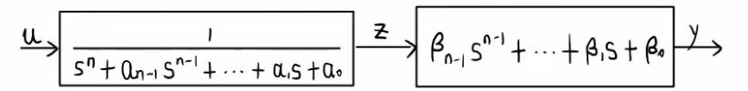
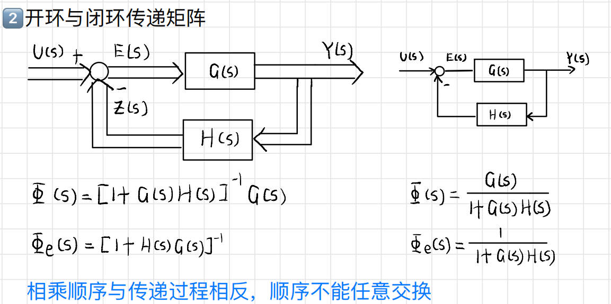
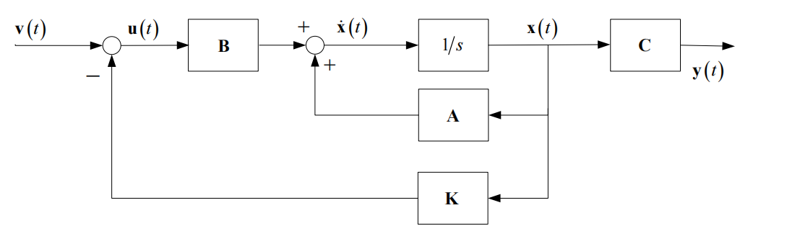
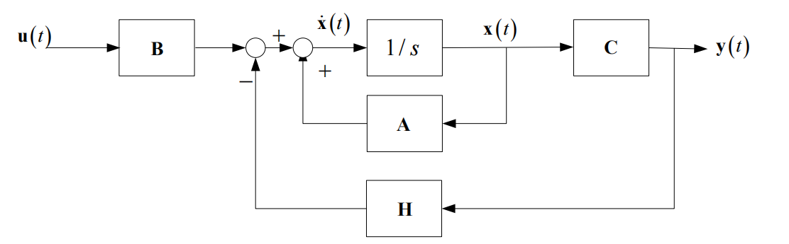
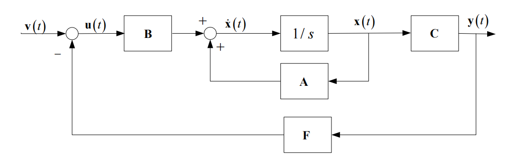
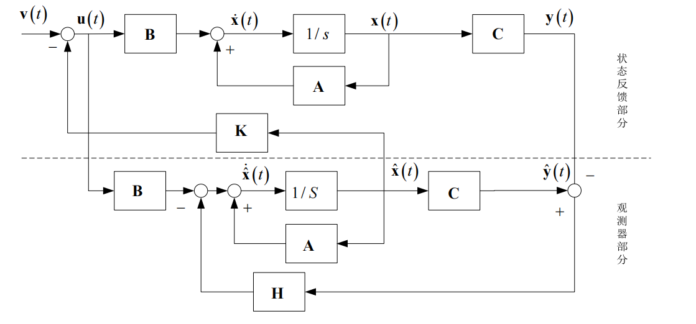
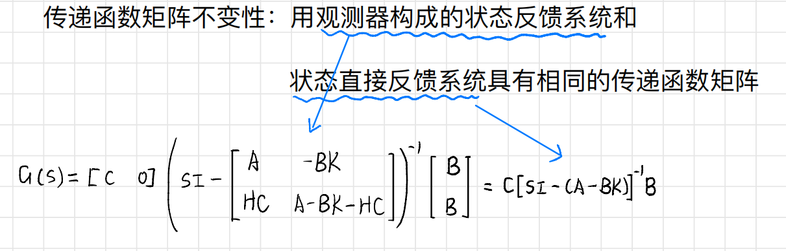
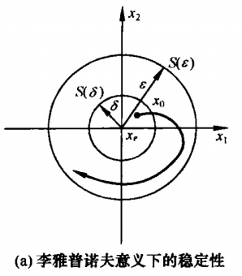
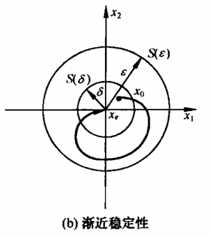

# 9 - 现代控制理论

## 系统数学描述的两种基本类型

### 线性系统状态空间表达式

* 状态方程: $\dot{x}\left( t \right) =Ax\left( t \right) +Bu\left( t \right)$
* 输出方程: $y\left( t \right) =C\left( t \right) x\left( t \right) +D\left( t \right) u\left( t \right)$

### 离散系统状态空间表达式 (几乎不会考)

* 状态方程: $x\left( k+1 \right) =G\left( k \right) x\left( k \right) +H\left( k \right) u\left( k \right)$
* 输出方程: $y\left( k \right) =C\left( k \right) x\left( k \right) +D\left( k \right) u\left( k \right)$

### 矩阵解释

* $A\left( t \right) ,G\left( k \right)$ : 系统矩阵、状态 矩阵
* $B\left( t \right) ,H\left( k \right)$ : 控制矩阵、输入 矩阵
* $C\left( t \right) ,C\left( k \right)$ : 观测 矩阵、输出 矩阵
* $D\left( t \right) ,D\left( k \right)$ : 前馈 矩阵、输入输出矩阵

### 线性连续时间系统结构图

* ​

状态变量选取 不唯一

当 $\color{RoyalBlue}D \equiv 0$ 时, 系统称为 绝对固有 矩阵, 否则称为 固有 系统

## 线性定常连续系统的状态空间表达式建立

### 直接法

根据系统的机理建立微分方程或差分方程

### 间接法

#### 微分方程 $\Rightarrow$ 状态空间表达式

##### 输入量(等式右边) 不含导数项, 单输入 $\Leftrightarrow$ 单输出, 线性定常, 即 $y^{(n)}+a_{n-1}y^{(n-1)}+a_{n-2}y^{(n-2)}+\cdots +a_1\dot{y}+a_0y=\beta _0 \color{YellowGreen}u$

* 根据 $\left\{ \begin{aligned}	\dot{x}&=Ax+bu\\	y&=Cx+0u\\\end{aligned} \right.$ 建立状态空间表达式

  * $\begin{aligned}	\left[ \begin{array}{c}	\dot{x}_1\\	\dot{x}_2\\	\vdots\\	\dot{x}_{n-1}\\	\dot{x}_n\\\end{array} \right] &=\left[ \begin{matrix}	0&		1&		0&		\cdots&		0\\	0&		0&		1&		\cdots&		0\\	\vdots&		\vdots&		\vdots&		\ddots&		\vdots\\	0&		0&		0&		\cdots&		1\\	-a_0&		-a_1&		-a_2&		\cdots&		-a_{n-1}\\\end{matrix} \right] \left[ \begin{array}{c}	x_1\\	x_2\\	\vdots\\	x_{n-1}\\	x_n\\\end{array} \right] +\left[ \begin{array}{c}	0\\	0\\	\vdots\\	0\\	\beta _0\\\end{array} \right] u\\	y&=\left[ \begin{matrix}	1&		0&		\cdots&		0&		0\\\end{matrix} \right] \left[ \begin{array}{c}	x_1\\	x_2\\	\vdots\\	x_{n-1}\\	x_n\\\end{array} \right]\\\end{aligned}$​

###### 推导

* 根据式子 $y^{(n)}+a_{n-1}y^{(n-1)}+a_{n-2}y^{(n-2)}+\cdots +a_1\dot{y}+a_0y=\beta _0 u$ , 左边仅保留 $y^{(n)}$ , 其他部分全部移项到右边

  * $y^{(n)}=\beta _0u-a_{n-1}y^{(n-1)}-a_{n-2}y^{(n-2)}-\cdots -a_1\dot{y}-a_0y$
* 设中间变量 $\left\{ \begin{aligned}	x_1&=y\\	x_2&=\dot{y}\\	x_3&=\ddot{y}\\	&\vdots\\	x_{n-1}&=y^{(n-2)}\\	x_n&=y^{(n-1)}\\\end{aligned} \right.$, 对中间变量求导 $\left\{ \begin{aligned}	\dot{x}_1&=\dot{y}\\	\dot{x}_2&=\ddot{y}\\	\dot{x}_3&=y^{(3)}\\	&\vdots\\	\dot{x}_{n-1}&=y^{(n-1)}\\	\dot{x}_n&=y^{(n)}\\\end{aligned} \right.$,匹配两个式子 相等的项 得 $\left\{ \begin{aligned}	\dot{x}_1&=\dot{y}=x_2\\	\dot{x}_2&=\ddot{y}=x_3\\	\dot{x}_3&=y^{(3)}=x_4\\	&\vdots\\	\dot{x}_{n-1}&=y^{(n-1)}=x_n\\	\dot{x}_n&=y^{(n)}\\\end{aligned} \right.$
* 根据中间变量得到 $\dot{x_n} = y^{(n)}=\beta _0u-a_{n-1}y^{(n-1)}-a_{n-2}y^{(n-2)}-\cdots -a_1\dot{y}-a_0y$ , 最后得到式子 $\left\{ \begin{aligned}	\dot{x}_1&=\dot{y}=x_2\\	\dot{x}_2&=\ddot{y}=x_3\\	\dot{x}_3&=y^{(3)}=x_4\\	&\vdots\\	\dot{x}_{n-1}&=y^{(n-1)}=x_n\\	\dot{x}_n&=y^{(n)}=\beta _0u-a_{n-1}y^{(n-1)}-a_{n-2}y^{(n-2)}-\cdots -a_1\dot{y}-a_0y\\\end{aligned} \right.$
* 按照 $\left\{ \begin{aligned}	\dot{x}&=Ax+bu\\	y&=Cx+0u\\\end{aligned} \right.$ 格式进行矩阵的建立

  * $\left[ \begin{array}{c}	\dot{x}_1\\	\dot{x}_2\\	\vdots\\	\dot{x}_{n-1}\\	\dot{x}_n\\\end{array} \right] =\left[ \begin{matrix}	0&		1&		0&		\cdots&		0\\	0&		0&		1&		\cdots&		0\\	\vdots&		\vdots&		\vdots&		\ddots&		\vdots\\	0&		0&		0&		\cdots&		1\\	-a_0&		-a_1&		-a_2&		\cdots&		-a_{n-1}\\\end{matrix} \right] \left[ \begin{array}{c}	x_1\\	x_2\\	\vdots\\	x_{n-1}\\	x_n\\\end{array} \right] +\left[ \begin{array}{c}	0\\	0\\	\vdots\\	0\\	\beta _0\\\end{array} \right] u$
* 因为设的中间变量是 $x_1=y$ , 所以输出方程得

  * $y=\left[ \begin{matrix}	1&		0&		\cdots&		0&		0\\\end{matrix} \right] \left[ \begin{array}{c}	x_1\\	x_2\\	\vdots\\	x_{n-1}\\	x_n\\\end{array} \right]$

> 例: 已知系统微分方程为 $y^{\prime\prime\prime}+2y^{\prime\prime}+3y^{\prime}+4y=u$ , 求系统状态空间表达式

* 设中间变量 $\left\{ \begin{aligned}	x_1&=y\\	x_2&=y^{\prime}\\	x_3&=y^{\prime\prime}\\\end{aligned} \right.$ , 对中间变量求导得 $\left\{ \begin{aligned}	{x_1}^{\prime}&=y^{\prime}=x_2\\	{x_2}^{\prime}&=y^{\prime\prime}=x_3\\	{x_3}^{\prime}&=y^{\prime\prime\prime}=u-2x_3-3x_2-4x_1\\\end{aligned} \right.$
* 按照 $\left\{ \begin{aligned}	\dot{x}&=Ax+bu\\	y&=Cx+0u\\\end{aligned} \right.$ 格式列写结果

  * $\begin{aligned}	\left[ \begin{array}{c}	\dot{x}_1\\	\dot{x}_2\\	\dot{x}_3\\\end{array} \right] &=\left[ \begin{matrix}	0&		1&		0\\	0&		0&		1\\	-4&		-3&		-2\\\end{matrix} \right] \left[ \begin{array}{c}	x_1\\	x_2\\	x_3\\\end{array} \right] +\left[ \begin{array}{c}	0\\	0\\	1\\\end{array} \right] u\\	y&=\left[ \begin{matrix}	1&		0&		0\\\end{matrix} \right] \left[ \begin{array}{c}	x_1\\	x_2\\	x_3\\\end{array} \right]\\\end{aligned}$

##### 输入项(等式右边) 含有导数项 , 单数入 $\Leftrightarrow$ 单输出, 线性定常, 即 $y^n+a_{n-1}y^{(n-1)}+a_{n-2}y^{(n-2)}+\cdots +a_1\dot{y}+a_0y=b_m \textcolor{yellowgreen}u^{(m)}+b_{m-1}\textcolor{yellowgreen}u^{(m-1)}+b_{m-2}\textcolor{yellowgreen}u^{(m-2)}+\cdots +b_1 \dot{ \textcolor{yellowgreen}u}+b_0u$

* 一般要求输入的阶次 小于 或 等于 输出的阶次, 即 $m\leqslant n$​

###### 当 $b_n \neq 0$ 时, 即输入与输出阶次​ 相同

* 利用中间变量进行替换

  * $\left\{ \begin{aligned}	h_0&=b_n\\	h_1&=b_{n-1}-a_{n-1}h_0\\	h_2&=b_{n-2}-a_{n-1}h_1-a_{n-2}h_0\\	\vdots\\	h_{n-1}&=b_1-a_{n-1}h_{n-2}-a_{n-2}h_{n-3}-\cdots -a_1h_0\\	h_n&=b_0-a_{n-1}h_{n-1}-a_{n-2}h_{n-2}-\cdots -a_1h_0-a_0h_0\\\end{aligned} \right.$
* 根据 $\left\{ \begin{aligned}	\dot{x}&=Ax+bu\\	y&=Cx+du\\\end{aligned}\qquad d=h_0=b_n \right.$ 列写状态空间表达式

  * $\begin{aligned}	\left[ \begin{array}{c}	\dot{x}_1\\	\dot{x}_2\\	\vdots\\	\dot{x}_{n-1}\\	\dot{x}_n\\\end{array} \right] &=\left[ \begin{matrix}	0&		1&		0&		\cdots&		0\\	0&		0&		1&		\cdots&		0\\	\vdots&		\vdots&		\vdots&		\ddots&		\vdots\\	0&		0&		0&		\cdots&		1\\	-a_0&		-a_1&		-a_2&		\cdots&		-a_{n-1}\\\end{matrix} \right] \left[ \begin{array}{c}	x_1\\	x_2\\	\vdots\\	x_{n-1}\\	x_n\\\end{array} \right] +\left[ \begin{array}{c}	h_1\\	h_2\\	\vdots\\	h_{n-1}\\	h_n\\\end{array} \right] u\\	y&=\left[ \begin{matrix}	1&		0&		\cdots&		0&		0\\\end{matrix} \right] \left[ \begin{array}{c}	x_1\\	x_2\\	\vdots\\	x_{n-1}\\	x_n\\\end{array} \right]\\\end{aligned}$

> 例: 已知系统微分方程为 $\ddot{y}+2\zeta \omega \dot{y}+\omega ^2y=T\dot{u}+u$ , 求系统状态空间表达式

* 右边有导数项, 使用公式进行分解
* 列出系数 $\left\{ \begin{aligned}	a_0&=\omega ^2\\	a_1&=2\zeta \omega\\\end{aligned} \right. \qquad \left\{ \begin{aligned}	b_0&=1\\	b_1&=T\\\end{aligned} \right.$
* 计算中间变量 $\left\{ \begin{aligned}	h_0&=b_n=T\\	h_1&=b_{n-1}-a_{n-1}h_0=b_0-a_0h_0=1-\omega ^2T\\\end{aligned} \right.$
* 按照格式列写状态空间表达式

  * $\begin{aligned}	\left[ \begin{array}{c}	\dot{x}_1\\	\dot{x}_2\\\end{array} \right] &=\left[ \begin{matrix}	0&		1\\	-\omega ^2&		-2\zeta \omega\\\end{matrix} \right] \left[ \begin{array}{c}	x_1\\	x_2\\\end{array} \right] +\left[ \begin{array}{c}	T\\	1-\omega ^2T\\\end{array} \right] u\\	y&=\left[ \begin{matrix}	1&		0\\\end{matrix} \right] \left[ \begin{array}{c}	x_1\\	x_2\\\end{array} \right]\\\end{aligned}$

###### 当 $b_n=0$ 时, 即输入阶次 小于 输出阶次

* 方法 1: 将上一个方法中的 $b_n=h_0=0$ 即可得到结果
* 方法 2: 倒挂式

  * 令 $\left\{ \begin{aligned}	x_n&=y\\	x_i&=\dot{x}_{i+1}+a_iy-b_iu\qquad i=1,2,\cdots ,n-1\\\end{aligned} \right.$
  * 计算状态空间表达式

    * $\left[ \begin{array}{c}	\dot{x}_1\\	\dot{x}_2\\	\dot{x}_3\\	\vdots\\	\dot{x}_n\\\end{array} \right] =\left[ \begin{matrix}	0&		0&		\cdots&		0&		-a_0\\	1&		0&		\cdots&		0&		-a_1\\	0&		1&		\cdots&		0&		-a_2\\	\vdots&		\vdots&		\ddots&		\vdots&		\vdots\\	0&		0&		\cdots&		1&		-a_{n-1}\\\end{matrix} \right] \left[ \begin{array}{c}	x_1\\	x_2\\	x_3\\	\vdots\\	x_n\\\end{array} \right] +\left[ \begin{array}{c}	b_0\\	b_1\\	b_2\\	\vdots\\	b_{n-1}\\\end{array} \right] u$
  * 根据 $\left\{ \begin{aligned}	\dot{x}&=Ax+bu\\	y&=Cx+0u\\\end{aligned} \right.$ 得

    * $y=\left[ \begin{matrix}	0&		0&		\cdots&		0&		1\\\end{matrix} \right] \left[ \begin{array}{c}	x_1\\	x_2\\	\vdots\\	x_{n-1}\\	x_n\\\end{array} \right]$

> 例: 已知系统微分方程为 $\ddot{y}+2\zeta \omega \dot{y}+\omega ^2y=T\dot{u}+u$ , 求系统状态空间表达式

* 列出系数 $\left\{ \begin{aligned}	a_0&=\omega ^2\\	a_1&=2\zeta \omega\\\end{aligned} \right. \qquad \left\{ \begin{aligned}	b_0&=1\\	b_1&=T\\\end{aligned} \right.$
* 直接套公式

  * $\begin{aligned}	\left[ \begin{array}{c}	\dot{x}_1\\	\dot{x}_2\\\end{array} \right] &=\left[ \begin{matrix}	0&		-\omega ^2\\	1&		-2\zeta \omega\\\end{matrix} \right] \left[ \begin{array}{c}	x_1\\	x_2\\\end{array} \right] +\left[ \begin{array}{c}	1\\	T\\\end{array} \right] u\\	y&=\left[ \begin{matrix}	0&		1\\\end{matrix} \right] \left[ \begin{array}{c}	x_1\\	x_2\\\end{array} \right]\\\end{aligned}$

#### 传递函数 $\Rightarrow$ 状态空间表达式

* 状态变量的 选取非唯一 $\Rightarrow$ 同一个传递函数的 实现 也 非唯一

##### 常见矩阵形式

* 可控标准型 (能控标准型)[^1]
* 可观标准型 (能观标准型)[^2]
* 对角标准型 (Diagonal)[^3]
* 约旦标准型 (Jordan)[^4]

##### 严格有理真分式

假设传递函数 $G\left( s \right) =\cfrac{Y\left( s \right)}{U\left( s \right)}=\cfrac{b_ns^n+b_{n-1}s^{n-1}+b_{n-2}s^{n-2}+\cdots +b_1s+b_0}{s^n+a_{n-1}s^{n-1}+a_{n-2}s^{n-2}+\cdots +a_1s+a_0}$

* 分子与分母同阶, 需要进行 长除法 使得式子变为 严格有理真分式 , 即分母阶次 大于 分子阶次

  * $G\left( s \right) =b_n+\cfrac{\beta _{n-1}s^{n-1}+\beta _{n-2}s^{n-2}+\cdots +\beta _1s+\beta _0}{s^n+a_{n-1}s^{n-1}+a_{n-2}s^{n-2}+\cdots +a_1s+a_0}\xlongequal{\Delta}b_n+\cfrac{N\left( s \right)}{D\left( s \right)}$
* 等价为 $b_n + \cfrac{N(s)}{D(s)}$ 后, 取出 $\cfrac{N(s)}{D(s)}$ , 它是 严格有理真分式

##### 串联分解法

对 $\cfrac{N(s)}{D(s)} = \cfrac{\beta _{n-1}s^{n-1}+\beta _{n-2}s^{n-2}+\cdots +\beta _1s+\beta _0}{s^n+a_{n-1}s^{n-1}+a_{n-2}s^{n-2}+\cdots +a_1s+a_0}$ 进行串联分解

* $\cfrac{N(s)}{D(s)}=\cfrac{1}{s^n+a_{n-1}s^{n-1}+a_{n-2}s^{n-2}+\cdots +a_1s+a_0}\left( \beta _{n-1}s^{n-1}+\beta _{n-2}s^{n-2}+\cdots +\beta _1s+\beta _0 \right)$
* 引入中间变量 $z$
* ​​
* 使得原本的分子和分母直接组合的形式变成拆开的形式, 即

  * $\begin{aligned}	\cfrac{Z\left( s \right)}{U\left( s \right)}&=\cfrac{1}{s^n+a_{n-1}s^{n-1}+a_{n-2}s^{n-2}+\cdots +a_1s+a_0} \Rightarrow Z\left( s \right) \left( s^n+a_{n-1}s^{n-1}+a_{n-2}s^{n-2}+\cdots +a_1s+a_0 \right) =U\left( s \right) \\	\cfrac{Y\left( s \right)}{Z\left( s \right)}&=\beta _{n-1}s^{n-1}+\beta _{n-2}s^{n-2}+\cdots +\beta _1s+\beta _0 \Rightarrow Y\left( s \right) =\left( \beta _{n-1}s^{n-1}+\beta _{n-2}s^{n-2}+\cdots +\beta _1s+\beta _0 \right) Z\left( s \right) \\\end{aligned}$

* 进行 Laplace 反变换得到

  * $z^{\left( n \right)}+a_{n-1}z^{\left( n-1 \right)}+a_{n-2}z^{\left( n-2 \right)}+\cdots +a_1\dot{z}+a_0z=u$
  * $y=\beta _{n-1}z^{n-1}+\beta _{n-2}z^{n-2}+\cdots +\beta _1z+\beta _0$
* 对 $z^{\left( n \right)}+a_{n-1}z^{\left( n-1 \right)}+a_{n-2}z^{\left( n-2 \right)}+\cdots +a_1\dot{z}+a_0z=u$ 而言, 可以观察得右边输入无导数项, 套公式求解

  * $\left[ \begin{array}{c}	\dot{x}_1\\	\dot{x}_2\\	\vdots\\	\dot{x}_{n-1}\\	\dot{x}_n\\\end{array} \right] =\left[ \begin{matrix}	0&		1&		0&		\cdots&		0\\	0&		0&		1&		\cdots&		0\\	\vdots&		\vdots&		\vdots&		\ddots&		\vdots\\	0&		0&		0&		\cdots&		1\\	-a_0&		-a_1&		-a_2&		\cdots&		-a_{n-1}\\\end{matrix} \right] \left[ \begin{array}{c}	x_1\\	x_2\\	\vdots\\	x_{n-1}\\	x_n\\\end{array} \right] +\left[ \begin{array}{c}	0\\	0\\	\vdots\\	0\\	1\\\end{array} \right] u$
* 对输出 $y=\beta _{n-1}z^{\left( n-1 \right)}+\beta _{n-2}z^{\left( n-2 \right)}+\cdots +\beta _1\dot{z}+\beta _0z$ 而言

  * 因为由上式得到

    * $\left\{ \begin{aligned}	x_1&=z\\	x_2&=\dot{z}\\	x_3&=\ddot{z}\\	\vdots\\	x_n&=z^{\left( n-1 \right)}\\\end{aligned} \right.$
  * 因此

    * $\begin{aligned}	y&=\beta _{n-1}x_n+\beta _{n-2}x_{n-1}+\cdots +\beta _1x_2+\beta _0x_1\\	&=\left[ \begin{matrix}	\beta _0&		\beta _1&		\cdots&		\beta _{n-2}&		\beta _{n-1}\\\end{matrix} \right] \left[ \begin{array}{c}	x_1\\	x_2\\	\vdots\\	x_{n-1}\\	x_n\\\end{array} \right]\\\end{aligned}$
* 因此最终的结果为 $\left\{ \begin{aligned}	\dot{x}&=Ax+Bu\\	y&=Cx+Du\\\end{aligned} \right.$

  * $\begin{aligned}	\left[ \begin{array}{c}	\dot{x}_1\\	\dot{x}_2\\	\vdots\\	\dot{x}_{n-1}\\	\dot{x}_n\\\end{array} \right] &=\left[ \begin{matrix}	0&		1&		0&		\cdots&		0\\	0&		0&		1&		\cdots&		0\\	\vdots&		\vdots&		\vdots&		\ddots&		\vdots\\	0&		0&		0&		\cdots&		1\\	-a_0&		-a_1&		-a_2&		\cdots&		-a_{n-1}\\\end{matrix} \right] \left[ \begin{array}{c}	x_1\\	x_2\\	\vdots\\	x_{n-1}\\	x_n\\\end{array} \right] +\left[ \begin{array}{c}	0\\	0\\	\vdots\\	0\\	1\\\end{array} \right] u\\	y&=\left[ \begin{matrix}	\beta _0&		\beta _1&		\cdots&		\beta _{n-2}&		\beta _{n-1}\\\end{matrix} \right] \left[ \begin{array}{c}	x_1\\	x_2\\	\vdots\\	x_{n-1}\\	x_n\\\end{array} \right] +b_nu\\\end{aligned}$
  * $D$ 矩阵与 $b_n$ 有关, 如果 $b_n=0$, 那么 $D=O$, 即零矩阵

##### 可控标准型 (能控标准型)

* 给出传递函数 $G\left( s \right)  = \cfrac{\beta _{n-1}s^{n-1}+\beta _{n-2}s^{n-2}+\cdots +\beta _1s+\beta _0}{s^n+a_{n-1}s^{n-1}+a_{n-2}s^{n-2}+\cdots +a_1s+a_0}$
* 按照 $\left\{ \begin{aligned}	\dot{x}&=Ax+Bu\\	y&=Cx+Du\\\end{aligned} \right.$ 的形式写出

  * $\begin{aligned}	\left[ \begin{array}{c}	\dot{x}_1\\	\dot{x}_2\\	\vdots\\	\dot{x}_{n-1}\\	\dot{x}_n\\\end{array} \right] &=\left[ \begin{matrix}	0&		1&		0&		\cdots&		0\\	0&		0&		1&		\cdots&		0\\	\vdots&		\vdots&		\vdots&		\ddots&		\vdots\\	0&		0&		0&		\cdots&		1\\	-a_0&		-a_1&		-a_2&		\cdots&		-a_{n-1}\\\end{matrix} \right] \left[ \begin{array}{c}	x_1\\	x_2\\	\vdots\\	x_{n-1}\\	x_n\\\end{array} \right] +\left[ \begin{array}{c}	0\\	0\\	\vdots\\	0\\	1\\\end{array} \right] u\\	y&=\left[ \begin{matrix}	\beta _0&		\beta _1&		\cdots&		\beta _{n-2}&		\beta _{n-1}\\\end{matrix} \right] \left[ \begin{array}{c}	x_1\\	x_2\\	\vdots\\	x_{n-1}\\	x_n\\\end{array} \right] +b_nu\\\end{aligned}$
* 以上这种形式叫做 可控标准型

##### 可观标准型 (能观标准型)

* 给出传递函数 $G\left( s \right)  = \cfrac{\beta _{n-1}s^{n-1}+\beta _{n-2}s^{n-2}+\cdots +\beta _1s+\beta _0}{s^n+a_{n-1}s^{n-1}+a_{n-2}s^{n-2}+\cdots +a_1s+a_0}$
* 对可控标准型进行转置成以下结果

  * $\begin{aligned}	\left[ \begin{array}{c}	\dot{x}_1\\	\dot{x}_2\\	\vdots\\	\dot{x}_{n-1}\\	\dot{x}_n\\\end{array} \right] &=\left[ \begin{matrix}	0&		0&		\cdots&		0&		-a_0\\	1&		0&		\cdots&		0&		-a_1\\	0&		1&		\cdots&		0&		-a_2\\	\vdots&		\vdots&		\ddots&		\vdots&		\vdots\\	0&		0&		\cdots&		1&		-a_{n-1}\\\end{matrix} \right] \left[ \begin{array}{c}	x_1\\	x_2\\	\vdots\\	x_{n-1}\\	x_n\\\end{array} \right] +\left[ \begin{array}{c}	\beta _0\\	\beta _1\\	\vdots\\	\beta _{n-2}\\	\beta _{n-1}\\\end{array} \right] u\\	y&=\left[ \begin{matrix}	0&		0&		\cdots&		0&		1\\\end{matrix} \right] \left[ \begin{array}{c}	x_1\\	x_2\\	\vdots\\	x_{n-1}\\	x_n\\\end{array} \right] +b_nu\\\end{aligned}$
* 长这样的矩阵称为 可观标准型

##### 可控标准型与可观标准型各个矩阵的关系: $\begin{matrix}	A_c={A_o}^{\top}&		B_c={C_o}^{\top}&		C_c={B_o}^{\top}\\\end{matrix}$

* 基本就是对分块矩阵 $\left\{ \begin{aligned}	\dot{x}&=Ax+Bu\\	y&=Cx+Du\\\end{aligned} \right.$ 从 $\dot{x}$ 画一条斜线到 $D$, 然后关于斜线作转置
* 或者利用分块矩阵的转置: $\left[ \begin{matrix}	A_c&		B_c\\	C_c&		D_c\\\end{matrix} \right] ^{\top}=\left[ \begin{matrix}	{A_c}^{\top}&		{C_c}^{\top}\\	{B_c}^{\top}&		{D_c}^{\top}\\\end{matrix} \right] =\left[ \begin{matrix}	A_o&		B_o\\	C_o&		D_o\\\end{matrix} \right]$

  * 下标 $c$ 意为: control , 对应可 控 标准型
  * 下标 $o$ 意为: observe , 对应可 观 标准型

##### 对角标准型 (Diagonal)

* 当 $\cfrac{N(s)}{D(s)}$ 只含单实极点, 即 $\cfrac{N\left( s \right)}{D\left( s \right)}=\sum\limits_{i=1}^n{\cfrac{c_i}{s-\lambda _i}}$

  * 可以用留数法把整个式子拆开, $c_i$ 就是极点在 $\lambda_i$ 处的留数
  * 矩阵就可以写成

    * $\begin{aligned}	\left[ \begin{array}{c}	\dot{x}_1\\	\dot{x}_2\\	\vdots\\	\dot{x}_{n-1}\\	\dot{x}_n\\\end{array} \right] &=\left[ \begin{matrix}	\lambda _1&		&		&		&		\\	&		\lambda _2&		&		&		\\	&		&		\ddots&		&		\\	&		&		&		\lambda _{n-1}&		\\	&		&		&		&		\lambda _n\\\end{matrix} \right] \left[ \begin{array}{c}	x_1\\	x_2\\	\vdots\\	x_{n-1}\\	x_n\\\end{array} \right] +\left[ \begin{array}{c}	1\\	1\\	1\\	1\\	1\\\end{array} \right] u\\	y&=\left[ \begin{matrix}	c_1&		c_2&		\cdots&		c_{n-1}&		c_n\\\end{matrix} \right] \left[ \begin{array}{c}	x_1\\	x_2\\	\vdots\\	x_{n-1}\\	x_n\\\end{array} \right]\\\end{aligned}$

##### 约旦标准型 (Jordan)

* 当 $\cfrac{N(s)}{D(s)}$ 含重实数根

  * 假设有个三重实极点 $D\left( s \right) =\left( s-\lambda _1 \right) ^3\left( s-\lambda _4 \right) \cdots \left( s-\lambda _n \right)$, 那么就可以分解成以下形式

    * $\cfrac{N\left( s \right)}{D\left( s \right)}=\cfrac{c_{11}}{\left( s-\lambda _1 \right) ^3}+\cfrac{c_{12}}{\left( s-\lambda _2 \right) ^2}+\cfrac{c_{13}}{\left( s-\lambda _1 \right)}+\sum\limits_{i=4}^n{\cfrac{c_i}{s-\lambda _i}}$
  * 按照格式可以写出矩阵

    * $\begin{aligned}	\left[ \begin{array}{c}	\dot{x}_{11}\\	\dot{x}_{12}\\	\dot{x}_{13}\\	\dot{x}_4\\	\vdots\\	\dot{x}_n\\\end{array} \right] &=\left[ \begin{matrix}	\lambda _1&		1&		&		&		&		\\	&		\lambda _1&		1&		&		&		\\	&		&		\lambda _1&		&		&		\\	&		&		&		\lambda _4&		&		\\	&		&		&		&		\ddots&		\\	&		&		&		&		&		\lambda _n\\\end{matrix} \right] \left[ \begin{array}{c}	x_{11}\\	x_{12}\\	x_{13}\\	x_4\\	\vdots\\	x_n\\\end{array} \right] +\left[ \begin{array}{c}	0\\	0\\	1\\	1\\	\vdots\\	1\\\end{array} \right] u\\	y&=\left[ \begin{matrix}	c_{11}&		c_{12}&		c_{13}&		c_4&		\cdots&		c_n\\\end{matrix} \right] \left[ \begin{array}{c}	x_{11}\\	x_{12}\\	x_{13}\\	x_4\\	\vdots\\	x_n\\\end{array} \right]\\\end{aligned}$
  * 其中出现了 Jordan 块, 即 $\left[ \begin{matrix}	\lambda _1&		1&		0\\	0&		\lambda _1&		1\\	0&		0&		\lambda _1\\\end{matrix} \right]$, 对应的 $B$ 矩阵是 $\left[ \begin{array}{c}	0\\	0\\	1\\\end{array} \right]$, 只有最后一行是 $1$
* Jordan 块的特征

  * 如果有 $n$ 重根, 那么 Jordan 块的维度可以是 $n\times n$ 或 $1\times1$

    * 即 Jordan 块仅仅只是一个重复出现的特征值, 比如 $\left[ \begin{matrix}	\lambda _4&		&		\\	&		\lambda _4&		\\	&		&		\lambda _4\\\end{matrix} \right] \Leftrightarrow \left[ \begin{matrix}	1&		1&		2\\	0&		1&		0\\	0&		0&		1\\\end{matrix} \right]$, 特征值 $\lambda_4$ 重复出现, 单独一个就是一个小的 $1\times1$ 的 Jordan 块
  * 对角线元素都是特征值 $\lambda$
  * 当 $n>1$ , 除了第一行, 剩下所有行的特征值上方都是 $1$

> 例: 已知系统传递函数为 $G\left( s \right) =\cfrac{s^2+6s+8}{s^2+4s+3}$ , 求能控, 能观, 对角标准型

* 化为 严格有理真分式[^5]

  * $G\left( s \right) =\cfrac{s^2+6s+8}{s^2+4s+3}=\cfrac{s^2+4s+3+2s+5}{s^2+4s+3}=1+\cfrac{2s+5}{s^2+4s+3}=b_n+\cfrac{N\left( s \right)}{D\left( s \right)}$
* 能控标准型

  * $\begin{aligned}	\left[ \begin{array}{c}	\dot{x}_1\\	\dot{x}_2\\\end{array} \right] &=\left[ \begin{matrix}	0&		1\\	-3&		-4\\\end{matrix} \right] \left[ \begin{array}{c}	x_1\\	x_2\\\end{array} \right] +\left[ \begin{array}{c}	0\\	1\\\end{array} \right] u\\	y&=\left[ \begin{matrix}	5&		2\\\end{matrix} \right] \left[ \begin{array}{c}	x_1\\	x_2\\\end{array} \right] +u\\\end{aligned}$
* 能观标准型

  * 根据能控标准型, 进行转置
  * $\begin{aligned}	\left[ \begin{array}{c}	\dot{x}_1\\	\dot{x}_2\\\end{array} \right] &=\left[ \begin{matrix}	0&		-3\\	1&		-4\\\end{matrix} \right] \left[ \begin{array}{c}	x_1\\	x_2\\\end{array} \right] +\left[ \begin{array}{c}	5\\	2\\\end{array} \right] u\\	y&=\left[ \begin{matrix}	0&		1\\\end{matrix} \right] \left[ \begin{array}{c}	x_1\\	x_2\\\end{array} \right] +u\\\end{aligned}$
* 对角标准型

  * 导出单极点形式 $\cfrac{N\left( s \right)}{D\left( s \right)}=\cfrac{2s+5}{s^2+4s+3}=\cfrac{\frac{3}{2}}{s+1}+\cfrac{\frac{1}{2}}{s+3}$
  * 根据公式写出矩阵

    * $\begin{aligned}	\left[ \begin{array}{c}	\dot{x}_1\\	\dot{x}_2\\\end{array} \right] &=\left[ \begin{matrix}	-1&		0\\	0&		-3\\\end{matrix} \right] \left[ \begin{array}{c}	x_1\\	x_2\\\end{array} \right] +\left[ \begin{array}{c}	1\\	1\\\end{array} \right] u\\	y&=\left[ \begin{matrix}	\cfrac{3}{2}&		\cfrac{1}{2}\\\end{matrix} \right] \left[ \begin{array}{c}	x_1\\	x_2\\\end{array} \right] +u\\\end{aligned}$

## 线性定常系统状态方程的解

### 齐次状态方程的解 $\dot{x}(t) = Ax(t)$

#### 方法 1 : 幂级数法

* 如果知道系统 $0$ 时刻状态信息 $x(0)$ , 想要求 $t$ 时刻状态信息

  * $x(t) = \Phi(t)x(0)=e^{At}x(0)$

    * 其中 $\Phi(t)$ 为 状态转移矩阵
* 如果知道系统任意时刻 $t_0$ 的状态信息 $x(t_0)$ , 想要求 $t$ 时刻的状态信息

  * $x(t)=e^{A(t-t_0)}x(t_0)$

    * 其中 $\Phi(t-t_0)=e^{A(t-t_0)}$

#### 方法 2 : Laplace 变换

* 题目给了 $0$ 时刻的状态信息, 求任意时刻 $t$ 的状态信息

  * $x(t) = \textcolor{RoyalBlue}{\mathcal{L}^{-1}\left[\left(s\mathrm{I} -A\right)^{-1}\right]}x(0)$
  * 状态转移矩阵 $\Phi\left(t\right)=e^{At} = \mathcal{L}^{-1}\left[\left(s\mathrm{I} -A\right)^{-1}\right]$

> 例: 系统状态方程为 $\left[ \begin{array}{c}	\dot{x}_1\left( t \right)\\	\dot{x}_2\left( t \right)\\\end{array} \right] =\left[ \begin{matrix}	0&		1\\	-2&		-3\\\end{matrix} \right] \left[ \begin{array}{c}	x_1\left( t \right)\\	x_2\left( t \right)\\\end{array} \right]$ , 求状态方程的解

* 系统格式为 $\dot{x} = Ax$, 没有 $Bu$ 这一项, 识别为齐次系统
* 使用 Laplace 变换求解

  * 求 $s\mathrm{I}-A=\left[ \begin{matrix}	s&		\\	&		s\\\end{matrix} \right] -\left[ \begin{matrix}	0&		1\\	-2&		-3\\\end{matrix} \right] =\left[ \begin{matrix}	s&		-1\\	2&		s+3\\\end{matrix} \right]$
  * 求逆

    * $\begin{aligned}	\left( s\mathrm{I}-A \right) ^{-1}&=\frac{\left( s\mathrm{I}-A \right) ^{\ast}}{|s\mathrm{I}-A|}\\	&=\frac{1}{s\left( s+3 \right) -\left( -2 \right)}\left[ \begin{matrix}	s+3&		1\\	-2&		s\\\end{matrix} \right]\\	&=\frac{1}{\left( s+1 \right) \left( s+2 \right)}\left[ \begin{matrix}	s+3&		1\\	-2&		s\\\end{matrix} \right]\\	&=\left[ \begin{matrix}	\cfrac{2}{s+1}-\cfrac{1}{s+2}&		\cfrac{1}{s+1}-\cfrac{1}{s+2}\\	\cfrac{-2}{s+1}+\cfrac{2}{s+2}&		\cfrac{-1}{s+1}+\cfrac{2}{s+2}\\\end{matrix} \right]\\\end{aligned}$
  * 运用 Laplace 反变换, 对矩阵中的每一个元素 单独反变换

    * 状态转移矩阵 $\Phi \left( t \right) =\mathcal{L} ^{-1}\left[ \left( s\mathrm{I}-A \right) ^{-1} \right] =\left[ \begin{matrix}	2e^{-t}-e^{-2t}&		e^{-t}-e^{-2t}\\	-2e^{-t}+2e^{-2t}&		-e^{-t}+2e^{-2t}\\\end{matrix} \right]$
    * ‍
      > |$E(s)$|$e(t)$|$E(z)$|
      > | :-: | :-: | :-: |
      > |$\color{RoyalBlue}1$|$\delta (t)$|$\color{yellowgreen}1$|
      > |$\color{RoyalBlue}\cfrac{1}{s}$|$1(t)$|$\color{yellowgreen}\cfrac{z}{z-1}$|
      > |$\color{RoyalBlue}\cfrac{1}{s^2}$|$t$|$\color{yellowgreen}\cfrac{Tz}{(z-1)^2}$|
      > |$\color{RoyalBlue}\cfrac{1}{s^3}$|$\cfrac{1}{2}t^2$|$\color{yellowgreen}\cfrac{T^2 z(z+1)}{2(z-1)^3}$|
      > |$\color{RoyalBlue}\cfrac{1}{s+a}$|$e^{-at}$|$\color{yellowgreen}\cfrac{z}{z-e^{-aT}}$|
      > |$\color{RoyalBlue}\cfrac{1}{(s+a)^2}$|$te^{-at}$|$\color{yellowgreen}\cfrac{Tze^{-aT}}{(z-e^{-aT})^2}$|
      > |$\color{RoyalBlue}\cfrac{1}{s-\cfrac{1}{T}\ln a}$|$a^{\frac{t}{T}}$|$\color{yellowgreen}\cfrac{z}{z-a}$|
      >
  * 代入 $0$ 初始条件, 得到状态方程的解

    * $\begin{aligned}	x(t)&=\Phi (t)x(0)=e^{At}x(0)\\	\left[ \begin{array}{c}	x_1\left( t \right)\\	x_2\left( t \right)\\\end{array} \right] &=\Phi \left( t \right) \left[ \begin{array}{c}	x_1\left( 0 \right)\\	x_2\left( 0 \right)\\\end{array} \right] =\left[ \begin{matrix}	2e^{-t}-e^{-2t}&		e^{-t}-e^{-2t}\\	-2e^{-t}+2e^{-2t}&		-e^{-t}+2e^{-2t}\\\end{matrix} \right] \left[ \begin{array}{c}	x_1\left( 0 \right)\\	x_2\left( 0 \right)\\\end{array} \right]\\\end{aligned}$

### 非齐次状态方程的解

非齐次状态方程形式 $\dot{x}\left( t \right) =Ax\left( t \right) +Bu\left( t \right)$

* 特点为含有 $\color{RoyalBlue}Bu(t)$ 这一项

#### 方法 1 : 积分法

* 知道 $0$ 时刻 $x(0)$ 的值, 即初始条件时

  * $\begin{aligned}	x\left( t \right) &=e^{At}x\left( 0 \right) +\displaystyle\int_0^t{e^{A\left( t-\tau \right)}Bu\left( \tau \right) \mathrm{d}\tau}\\	&=\textcolor{RoyalBlue}{\Phi \left( t \right)} x\left( 0 \right) +\displaystyle\int_0^t {\textcolor{RoyalBlue}{\Phi \left( t-\tau \right)} Bu\left( \tau \right) \mathrm{d}\tau}\\\end{aligned}$
* 知道 $t_0$ 时刻 $x(t_0)$ 的值

  * $\begin{aligned}	x\left( t \right) &=e^{A\left( t-t_0 \right)}x\left( t_0 \right) +\displaystyle\int_{t_0}^t{e^{A\left( t-\tau \right)}Bu\left( \tau \right) \mathrm{d}\tau}\\	&=\textcolor{RoyalBlue}{\Phi \left( t-t_0 \right)} x\left( t_0 \right) +\displaystyle\int_{t_0}^t{\textcolor{RoyalBlue}{\Phi \left( t-\tau \right)} Bu\left( \tau \right) \mathrm{d}\tau}\\\end{aligned}$

> 状态转移矩阵 $\Phi\left(t\right)=e^{At} = \mathcal{L}^{-1}\left[\left(s\mathrm{I} -A\right)^{-1}\right]$

#### 方法 2 : Laplace 变换法

* 知道 $0$ 时刻 $x(0)$ 的值

  * $x\left( t \right) = \textcolor{Yellowgreen}{\mathcal{L} ^{-1}\left[ \left( s\mathrm{I}-A \right) ^{-1} \right] x\left( 0 \right)} + \textcolor{RoyalBlue}{\mathcal{L} ^{-1}\left[ \left( s\mathrm{I}-A \right) ^{-1}BU\left( s \right) \right]}$

> 例: 系统状态方程 $\left[ \begin{array}{c}	\dot{x}_1\\	\dot{x}_2\\\end{array} \right] =\left[ \begin{matrix}	0&		1\\	-2&		-3\\\end{matrix} \right] \left[ \begin{array}{c}	x_1\\	x_2\\\end{array} \right] +\left[ \begin{array}{c}	0\\	1\\\end{array} \right] u$ 且 $x\left( 0 \right) =\left[ \begin{matrix}	x_1\left( 0 \right)&		x_2\left( 0 \right)\\\end{matrix} \right] ^{\top}$ , 求输入 $u\left( t \right) =1\left( t \right)$ 作用下状态方程的解

* 由于 $u(t)=1,u(t-\tau)=1$ , 使用积分法

  * $x\left( t \right) =\Phi \left( t \right) x\left( 0 \right) +\displaystyle\int_0^t{\Phi \left( t-\tau \right) Bu\left( \tau \right) \mathrm{d}\tau}$
  * 换元 $t-\tau =x$, 则

    * $\begin{aligned}	x\left( t \right) &=\Phi \left( t \right) x\left( 0 \right) +\displaystyle\int_t^0{\Phi \left( x \right) B\left( t-x \right) ^{\prime}\mathrm{d}x}\\	&=\Phi \left( t \right) x\left( 0 \right) +\displaystyle\int_0^t{\Phi \left( x \right) B\mathrm{d}x}\\\end{aligned}$
  * 最后继续换回来得 $x\left( t \right) =\Phi \left( t \right) x\left( 0 \right) +\displaystyle\int_0^t{\Phi \left( \tau \right) B\mathrm{d}\tau}$
  * 在上一个例子中得到 $\Phi(t)=\left[ \begin{matrix}	2e^{-t}-e^{-2t}&		e^{-t}-e^{-2t}\\	-2e^{-t}+2e^{-2t}&		-e^{-t}+2e^{-2t}\\\end{matrix} \right]$
  * 将式子进行积分得

    * $\begin{aligned}	x\left( t \right) &=\Phi \left( t \right) x\left( 0 \right) +\displaystyle\int_0^t{\Phi \left( \tau \right) B\mathrm{d}\tau}\\	&=\Phi \left( t \right) x\left( 0 \right) +\displaystyle\int_0^t{\left[ \begin{matrix}	2e^{-t}-e^{-2t}&		e^{-t}-e^{-2t}\\	-2e^{-t}+2e^{-2t}&		-e^{-t}+2e^{-2t}\\\end{matrix} \right] \left[ \begin{array}{c}	0\\	1\\\end{array} \right] \mathrm{d}\tau}\\	&=\Phi \left( t \right) x\left( 0 \right) +\displaystyle\int_0^t{\left[ \begin{array}{c}	e^{-t}-e^{-2t}\\	-e^{-t}+2e^{-2t}\\\end{array} \right] \mathrm{d}\tau}\\	&=\Phi \left( t \right) x\left( 0 \right) +\left. \left[ \begin{array}{c}	-e^{-t}+\frac{1}{2}e^{-2t}\\	e^{-t}-e^{-2t}\\\end{array} \right] \right|_{0}^{t}\\	&=\Phi \left( t \right) x\left( 0 \right) +\left[ \begin{array}{c}	-e^{-t}+\frac{1}{2}e^{-2t}+\frac{1}{2}\\	e^{-t}-e^{-2t}\\\end{array} \right]\\\end{aligned}$
  * 代入 $0$ 时刻的条件与状态转移矩阵后得到结果

    * $x\left( t \right) =\left[ \begin{matrix}	2e^{-t}-e^{-2t}&		e^{-t}-e^{-2t}\\	-2e^{-t}+2e^{-2t}&		-e^{-t}+2e^{-2t}\\\end{matrix} \right] \left[ \begin{array}{c}	x_1\left( 0 \right)\\	x_2\left( 0 \right)\\\end{array} \right] +\left[ \begin{array}{c}	-e^{-t}+\cfrac{1}{2}e^{-2t}+\cfrac{1}{2}\\	e^{-t}-e^{-2t}\\\end{array} \right]$

### 状态转移矩阵 $\Phi (t)$ 的基本性质

* $\Phi (0)=\mathrm{I}$

  * $e^{A0}=1\mathrm{I}=\mathrm{I}$
* $\left[ \Phi (t) \right] ^{-1}=\Phi \left( -t \right)$

  * $\left[e^{At}\right]^{-1}=e^{-At}=e^{A(-t)}=\Phi(-t)$
* $\left[\Phi (t)\right]^{\prime}=A\Phi (t)=\Phi (t)A$

  * $[e^{At}]^{\prime}=Ae^{At}=A\Phi (t)$
* 利用 $\left\{ \begin{aligned}	\Phi \left( 0 \right) &=\mathrm{I}\\	\left .\Phi ^{\prime}\left( t \right) \right| _{t=0}&=A\\\end{aligned} \right.$ 可以检验所求的状态转移矩阵 $\Phi (t)$ 是否正确

### 已知状态空间表达式的矩阵 $A,B,C,D$, 反求系统传递函数矩阵 $G(s)$

* 如果给出状态空间表达式 $\left\{ \begin{aligned}	\dot{x}&=Ax+Bu\\	y&=Cx+Du\\\end{aligned} \right.$ , 知道矩阵 $A,B,C,D$ 的情况下反求出系统对应的传递函数矩阵 $G(s)$

  * $G(s)=\color{RoyalBlue}C\left( s\mathrm{I}-A \right) ^{-1}B+D$
* 具体计算的时候就是先求 $\left(s\mathrm{I} - A\right)^{-1}$, 然后再矩阵乘法
* 对比经典控制的结构图

  * ​

## 线性系统的 可控性 与 可观测性 (重点)

* 可控性

  * 系统所有状态是否可以通过 输入 来影响
* 可观性

  * 系统所有状态是否可以通过 输出 来反映
* 完全可控

  * 系统 所有状态变量 的运动都可以通过 输入 来进行影响
  * 如果不是所有的状态变量都可控, 如果有一个不可控, 那就是 系统不可控
  * 不可控 = 不完全可控 + 完全不可控
* 完全可观

  * 系统 所有状态变量 的运动都可以通过 输出 来进行反映
  * 如果不是所有的状态变量都可观, 如果有一个不可观, 那就是 系统不可观
  * 不可观 = 不完全可观 + 完全不可观
* 能控并能观的 充要条件

  * 传递函数的分子分母没有 零极点对相消 的情况

## 可控性判据

### 线性定常系统 可控性判据 - 秩判据

* 给出系统的状态空间表达式 $\left\{ \begin{aligned}	\dot{x}&=Ax+Bu\\	y&=Cx+Du\\\end{aligned} \right.$
* 系统完全可控的 充要条件 : $\mathrm{rank}\left[ \begin{matrix}	B&		AB&		\cdots&		A^{n-1}B\\\end{matrix} \right] =n$

  * 即, 列出的矩阵进行初等行变换后 满秩
* 称 $S_c=\left[ \begin{matrix}	B&		AB&		\cdots&		A^{n-1}B\\\end{matrix} \right]$ 为 可控性 判别阵

> 例: 判断线性定常系统 $\dot{x}=Ax+Bu$ 在 $A=\left[ \begin{matrix}	-2&		2&		-1\\	0&		-2&		0\\	1&		-4&		0\\\end{matrix} \right] ,\qquad B=\left[ \begin{array}{c}	0\\	0\\	1\\\end{array} \right]$ 情况下是否可控

* 写出判别阵 $S_c=\left[ \begin{matrix}	B&		AB&		A^2B\\\end{matrix} \right]$
* 计算 $\begin{aligned}	B&=\left[ \begin{array}{c}	0\\	0\\	1\\\end{array} \right]\\	AB&=\left[ \begin{matrix}	-2&		2&		-1\\	0&		-2&		0\\	1&		-4&		0\\\end{matrix} \right] \left[ \begin{array}{c}	0\\	0\\	1\\\end{array} \right] =\left[ \begin{array}{c}	-1\\	0\\	0\\\end{array} \right]\\	A^2B&=A\left( AB \right) =\left[ \begin{matrix}	-2&		2&		-1\\	0&		-2&		0\\	1&		-4&		0\\\end{matrix} \right] \left[ \begin{array}{c}	-1\\	0\\	0\\\end{array} \right] =\left[ \begin{array}{c}	2\\	0\\	-1\\\end{array} \right]\\\end{aligned}$

  * 计算 $A^2B$ 的时候要充分使用前一个结果 $AB$ 来进行继续计算, 不用从头求
* 填入判别阵,  $S_c = \left[ \begin{matrix}	0&		-1&		2\\	0&		0&		0\\	1&		0&		-1\\\end{matrix} \right]$, 计算 $\mathrm{rank}S_c=2<3$ , 不可控

### 线性定常系统 可控性判据 - 对角规范型 判据 (Diagonal)

* 给出系统的状态空间表达式 $\left\{ \begin{aligned}	\dot{x}&=Ax+Bu\\	y&=Cx+Du\\\end{aligned} \right.$
* 如果系统矩阵 $A$ 的特征值 $\lambda_1, \lambda_2, \cdots, \lambda_n$ 两两相异 , 可以进行对角化

  * $\dot{\overline{x}}=\left[ \begin{matrix}	\lambda _1&		&		&		\\	&		\lambda _2&		&		\\	&		&		\ddots&		\\	&		&		&		\lambda _n\\\end{matrix} \right] \overline{x}+\overline{B}u\qquad \begin{cases}	x=P\overline{x}\\	\overline{B}=P^{-1}B\\\end{cases}$
* 系统 完全可控 的 充分必要条件 : $\overline{B}$ 不包含元素全为 $0$ 的 行

### 线性定常系统 可控性判据 - 约旦规范型 判据 (Jordan)

* $\left\{ \begin{aligned}	\dot{x}&=Jx+Bu\\	y&=Cx+Du\\\end{aligned} \right.$ , 其中是 $J$ 包含 Jordan 块的矩阵
* 能控条件 (三个条件一定要 全部判断 )

  * $B$ 中对应 相同特征值 , 它与每个 Jordan 块 末行 相对应的元素 没有全为 $\color{Yellowgreen}0$
  * $B$ 中对应 互异特征值 , 它的 各行元素 没有全为 $\color{Yellowgreen}0$
  * 相同特征值 对应 不同的 Jordan 块 的时候, $B$ 中与各个 Jordan 块 末行 元素所形成的矢量 线性无关

> 例: 判断系统状态方程是否可观
>
> $\begin{aligned}	\dot{x}&=\left[ \begin{matrix}	\lambda _1&		1&		0&		0&		0&		0&		0\\	0&		\lambda _1&		0&		0&		0&		0&		0\\	0&		0&		\lambda _2&		0&		0&		0&		0\\	0&		0&		0&		\lambda _3&		0&		0&		0\\	0&		0&		0&		0&		\lambda _4&		0&		0\\	0&		0&		0&		0&		0&		\lambda _4&		0\\	0&		0&		0&		0&		0&		0&		\lambda _4\\\end{matrix} \right] x+\left[ \begin{matrix}	0&		0&		0\\	1&		0&		0\\	0&		1&		0\\	0&		0&		1\\	1&		1&		2\\	0&		1&		0\\	0&		0&		1\\\end{matrix} \right] u\\	y&=\left[ \begin{matrix}	1&		1&		2&		0&		0&		2&		0\\	1&		0&		1&		2&		0&		1&		1\\	1&		1&		2&		3&		0&		2&		2\\\end{matrix} \right] x\\\end{aligned}$​

* Jordan 块的 最后一行 , 即第二行对应的 $b$ 矩阵的行 不是全为 $0$
* 非 Jordan 块的 不同的特征值 , 即第三行与第四行对应 $b$ 矩阵的行 不是全为 $0$
* 相同特征值的不同 Jordan 块, 即第五、六、七行元素所对应 $b$ 矩阵的行 线性无关

  * 即 $\left[ \begin{matrix}	\lambda _4&		&		\\	&		\lambda _4&		\\	&		&		\lambda _4\\\end{matrix} \right] \Leftrightarrow \left[ \begin{matrix}	1&		1&		2\\	0&		1&		0\\	0&		0&		1\\\end{matrix} \right]$, 可知 $\mathrm{rank}\left[ \begin{matrix}	1&		1&		2\\	0&		1&		0\\	0&		0&		1\\\end{matrix} \right] =3$ , 满秩, 即 线性无关
* 由上可得系统 可控

### 输出可控性

* 输出可控性与输入可控性没有必然联系
* 输出可控 充要条件

  * $\mathrm{rank}\left[ \begin{matrix}	CB&		CAB&		\cdots&		CA^{n-1}B&		D\\\end{matrix} \right] =q$
  * $q$ 为 输出向量 的维数

## 可观性判据

### 线性定常系统 可观性判据 - 秩判据

* 给出系统的状态空间表达式 $\left\{ \begin{aligned}	\dot{x}&=Ax+Bu\\	y&=Cx+Du\\\end{aligned} \right.$
* 系统完全可观的 充要条件 : $\mathrm{rank}\left[ \begin{array}{c}	C\\	CA\\	\vdots\\	CA^{n-1}\\\end{array} \right] =n$

  * 即, 列出的矩阵进行初等行变换后 满秩
* 称 $S_o=\left[ \begin{array}{c}	C\\	CA\\	\vdots\\	CA^{n-1}\\\end{array} \right]$ 为 可观性 判别阵

> 例: 判断下面两个系统是否可观
>
> $\dot{x}=Ax+Bu,\qquad y=Cx$
> (1) $A=\left[ \begin{matrix}	-2&		0\\	0&		-1\\\end{matrix} \right] ,B=\left[ \begin{array}{c}	3\\	1\\\end{array} \right] ,C=\left[ \begin{matrix}	1&		0\\\end{matrix} \right]$
> (2) $A=\left[ \begin{matrix}	1&		-1\\	1&		1\\\end{matrix} \right] ,B=\left[ \begin{matrix}	2&		-1\\	1&		0\\\end{matrix} \right] ,C=\left[ \begin{matrix}	1&		0\\	-1&		1\\\end{matrix} \right]$

* (1)

  * $S_o=\left[ \begin{array}{c}	C\\	CA\\\end{array} \right] =\left[ \begin{matrix}	1&		0\\	-2&		0\\\end{matrix} \right] , \mathrm{rank}S_o=1<n=2$ , 不可观
* (2)

  * $S_o=\left[ \begin{matrix}	1&		0\\	-1&		1\\	1&		-1\\	0&		2\\\end{matrix} \right] , \mathrm{rank}S_o=2=n$ , 可观

### 线性定常系统 可观性判据 - 对角规范型 判据 (Diagonal)

* 给出系统的状态空间表达式 $\left\{ \begin{aligned}	\dot{x}&=Ax+Bu\\	y&=Cx+Du\\\end{aligned} \right.$
* 如果系统矩阵 $A$ 的特征值 $\lambda_1, \lambda_2, \cdots, \lambda_n$ 两两相异 , 可以进行对角化

  * $\dot{\overline{x}}=\left[ \begin{matrix}	\lambda _1&		&		&		\\	&		\lambda _2&		&		\\	&		&		\ddots&		\\	&		&		&		\lambda _n\\\end{matrix} \right] \overline{x},\qquad y=\overline{C}x\qquad \begin{cases}	x=P\overline{x}\\	CP=\overline{C}\\\end{cases}$
* 系统 完全可观 的 充分必要条件 : $\overline{C}$ 不包含元素全为 $0$ 的 列

### 线性定常系统 可观性判据 - 约旦规范型 判据 (Jordan)

* $\left\{ \begin{aligned}	\dot{x}&=Jx+Bu\\	y&=Cx+Du\\\end{aligned} \right.$ , 其中是 $J$ 包含 Jordan 块的矩阵
* 能观条件 (三个条件一定要 全部判断 )

  * $C$ 中对应 相同特征值 , 它与每个 Jordan 块 首列 相对应矩阵 $C$ 的元素 没有全为 $\color{OrangeRed}0$
  * $C$ 中对应 互异特征值 , 它的 各列元素 没有全为 $0$
  * 相同特征值 对应 不同的 Jordan 块 的时候, $C$ 中与各个 Jordan 块 首列 元素所形成的矢量 线性无关

> 例: 判断系统状态方程是否可观
>
> $\begin{aligned}	\dot{x}&=\left[ \begin{matrix}	\lambda _1&		1&		0&		0&		0&		0&		0\\	0&		\lambda _1&		0&		0&		0&		0&		0\\	0&		0&		\lambda _2&		0&		0&		0&		0\\	0&		0&		0&		\lambda _3&		0&		0&		0\\	0&		0&		0&		0&		\lambda _4&		0&		0\\	0&		0&		0&		0&		0&		\lambda _4&		0\\	0&		0&		0&		0&		0&		0&		\lambda _4\\\end{matrix} \right] x+\left[ \begin{matrix}	0&		0&		0\\	1&		0&		0\\	0&		1&		0\\	0&		0&		1\\	1&		1&		2\\	0&		1&		0\\	0&		0&		1\\\end{matrix} \right] u\\	y&=\left[ \begin{matrix}	1&		1&		2&		0&		0&		2&		0\\	1&		0&		1&		2&		0&		1&		1\\	1&		1&		2&		3&		0&		2&		2\\\end{matrix} \right] x\\\end{aligned}$

* Jordan 块对应的首列, 即第一列, 不是全 $0$ 行
* 不同特征值, 即第三、四列, 不是全 $0$ 行
* 相同特征值对应的不同 Jordan 块的首列, 即 $\left[ \begin{array}{c}	0\\	0\\	0\\\end{array} \right] ,\left[ \begin{array}{c}	2\\	1\\	2\\\end{array} \right] ,\left[ \begin{array}{c}	0\\	1\\	2\\\end{array} \right]$, 线性相关 , 不符合要求
* 系统 不可观

## 线性定常系统的 线性变换

* 对系统状态方程 $\left\{ \begin{aligned}	\dot{x}&=Ax+Bu\\	y&=Cx\\\end{aligned} \right.$, 进行可逆变换 $x=P\overline{x}$ , 变换后 $\left\{ \begin{aligned}	\dot{\overline{x}}&=\overline{A}\overline{x}+\overline{B}u\\	y&=\overline{C}\overline{x}\\\end{aligned} \right.$

  * $\left\{ \begin{aligned}	\overline{A}&=P^{-1}AP\\	\overline{B}&=P^{-1}B\\	\overline{C}&=CP\\\end{aligned} \right.$
  * 其实就是 对角化 了

### 推导

* 目的, 把系统状态方程 $\left\{ \begin{aligned}	\dot{x}&=Ax+Bu\\	y&=Cx\\\end{aligned} \right.$ , 变为 $\left\{ \begin{aligned}	\dot{\overline{x}}&=\varLambda \overline{x}+\overline{B}u\\	y&=\overline{C}x\\\end{aligned} \right.$ , 其中 $\varLambda$ 为对角阵
* 即 $P^{-1}AP=\varLambda =\left[ \begin{matrix}	\lambda _1&		&		&		\\	&		\lambda _2&		&		\\	&		&		\ddots&		\\	&		&		&		\lambda _n\\\end{matrix} \right]$
* 设 $x=P\overline{x}$ , 求个导得 $\dot{x}=P\dot{\overline{x}}$ , 可以对 $\left\{ \begin{aligned}	\dot{x}&=Ax+Bu\\	y&=Cx\\\end{aligned} \right.$ 进行表达式替换得 $\left\{ \begin{aligned}	P\dot{\overline{x}}&=AP\overline{x}+Bu\\	y&=CP\overline{x}\\\end{aligned} \right.$
* 对式子 $P\dot{\overline{x}}=AP\overline{x}+Bu$ 左乘一个 $P^{-1}$ 得 $\left\{ \begin{aligned}	P^{-1}P\dot{\overline{x}}&=P^{-1}AP\overline{x}+P^{-1}Bu\\	\dot{\overline{x}}&=\varLambda \overline{x}+P^{-1}Bu\\\end{aligned} \right.$
* 归纳出变换后得状态方程得 $\left\{ \begin{aligned}	\dot{\overline{x}}&=\varLambda \overline{x}+\overline{B}u\\	y&=\overline{C}\overline{x}\\\end{aligned} \right. \qquad \begin{cases}	\varLambda =P^{-1}AP\\	\overline{B}=P^{-1}B\\	\overline{C}=CP\\\end{cases}$

### 线性变化后

* 特征值不变
* 传递矩阵不变
* 能控能观性不变

### 常用的是把状态方程矩阵中的 $A$ 对角化, 求可逆线性变换

* 如果 $A$ 为任意形式
* 如果 $A$ 有约旦块 (比较难, 很少考, 胡寿松 467 页)

## 已知系统矩阵 $A$ , 求系统的 对角标准型

### $A$ 为任意形式

* 对角矩阵 $\varLambda =P^{-1}AP=\left[ \begin{matrix}	\lambda _1&		&		&		\\	&		\lambda _2&		&		\\	&		&		\ddots&		\\	&		&		&		\lambda _n\\\end{matrix} \right]$
* 其中变换矩阵 $P=\left[ \begin{matrix}	P_1&		P_2&		\cdots&		P_n\\\end{matrix} \right]$
* 变换矩阵中的列向量 $P_i \quad i=1,2,\cdots,n$ 可以由线代中的特征值定义 $AP_i=\lambda _iP_i\qquad i=1,2,\cdots ,n$ 得
* 其实就是把 $A$ 对角化后求得的特征向量矩阵

> 例: 系统的动态方程 $\dot{x}=\left[ \begin{matrix}	2&		-1&		-1\\	0&		-1&		0\\	0&		2&		1\\\end{matrix} \right] x+\left[ \begin{array}{c}	7\\	2\\	3\\\end{array} \right] u$ , 求对角标准型

* 对 $A$ 矩阵进行对角化

  * $\left| \lambda \mathrm{I}-A \right|=\left| \begin{matrix}	\lambda -2&		1&		1\\	0&		\lambda +1&		0\\	0&		-2&		\lambda -1\\\end{matrix} \right|=\left( \lambda -2 \right) \left( \lambda -1 \right) \left( \lambda +1 \right) =0 \Rightarrow \lambda_1=2, \lambda_2=1, \lambda_3=-1$
  * 由特征值定义, 列出 $\begin{aligned}	A\lambda _1&=\lambda _1P_1\\	A\lambda _2&=\lambda _2P_2\\	A\lambda _3&=\lambda _3P_3\\\end{aligned}$ , 求得 $P_1=\left[ \begin{array}{c}	1\\	0\\	0\\\end{array} \right] ,P_2=\left[ \begin{array}{c}	1\\	0\\	1\\\end{array} \right] ,P_3=\left[ \begin{array}{c}	0\\	1\\	-1\\\end{array} \right]$
  * 得到特征向量矩阵, 也就是可逆变换矩阵 $P=\left[ \begin{matrix}	P_1&		P_2&		P_3\\\end{matrix} \right] =\left[ \begin{matrix}	1&		1&		0\\	0&		0&		1\\	0&		1&		-1\\\end{matrix} \right]$
  * 求 $P^{-1}=\left[ \begin{matrix}	P_1&		P_2&		P_3\\\end{matrix} \right] ^{-1}=\left[ \begin{matrix}	1&		1&		0\\	0&		0&		1\\	0&		1&		-1\\\end{matrix} \right] ^{-1}=\left[ \begin{matrix}	1&		-1&		-1\\	0&		1&		1\\	0&		1&		0\\\end{matrix} \right]$
* 按照 $x=P\overline{x}$ 得出其他矩阵
* $\left\{ \begin{array}{l}	\overline{A}=P^{-1}AP=\varLambda =\left[ \begin{matrix}	2&		0&		0\\	0&		1&		0\\	0&		0&		-1\\\end{matrix} \right]\\	\overline{B}=P^{-1}B=\left[ \begin{matrix}	1&		-1&		-1\\	0&		1&		1\\	0&		1&		0\\\end{matrix} \right] \left[ \begin{array}{c}	7\\	2\\	3\\\end{array} \right] =\left[ \begin{array}{c}	2\\	5\\	2\\\end{array} \right]\\\end{array} \right.$

  * > * $\left\{ \begin{aligned}	\overline{A}&=P^{-1}AP\\	\overline{B}&=P^{-1}B\\	\overline{C}&=CP\\\end{aligned} \right.$
    >
* 由此得到系统对角标准型 $\dot{x}=\left[ \begin{matrix}	2&		0&		0\\	0&		1&		0\\	0&		0&		-1\\\end{matrix} \right] x+\left[ \begin{array}{c}	2\\	5\\	2\\\end{array} \right] u$

### $A$ 为友矩阵

* 如果 $A$ 为友矩阵, 有 $n$ 个互异的 $\lambda_n$ 时, 有 范德蒙矩阵 $P$ , 可使得 $A$ 对角化

  * $A$ 长这样 $\left[ \begin{matrix}	0&		1&		0&		\cdots&		0\\	0&		0&		1&		\cdots&		0\\	\vdots&		\vdots&		\vdots&		\ddots&		\vdots\\	0&		0&		0&		\cdots&		1\\	-a_0&		-a_1&		-a_2&		\cdots&		-a_{n-1}\\\end{matrix} \right]$, 有点类似 可控标准型 (能控标准型)[^1]
  * 那么就有范德蒙矩阵 $P=\left[ \begin{matrix}	1&		1&		1&		\cdots&		1\\	\lambda _1&		\lambda _2&		\lambda _3&		\cdots&		\lambda _n\\	\lambda _{1}^{2}&		\lambda _{1}^{2}&		\lambda _{1}^{2}&		\cdots&		\lambda _{1}^{2}\\	\vdots&		\vdots&		\vdots&		&		\vdots\\	\lambda _{1}^{n-1}&		\lambda _{2}^{n-1}&		\lambda _{3}^{n-1}&		\cdots&		\lambda _{n}^{n-1}\\\end{matrix} \right]$

## 已知系统矩阵 $A$ 可控, 求 可控标准型

* 给一个普通的没啥规律的矩阵 $A$ , 如果可控的话, 求可控标准型
* 方法

  * 根据 线性定常系统 可控性判据 - 秩判据[^6] , 判断可控与否
  * 对判别阵 $S_c$ 求逆, 得 $S_{c}^{-1}=\left[ \begin{matrix}	S_{11}&		S_{12}&		\cdots&		S_{1n}\\	S_{21}&		S_{22}&		\cdots&		S_{2n}\\	\vdots&		\vdots&		&		\vdots\\	S_{n1}&		S_{n2}&		\cdots&		S_{nn}\\\end{matrix} \right]$
  * 取最后一行 $P_1=\left[ \begin{matrix}	S_{n1}&		S_{n2}&		\cdots&		S_{nn}\\\end{matrix} \right]$, 然后计算矩阵 $P=\left[ \begin{array}{c}	P_1\\	P_1A\\	\vdots\\	P_1A^{n-1}\\\end{array} \right]$
  * 最后对 $P$ 求逆得到最终的变换矩阵 $P^{-1}$ , 即 $x=P^{-1}\overline{x}$ 来对系统状态方程进行可逆线性变换
  * 最后套公式, 把 $P^{-1}$ 代入下面公式中的 $P$ , 计算得各个矩阵的变换为 $\left\{ \begin{aligned}	\overline{A}&=PAP^{-1}\\	\overline{B}&=PB\\	\overline{C}&=CP^{-1}\\\end{aligned} \right.$

    * > * $\left\{ \begin{aligned}	\overline{A}&=P^{-1}AP\\	\overline{B}&=P^{-1}B\\	\overline{C}&=CP\\\end{aligned} \right.$
      >

> 例: 线性定常系统 $\dot{x}=\left[ \begin{matrix}	1&		-1\\	1&		0\\\end{matrix} \right] x+\left[ \begin{array}{c}	1\\	1\\\end{array} \right] u$ , 如果可控, 求能控标准型

* 列出判别阵 $S_c=\left[ \begin{matrix}	B&		AB\\\end{matrix} \right]$
* 计算 $b=\left[ \begin{array}{c}	1\\	1\\\end{array} \right] ,Ab=\left[ \begin{matrix}	1&		-1\\	1&		0\\\end{matrix} \right] \left[ \begin{array}{c}	1\\	1\\\end{array} \right] =\left[ \begin{array}{c}	0\\	1\\\end{array} \right]$
* 得到判别阵 $S_c=\left[ \begin{matrix}	1&		0\\	1&		1\\\end{matrix} \right] , \mathrm{rank}S_c=2=n$ , 符合要求, 系统可控
* 求判别矩阵的逆 ${S_c}^{-1}=\left[ \begin{matrix}	1&		0\\	1&		1\\\end{matrix} \right] ^{-1}=\left[ \begin{matrix}	1&		0\\	-1&		1\\\end{matrix} \right]$
* 取最后一行得 $P_1=\left[ \begin{matrix}	-1&		1\\\end{matrix} \right]$
* 计算 $P=\left[ \begin{array}{c}	P_1\\	P_1A\\\end{array} \right]$, 其中 $P_1A=\left[ \begin{matrix}	-1&		1\\\end{matrix} \right] \left[ \begin{matrix}	1&		-1\\	1&		0\\\end{matrix} \right] =\left[ \begin{matrix}	0&		1\\\end{matrix} \right]$, 整理得 $P=\left[ \begin{matrix}	-1&		1\\	0&		1\\\end{matrix} \right]$
* 求 $P^{-1}=\left[ \begin{matrix}	-1&		1\\	0&		1\\\end{matrix} \right] ^{-1}=\left[ \begin{matrix}	-1&		1\\	0&		1\\\end{matrix} \right]$, 得到最终的变换形式 $x=P^{-1}\overline{x}$
* 变换系统矩阵 $A,B \Rightarrow \overline{A},\overline{B}$

  * $\begin{aligned}	\overline{A}&=\left( P^{-1} \right) ^{-1}AP^{-1}=PAP^{-1}=\left[ \begin{matrix}	-1&		1\\	0&		1\\\end{matrix} \right] \left[ \begin{matrix}	1&		-1\\	1&		0\\\end{matrix} \right] \left[ \begin{matrix}	-1&		1\\	0&		1\\\end{matrix} \right] =\left[ \begin{matrix}	0&		1\\	-1&		1\\\end{matrix} \right]\\	\overline{B}&=\left( P^{-1} \right) ^{-1}B=PB=\left[ \begin{matrix}	-1&		1\\	0&		1\\\end{matrix} \right] \left[ \begin{array}{c}	1\\	1\\\end{array} \right] =\left[ \begin{array}{c}	0\\	1\\\end{array} \right]\\\end{aligned}$
* 最后得到系统能控标准型 $\dot{\overline{x}}=\left[ \begin{matrix}	0&		1\\	-1&		1\\\end{matrix} \right] x+\left[ \begin{array}{c}	0\\	1\\\end{array} \right] u$

## 线性定常系统的结构分解

* 对系统动态方程 $\left\{ \begin{aligned}	\dot{x}&=Ax+Bu\\	y&=Cx\\\end{aligned} \right.$

### 系统按 可控性 分解

* 计算可控判别阵 $S_c = \left[ \begin{matrix}	B&		AB&		\cdots&		A^{n-1}B\\\end{matrix} \right]$ , 计算 $\mathrm{rank}S_c =r < n$ , 系统不可控, 进行可控性分解
* 从 $S_c$ 中选 $r$ 个 线性无关 的列向量 $S_1,S_2,\cdots,S_r$, 再尽可能选择元素仅由 $0,1$ 构成的 $n-r$ 个 $n$ 维列向量 $S_{r+1},S_{r+2},\cdots,S_{n}$
* 将以上向量组分别放置左边和右边, 组合后称为变换矩阵 $T_c^{-1}=\left[ \begin{matrix}	S_1&		S_2&		\cdots&		S_r&		|&		S_{r+1}&		S_{r+2}&		\cdots&		S_n\\\end{matrix} \right]$

  * 因为 $T_c^{-1}$ 是 可逆 的, 所以要求自由选择的向量 $S_{r+1},S_{r+2},\cdots,S_{n}$ 在组合后必须让整个矩阵 满秩
* 设 $x_c$ 为能控部分, $x_{\overline{c}}$ 为 不能控 部分( $c$ 的头上加了一个"非")
* 系统变换后的动态方程 $\left\{ \begin{aligned}	\dot{\overline{x}}&=\overline{A}\overline{x}+\overline{B}u\\	y&=\overline{C}\overline{x}\\\end{aligned} \right.$ , 具体为 $\left\{ \begin{aligned}	\overline{x}&=\left[ \begin{array}{c}	x_c\\	x_{\overline{c}}\\\end{array} \right]\\	\overline{A}&=T_cAT_{c}^{-1}=\left[ \begin{matrix}	\overline{A}_{11}&		\overline{A}_{12}\\	0&		\overline{A}_{22}\\\end{matrix} \right]\\	\overline{B}&=T_cB=\left[ \begin{array}{c}	\overline{B}_1\\	0\\\end{array} \right]\\	\overline{C}&=CT_{c}^{-1}=\left[ \begin{matrix}	\overline{C}_1&		\overline{C}_2\\\end{matrix} \right]\\\end{aligned} \right.$
* 经过可逆变换后得到 $\begin{aligned}	\left[ \begin{array}{c}	\dot{x}_c\\	\dot{x}_{\overline{c}}\\\end{array} \right] &=\left[ \begin{matrix}	\overline{A}_{11}&		\overline{A}_{12}\\	0&		\overline{A}_{22}\\\end{matrix} \right] \left[ \begin{array}{c}	x_c\\	x_{\overline{c}}\\\end{array} \right] +\left[ \begin{array}{c}	\overline{B}_1\\	0\\\end{array} \right] u\\	y&=\left[ \begin{matrix}	\overline{C}_1&		\overline{C}_2\\\end{matrix} \right] \left[ \begin{array}{c}	x_c\\	x_{\overline{c}}\\\end{array} \right]\\\end{aligned}$
* 展开得到系统为 $\left\{ \begin{aligned}	\dot{x}_c&=\overline{A}_{11}x_c+\overline{A}_{12}x_{\overline{c}}+\overline{B}_1u\\	\dot{x}_{\overline{c}}&=\overline{A}_{22}x_{\overline{c}}\\	y&=\overline{C}_1x_c+\overline{C}_2x_{\overline{c}}\\\end{aligned} \right.$
* 可控 子系统为 $\left\{ \begin{aligned}	\dot{x}_c&=\overline{A}_{11}x_c+\overline{A}_{12}x_{\overline{c}}+\overline{B}_1u\\	y_1&=\overline{C}_1x_c\\\end{aligned} \right.$
* 不可控 子系统为 $\left\{ \begin{aligned}	\dot{x}_{\overline{c}}&=\overline{A}_{22}x_{\overline{c}}\\	y_2&=\overline{C}_2x_{\overline{c}}\\\end{aligned} \right.$

### 系统按 可观性 分解

* 计算可观判别阵 $S_o=\left[ \begin{array}{c}	C\\	CA\\	\vdots\\	CA^{n-1}\\\end{array} \right]$, 计算 $\mathrm{rank}S_o = l<n$ 成立, 系统不可观, 进行可观性分解
* 从 $S_o$ 中选取 $l$ 个 线性无关 的行向量 $S_1,S_2,\cdots,S_l$ , 再使用元素仅包含 $0,1$ 构成的 $n-l$ 个 $n$ 维行向量 $S_{l+1},S_{l+2},\cdots ,S_n$
* 将以上向量组分别放置上边和下边, 得到可观性变换矩阵 ${T_o}=\left[ \begin{array}{c}	S_1\\	S_2\\	\vdots\\	S_l\\	-\\	S_{l+1}\\	S_{l+2}\\	\vdots\\	S_n\\\end{array} \right]$

  * 因为 $T_o$ 是 可逆 的, 所以要求自由选择的向量 $S_{l+1},S_{l+2},\cdots ,S_n$ 在组合后必须使得整个矩阵 满秩
  * 注意 $T_o$ 在这里 不是取逆矩阵 的形式
* 设 $x_o$ 为 能观 部分,  $x_{\overline{o}}$ 为 不能观 部分, 变换后系统动态方程变为 $\left\{ \begin{aligned}	\dot{\overline{x}}&=\overline{A}\overline{x}+\overline{B}u\\	y&=\overline{C}\overline{x}\\\end{aligned} \right.$ , 其中 $\left\{ \begin{aligned}	\overline{x}&=\left[ \begin{array}{c}	x_o\\	x_{\overline{o}}\\\end{array} \right]\\	\overline{A}&=T_o{AT_o}^{-1}=\left[ \begin{matrix}	\overline{A}_{11}&		0\\	\overline{A}_{21}&		\overline{A}_{22}\\\end{matrix} \right]\\	\overline{B}&=T_oB=\left[ \begin{array}{c}	\overline{B}_1\\	\overline{B}_2\\\end{array} \right]\\	\overline{C}&={CT_o}^{-1}=\left[ \begin{matrix}	\overline{C}_1&		0\\\end{matrix} \right]\\\end{aligned} \right.$
* 经过可逆变换后得到系统动态方程为 $\begin{aligned}	\left[ \begin{array}{c}	\dot{x}_o\\	\dot{x}_{\overline{o}}\\\end{array} \right] &=\left[ \begin{matrix}	\overline{A}_{11}&		0\\	\overline{A}_{21}&		\overline{A}_{22}\\\end{matrix} \right] \left[ \begin{array}{c}	x_o\\	x_{\overline{o}}\\\end{array} \right] +\left[ \begin{array}{c}	\overline{B}_1\\	\overline{B}_2\\\end{array} \right] u\\	y&=\left[ \begin{matrix}	\overline{C}_1&		0\\\end{matrix} \right] \left[ \begin{array}{c}	x_o\\	x_{\overline{o}}\\\end{array} \right]\\\end{aligned}$
* 展开后得到

  * 可观 子系统 $\left\{ \begin{aligned}	\dot{x}_o&=\overline{A}_{11}x_o+\overline{B}_1u\\	y_1&=\overline{C}_1x_o\\\end{aligned} \right.$
  * 不可观 子系统 $\left\{ \begin{aligned}	\dot{x}_{\overline{o}}&=\overline{A}_{21}x_o+\overline{A}_{22}x_{\overline{o}}+\overline{B}_2u\\	y_2&=0\\\end{aligned} \right.$

> 例: 系统动态方程为 $\begin{aligned}	\dot{x}&=\left[ \begin{matrix}	0&		0&		-1\\	1&		0&		-3\\	0&		1&		-3\\\end{matrix} \right] x+\left[ \begin{array}{c}	1\\	1\\	0\\\end{array} \right] u\\	y&=\left[ \begin{matrix}	0&		1&		-2\\\end{matrix} \right] x\\\end{aligned}$ , 对系统进行能控能观性分解

* 检验判别阵

  * 计算 $\mathrm{rank}S_c=\mathrm{rank}\left[ \begin{matrix}	B&		AB&		A^2B\\\end{matrix} \right] =\mathrm{rank}\left[ \begin{matrix}	1&		0&		-1\\	1&		1&		-3\\	0&		1&		-2\\\end{matrix} \right] =2<3$ , 系统不可控
  * 计算 $\mathrm{rank}S_o=\mathrm{rank}\left[ \begin{array}{c}	C\\	CA\\	CA^2\\\end{array} \right] =\mathrm{rank}\left[ \begin{matrix}	0&		1&		-2\\	1&		-2&		3\\	-2&		3&		-4\\\end{matrix} \right] =2<3$ , 系统不可观
* 能控性分解

  * 构造 $T_c^{-1}$

    * 注意 $T_c^{-1}$ 是取 列向量
    * 选择 $S_c$ 中的 $\left[ \begin{array}{c}	1\\	1\\	0\\\end{array} \right] ,\left[ \begin{array}{c}	0\\	1\\	1\\\end{array} \right]$, 添加一个简单的 $\left[ \begin{array}{c}	0\\	0\\	1\\\end{array} \right]$, 构成 ${T_c}^{-1}=\left[ \begin{matrix}	1&		0&		0\\	1&		1&		0\\	0&		1&		1\\\end{matrix} \right]$, $\mathrm{rank}T_c^{-1}=3$, 满秩, 符合要求
  * 计算 $T_c=\left( {T_c}^{-1} \right) ^{-1}=\left[ \begin{matrix}	1&		0&		0\\	1&		1&		0\\	0&		1&		1\\\end{matrix} \right] ^{-1}=\left[ \begin{matrix}	1&		0&		0\\	-1&		1&		0\\	1&		-1&		1\\\end{matrix} \right]$
  * 计算变换后的系统动态方程的矩阵

    * $\begin{aligned}	\overline{A}&=T_c{AT_c}^{-1}=\left[ \begin{matrix}	1&		0&		0\\	-1&		1&		0\\	1&		-1&		1\\\end{matrix} \right] \left[ \begin{matrix}	0&		0&		-1\\	1&		0&		-3\\	0&		1&		-3\\\end{matrix} \right] \left[ \begin{matrix}	1&		0&		0\\	1&		1&		0\\	0&		1&		1\\\end{matrix} \right] =\left[ \begin{matrix}	0&		-1&		-1\\	1&		-2&		-2\\	0&		0&		-1\\\end{matrix} \right]\\	\overline{B}&=T_cB=\left[ \begin{matrix}	1&		0&		0\\	-1&		1&		0\\	1&		-1&		1\\\end{matrix} \right] \left[ \begin{array}{c}	1\\	1\\	0\\\end{array} \right] =\left[ \begin{array}{c}	1\\	0\\	0\\\end{array} \right]\\	\overline{C}&={CT_c}^{-1}=\left[ \begin{matrix}	0&		1&		-2\\\end{matrix} \right] \left[ \begin{matrix}	1&		0&		0\\	1&		1&		0\\	0&		1&		1\\\end{matrix} \right] =\left[ \begin{matrix}	1&		-1&		-2\\\end{matrix} \right]\\\end{aligned}$
  * 整理得 $\begin{aligned}	\dot{\overline{x}}&=\left[ \begin{matrix}	0&		-1&		-1\\	1&		-2&		-2\\	0&		0&		-1\\\end{matrix} \right] \overline{x}+\left[ \begin{array}{c}	1\\	0\\	0\\\end{array} \right] u\\	y&=\left[ \begin{matrix}	1&		-1&		-2\\\end{matrix} \right] \overline{x}\\\end{aligned}$
  * 可控子系统 $\begin{aligned}	\dot{x}_c&=\left[ \begin{matrix}	0&		-1\\	1&		-2\\\end{matrix} \right] x_c+\left[ \begin{array}{c}	-1\\	-2\\\end{array} \right] x_{\overline{c}}+\left[ \begin{array}{c}	1\\	0\\\end{array} \right] u\\	y&=\left[ \begin{matrix}	1&		-1\\\end{matrix} \right] x_c\\\end{aligned}$
  * 不可控子系统 $\begin{array}{c}	\dot{x}_{\overline{c}}=-x_{\overline{c}}\\	y=-2x_{\overline{c}}\\\end{array}$
* 子系统能观性分解

  * 取出子系统 $\begin{aligned}	\dot{x}_c&=\left[ \begin{matrix}	0&		-1\\	1&		-2\\\end{matrix} \right] x_c+\left[ \begin{array}{c}	-1\\	-2\\\end{array} \right] x_{\overline{c}}+\left[ \begin{array}{c}	1\\	0\\\end{array} \right] u\\	y&=\left[ \begin{matrix}	1&		-1\\\end{matrix} \right] x_c\\\end{aligned}$
  * 检验是否能观

    * $C=\left[ \begin{matrix}	1&		-1\\\end{matrix} \right] ,CA=\left[ \begin{matrix}	1&		-1\\\end{matrix} \right] \left[ \begin{matrix}	0&		-1\\	1&		-2\\\end{matrix} \right] =\left[ \begin{matrix}	-1&		1\\\end{matrix} \right] ,S_o=\left[ \begin{array}{c}	C\\	CA\\\end{array} \right] =\left[ \begin{matrix}	1&		-1\\	-1&		1\\\end{matrix} \right]$
    * $\mathrm{rank}S_o=1<2$ 子系统不能观
  * 构造 $T_o$

    * 注意 $T_o$ 是取 行向量 , 且 不是逆矩阵 的形式, 注意区别
    * 取 $S_o$ 中的 $\left[ \begin{matrix}	1&		-1\\\end{matrix} \right]$ , 再添加一个简单的 $\left[ \begin{matrix}	0&		1\\\end{matrix} \right]$ 得到 ${T_o}=\left[ \begin{matrix}	1&		-1\\	0&		1\\\end{matrix} \right]$
  * 计算 $T_o^{-1}=\left[ \begin{matrix}	1&		1\\	0&		1\\\end{matrix} \right]$
  * 计算变换后的系统动态方程

    * $\begin{aligned}	\overline{A}&=T_o{AT_o}^{-1}=\left[ \begin{matrix}	1&		-1\\	0&		1\\\end{matrix} \right] \left[ \begin{matrix}	0&		-1\\	1&		-2\\\end{matrix} \right] \left[ \begin{matrix}	1&		1\\	0&		1\\\end{matrix} \right] =\left[ \begin{matrix}	-1&		0\\	1&		-1\\\end{matrix} \right]\\	\overline{B}&=T_oB=\left[ \begin{matrix}	1&		-1\\	0&		1\\\end{matrix} \right] \left[ \begin{array}{c}	-1\\	-2\\\end{array} \right] =\left[ \begin{array}{c}	1\\	-2\\\end{array} \right]\\	\overline{C}&={CT_o}^{-1}=\left[ \begin{matrix}	1&		1\\	0&		1\\\end{matrix} \right] =\left[ \begin{matrix}	1&		-1\\\end{matrix} \right] \left[ \begin{matrix}	1&		1\\	0&		1\\\end{matrix} \right] =\left[ \begin{matrix}	1&		0\\\end{matrix} \right]\\\end{aligned}$
  * 整理得 $\begin{aligned}	\left[ \begin{array}{c}	\dot{x}_{co}\\	\dot{x}_{c\overline{o}}\\\end{array} \right] &=\overline{A}\left[ \begin{array}{c}	x_{co}\\	x_{c\overline{o}}\\\end{array} \right] +\overline{B}x_{\overline{c}o}+\left[ \begin{array}{c}	1\\	0\\\end{array} \right] u=\left[ \begin{matrix}	-1&		0\\	1&		-1\\\end{matrix} \right] \left[ \begin{array}{c}	x_{co}\\	x_{c\overline{o}}\\\end{array} \right] +\left[ \begin{array}{c}	1\\	-2\\\end{array} \right] x_{\overline{c}o}+\left[ \begin{array}{c}	1\\	0\\\end{array} \right] u\\	y&=\overline{C}\left[ \begin{array}{c}	x_{co}\\	x_{c\overline{o}}\\\end{array} \right] =\left[ \begin{matrix}	1&		0\\\end{matrix} \right] \left[ \begin{array}{c}	x_{co}\\	x_{c\overline{o}}\\\end{array} \right]\\\end{aligned}$
  * | |可控|不可控|
    | :----: | :--: | :----: |
    |可观|$x_{co}$ |$x_{\overline{c}o}$​|
    |不可观|$x_{c\overline{o}}$​|$x_{\overline{c}\overline{o}}$​|
* 整合能控能观得到 (贾立书上第四章 37 页)

  * $\begin{aligned}	\left[ \begin{array}{c}	\dot{x}_{co}\\	\dot{x}_{c\overline{o}}\\	\dot{x}_{\overline{c}o}\\\end{array} \right] &=\left[ \begin{matrix}	-1&		0&		1\\	1&		-1&		-2\\	0&		0&		-1\\\end{matrix} \right] \left[ \begin{array}{c}	x_{co}\\	x_{c\overline{o}}\\	x_{\overline{c}o}\\\end{array} \right] +\left[ \begin{array}{c}	1\\	0\\	0\\\end{array} \right] u\\	y&=\left[ \begin{matrix}	1&		0&		-2\\\end{matrix} \right] \left[ \begin{array}{c}	x_{co}\\	x_{c\overline{o}}\\	x_{\overline{c}o}\\\end{array} \right]\\\end{aligned}$

## 反馈结构与状态观测器

* 两种常用反馈结构

### 状态反馈 (K 反馈)

* 系统状态方程 $\left\{ \begin{aligned}	\dot{x}&=Ax+Bu\\	y&=Cx\\\end{aligned} \right.$
* 加入状态反馈

  * ​​
* 反馈后的矩阵, 状态方程和传递函数如下

  * $\begin{aligned}	u&=v-Kx\\	\dot{x}&=\left( A-BK \right) x+Bu\\	y&=Cx\\	G_K\left( s \right) &=C\left( s\mathrm{I}-A+BK \right) ^{-1}B\\\end{aligned}$

### 输出反馈

#### 将输出反馈至状态微分 (H 反馈)

* ​​
* 系统状态方程和传递函数如下

  * $\begin{aligned}	\dot{x}&=\left( A-HC \right) x+Bu\\	y&=Cx\\	G_H\left( s \right) &=C\left( s\mathrm{I}-A+HC \right) ^{-1}B\\\end{aligned}$

#### 将输出反馈至参考输入 (F 反馈)

* ​​
* 传递函数和状态方程如下

  * $\begin{aligned}	u&=V-Fy\\	\dot{x}&=\left( A-BFC \right) x=Bu\\	y&=Cx\\	G_F\left( s \right) &=C\left( s\mathrm{I}-A+BFC \right) ^{-1}B\\\end{aligned}$

#### 状态反馈与观测结合

​​

$\left\{ \begin{array}{l}	\dot{x}=Ax+Bu\\	y=Cx\\	\dot{\hat{x}}=A\hat{x}+Bu-H\left( \hat{y}-y \right)\\	\hat{y}=C\hat{x}\\	u=v-K\hat{x}\\\end{array} \right.$  

列出方程后整理:

$\begin{cases}	\dot{x}=Ax+Bv-BK\hat{x}\\	\hat{x}=A\hat{x}+Bv-BK\hat{x}-HC\hat{x}+HCx\\\end{cases}$  

然后列得:

$\begin{aligned}	\left[ \begin{array}{c}	\dot{x}\\	\dot{\hat{x}}\\\end{array} \right] &=\left[ \begin{matrix}	A&		-BK\\	HC&		A-BK-HC\\\end{matrix} \right] \left[ \begin{array}{c}	x\\	\hat{x}\\\end{array} \right] +\left[ \begin{array}{c}	B\\	B\\\end{array} \right] u\\	y&=\left[ \begin{matrix}	C&		0\\\end{matrix} \right] \left[ \begin{array}{c}	x\\	\hat{x}\\\end{array} \right]\\\end{aligned}$​  

## 反馈结构对系统性能的影响

* 引入反馈后系数矩阵 $A$ 一定会发生变化

### 对系统可控性与可观性的影响

* K 反馈 不改变 可控性 , 但可能改变系统的可观测性

  * 如果改变可观测性, 那么就是因为 K 状态反馈造成了所配置的 零极点对消
* 输出至状态微分的 H 反馈 不改变 可观测性, 但可能改变系统的可控性
* 输出至参考输入的 F 反馈, 同时 不改变 系统的可控性和可观测性

### 对系统稳定性的影响

* 状态反馈和输出反馈 都能影响 系统的稳定性
* 加入反馈, 通过反馈构成的闭环系统能成为稳定的系统叫做 镇定

### 若系统 完全可控 , 则可以实现任意零极点的配置, 即一定可镇定

### 汇总表格

|反馈形式|能控性|能观性|
| :-----------------------: | :---------------------------------------: | :---------------------------------------: |
|状态反馈 (  K 反馈 )|不变|不确定|
|输出至状态微分 ( H 反馈 )|不确定|不变|
|输出至参考输入 ( F 反馈 )|不变|不变|

## 系统的极点配置

### 通过 状态反馈 (K 反馈) 进行极点配置

* 可任意配置极点的充要条件: 被控系统是 可控的 , 即 $\mathrm{rank}S_c =n$

#### 极点配置步骤

* 列写系统状态方程 $\dot{x}=Ax+Bu$
* 使用 线性定常系统 可控性判据 - 秩判据[^6] 判断是否可控, 不可控就不能配置极点
* 根据题目要求, 把要配置的极点写成特征多项式 $a^{\ast}(\lambda) =\left( \lambda-\lambda _1 \right) \left( \lambda-\lambda _2 \right) \cdots \left( \lambda-\lambda _n \right) =\lambda^n+a_{n-1}\lambda^{n-1}+\cdots$
* 设 $k=\left[ \begin{matrix}	k_0&		k_1&		\cdots&		k_{n-1}\\\end{matrix} \right]$ , 维度匹配矩阵 $b$ 的维度, 即, 可以进行矩阵乘法
* 计算 $\det \left( \lambda \mathrm{I}-A+Bk \right) =\lambda ^n+b_{n-1}\lambda ^{n-1}+\cdots$
* 匹配系数 $a_{n-1}=b_{n-1},a_{n-2}=b_{n-2},\cdots$ 从而求出 $k$
* 状态反馈后的闭环系统为 $\left\{ \begin{aligned}	\dot{x}&=\left( A-Bk \right) x+Bu\\	y&=Cx\\\end{aligned} \right.$

> 例: 考虑系统 $\begin{aligned}	\dot{\mathbf{x}}&=\left[ \begin{matrix}	0&		0&		0\\	1&		-1&		0\\	0&		1&		-1\\\end{matrix} \right] \mathbf{x}+\left[ \begin{array}{l}	1\\	0\\	0\\\end{array} \right] u\\	y&=\left[ \begin{matrix}	0&		1&		1\\\end{matrix} \right] \mathbf{x}\\\end{aligned}$ , 要求通过状态反馈将闭环极点设置在 $\lambda _1=-2,\quad \lambda _2=-1\pm j\sqrt{3}$ 处

* 验证系统能控性

  * $\mathrm{Rank}\left( S_c \right) =\mathrm{Rank}\left[ B\quad AB\quad A^2B \right] =\mathrm{Rank}\left[ \begin{matrix}	1&		0&		0\\	0&		1&		-1\\	0&		0&		1\\\end{matrix} \right] =3$
  * 系统能控, 可以任意配置极点
* 计算要求配置的极点的特征多项式

  * $\begin{aligned}	a^{\ast}(\lambda )&=\det\mathrm{(}\lambda \mathrm{I}-A)=\left( \lambda -\lambda _1 \right) \left( \lambda -\lambda _2 \right) \left( \lambda -\lambda _3 \right)\\	&=(\lambda +2)(\lambda +1+j\sqrt{3})(\lambda +1-j\sqrt{3})\\	&=\lambda ^3+4\lambda ^2+8\lambda +8\\\end{aligned}$
* 求解闭环系统的特征多项式

  * $b$ 的规模为 $3\times1$, 则设 $K=\left[ \begin{matrix}	k_0&		k_1&		k_2\\\end{matrix} \right]$
  * $\det\mathrm{(}\lambda \mathrm{I}-A+BK)=\lambda ^3+\left( 2+k_0 \right) \lambda ^2+\left( 2k_0+k_1+1 \right) \lambda +\left( k_0+k_1+k_2 \right)$
* 匹配系数

  * $\left\{ \begin{aligned}	2+k_0&=4\\	2k_0+k_1+1&=8\\	k_0+k_1+k_2&=8\\\end{aligned} \right. \Rightarrow \begin{cases}	k_0=2\\	k_1=3\\	k_2=3\\\end{cases}\Rightarrow K=\left[ \begin{matrix}	2&		3&		3\\\end{matrix} \right]$
* 状态反馈后的系统为

  * $\begin{aligned}	\dot{\mathbf{x}}&=(A-BK)\mathbf{x}+Bv=\left[ \begin{matrix}	-2&		-3&		-3\\	1&		-1&		0\\	0&		1&		-1\\\end{matrix} \right] \mathbf{x}+\left[ \begin{array}{l}	1\\	0\\	0\\\end{array} \right] u\\	y&=C\mathbf{x}=\left[ \begin{matrix}	0&		1&		1\\\end{matrix} \right] \mathbf{x}\\\end{aligned}$
* 闭环传递函数

  * $\begin{aligned}	G(s)&=C(s\mathrm{I}-A+BK)^{-1}B\\	&=\left[ \begin{matrix}	0&		1&		1\\\end{matrix} \right] \left[ \begin{matrix}	s+2&		3&		3\\	-1&		s+1&		0\\	0&		-1&		s+1\\\end{matrix} \right] ^{-1}\left[ \begin{array}{l}	1\\	0\\	0\\\end{array} \right]\\	&=\frac{s+2}{(s+2)\left( s^2+2s+4 \right)}\\	&=\frac{1}{s^2+2s+4}\\\end{aligned}$

### 通过 输出反馈 进行极点配置

* 如果用 输出至状态微分 ( H 反馈 ) 进行极点配置

  * 可任意配置极点的充要条件: 被控系统是 可观的 , 即 $\mathrm{rank}S_o =n$

### 状态反馈 (K 反馈) 对传递函数零点的影响

* 改变系统极点的同时 不影响零点
* 如果配置极点使得某些极点与 $G(s)$ 的零点处构成 零极点对消 , 则对消的极点可能不可观测

### 全维观测器

#### 步骤

* 列出系统状态方程 $\left\{ \begin{aligned}	\dot{x}&=Ax+Bu\\	y&=Cx\\\end{aligned} \right.$

  * 题目可能会直接给传递函数, 所以如果没给系统状态方程的话要自己划出来
* 使用 线性定常系统 可观性判据 - 秩判据[^7] 判断是否可观, 不可观则不能配置极点
* 根据题目要求, 把要配置的极点写成特征多项式 $a^{\ast}\left( \lambda \right) =\left( \lambda -\lambda _1 \right) \left( \lambda -\lambda _2 \right) \cdots \left( \lambda -\lambda _n \right) =\lambda ^n+a_{n-1}\lambda ^{n-1}+\cdots$
* 根据矩阵 $C$ 的规模确定全维观测器 反馈增益矩阵 $H$
* 计算 $\det \left( \lambda \mathrm{I}-A+HC \right) =\lambda ^n+b_{n-1}\lambda ^{n-1}+\cdots$
* 匹配系数 $a_{n-1}=b_{n-1},a_{n-2}=b_{n-2},\cdots$ 从而求出 $H$

> 例: 给定系统传递函数 $\mathbf{G}(s)=\cfrac{5}{s(s+1)(s+2)}$ , 确定全维观测器, 使得观测器特征值都为 $-5$

* 写出系统能控标准型 $\begin{aligned}	\dot{\mathbf{x}}&=\left[ \begin{matrix}	0&		1&		0\\	0&		0&		1\\	0&		-2&		-3\\\end{matrix} \right] \mathbf{x}+\left[ \begin{array}{l}	0\\	0\\	1\\\end{array} \right] u\\	y&=\left[ \begin{matrix}	5&		0&		0\\\end{matrix} \right] \mathbf{x}\\\end{aligned}$
* 验证 可观性

  * $\mathrm{Rank}S_{o}^{\top}=\mathrm{Rank}\left[ \begin{array}{c}	C\\	CA\\	CA^2\\\end{array} \right] =\mathrm{Rank}\left[ \begin{matrix}	5&		0&		0\\	0&		5&		0\\	0&		0&		5\\\end{matrix} \right] =3$ , 满秩, 系统可观
* 确定要配置极点的特征多项式

  * $a^*(\lambda )=(\lambda +5)^3=\lambda ^3+15\lambda ^2+75\lambda +125$
* 根据 $C$ 的规模确定全维观测器反馈增益矩阵 $H=\left[ \begin{array}{c}	h_1\\	h_2\\	h_3\\\end{array} \right]$, 一般写转置后的表达式 $H=\left[ \begin{matrix}	h_1&		h_2&		h_3\\\end{matrix} \right] ^{\top}$
* 计算 $|\lambda \mathrm{I}-A+HC|=\lambda ^3+\left( 3+5h_1 \right) \lambda ^2+\left( 15h_1+5h_2+2 \right) \lambda +5h_3+15h_2+10h_1$
* 匹配系数

  * $\left\{ \begin{aligned}	3+5h_1&=15\\	15h_1+5h_2+2&=75\\	5h_3+15h_2+10h_1&=125\\\end{aligned} \right. \Rightarrow \begin{cases}	h_1=\cfrac{12}{5}\\	h_2=\cfrac{37}{5}\\	h_3=-2\\\end{cases}$
* 求得 $H=\left[ \begin{matrix}	\cfrac{12}{5}&		\cfrac{37}{5}&		-2\\\end{matrix} \right] ^{\top}$

## 分离特性

### 分离定理

* 若被控系统 可控可观测
* 用状态观测器 (H) 估值形成状态反馈 (K) 时
* 系统的极点配置和观测器设计可以 分别独立进行
* 即 K 和 H 矩阵的设计可以 分别独立进行

### 传递函数矩阵不变性

* 用 观测器 构成的 状态反馈系统 和 状态直接反馈系统 具有 相同的传递函数矩阵
* ​

## 李雅普诺夫稳定性分析

### 平衡状态

* 对于一个系统, 无论是线性还是非线性, 使得 $\dot{x}_e = 0$ , 则称 $x_e$ 为 平衡状态

### 李雅普诺夫意义下的稳定 (重点)

* 设系统 初始状态 在半径为 $\delta$ , 以平衡状态 $x_e$ 为 球心 的 闭球域 $S\left(\delta\right)$ 内, 即 $\left| \left| x_0-x_e \right| \right|\leqslant \delta ,\quad t=t_0$
* 若能使 系统方程的解 $x\left(t;x_0,t_0\right)$ 在 $t\to\infty$ 的过程中都位于 任意半径 $\epsilon$ , 球心 在 $x_e$ 的闭球域 $S\left(\epsilon\right)$ 内 , 即 $\left| \left| x\left( t;x_0,t_0 \right) -x_0 \right| \right|\leqslant \epsilon ,\quad t\geqslant t_0$
* 则称系统的平衡状态 $x_e$ 在李雅普诺夫意义下 是 稳定 的
* 如果 $\delta$ 与 $t_0$ 无关, 即初始状态的半径与初始时刻无关, 则称为 一致稳定
* 解读

  * 与 时间、初始状态 有关系
  * 这个点初始状态 在小球内 , 无论时间过了多久这个点都 不超过大球
* ​

### 渐进稳定性

* 在 满足李雅普诺夫意义下稳定 的情况下, $\lim\limits_{t\to\infty}\left|\left|x\left(t;x_0,t_0\right)-x_e\right|\right|=0$ , 则称这个平衡状态是 渐近稳定 的
* 即, 从 $S\left(\delta\right)$ 出发的轨迹不仅 不会超出 $S\left(\epsilon\right)$ , 而且 $t\to\infty$ 时还 收敛 到 $x_e$
* 解读

  * 这个点不会超过大球, 且时间趋于无穷时收敛到球心
* 如果 $\delta$ 与 $t_0$ 无关, 且求极限的过程与 $t_0$ 无关, 则称平衡状态是 一致渐进稳定
* ​

### 大范围渐近稳定

* 当初始条件扩展至 整个状态空间 , 且平衡状态均具有 渐近稳定性, 则称此平衡状态是 大范围渐近稳定

### 线性定常系统 如果是 渐进稳定 的，则⼀定是 ⼤范围 渐进稳定的

### 等幅振荡 是李雅普诺夫意义下的稳定

## 状态稳定性和输出稳定性 (针对线性定常系统)

### 状态稳定性 (内部稳定)

* 李雅普诺夫稳定性判据

  * 李雅普诺夫第一法
  * 李雅普诺夫第二法

### 输出稳定性

* BIBO 稳定(外部稳定)

  * 有界的输入, 有界的输出稳定
* 内部稳定

  * 系统内部状态是否收敛 (与系统矩阵 $A$ 的特征值有关 )
* 利用传递函数进行判稳: 线性系统稳定性判据 - 劳斯判据[^8]
* 当系统的传递函数没有零极点对消的现象

  * 此时系统的状态稳定性与输出稳定性相⼀致
* 系统渐近稳定 $\Leftrightarrow$ 状态矩阵 $A$ 的特征值具有 负实部
* 系统 BIBO 稳定 $\Leftrightarrow$ 系统的特征多项式的根具有 负实部
* 传递函数的极点是系统特征值的子集

  * 因为不稳定的时候会发生零极点相消

## 李雅普诺夫第一法-特征值判据

* 系统 $\left\{ \begin{aligned}	\dot{x}&=Ax+Bu\\	y&=Cx\\\end{aligned} \right.$ 渐进稳定的充分必要条件是 $A$ 所有特征值均位于复平面左半部分

## 李雅普诺夫第二法

### 主要定理

* 对线性定常系统 $\dot{x}=f\left(x\right), \quad t\geqslant0$, 其中 $f\left(0\right)=0$
* 如果存在一个具有连续一阶导函数的标量函数 $V\left( x \right) ,V\left( 0 \right) =0$ , 并且对于状态空间 $X$ 中的一切非零 $x$ 都满足

  * $V\left( x \right)$ 正定
  * $\dot{V}\left( x \right)$ 负定
  * $\left| \left| x \right| \right|\rightarrow \infty ,\quad V\left( x \right) \rightarrow \infty$
* 则系统原点平衡状态是大范围渐近稳定的

> 例: 系统状态方程为 $\begin{aligned}	\dot{x}_1&=x_2-x_1\left( {x_1}^2+{x_2}^2 \right)\\	\dot{x}_2&=-x_1-x_2\left( {x_1}^2+{x_2}^2 \right)\\\end{aligned}$ , 试确定系统的稳定性

* 原点 $\left( x_1=0,x_2=0 \right)$ 是系统唯一的平衡状态
* 为了符合条件, 直接设一个肯定是正定的标量函数 $V\left( x \right) ={x_1}^2+{x_2}^2$
* 求导得 $\dot{V}\left( x \right) =2x_1\dot{x}_1+2x_2\dot{x}_2$ , 代入题目条件得

  * $\begin{aligned}	\dot{V}\left( x \right) &=2x_1\left( x_2-x_1\left( {x_1}^2+{x_2}^2 \right) \right) +2x_2\left( -x_1-x_2\left( {x_1}^2+{x_2}^2 \right) \right)\\	&=2x_1x_2-2{x_1}^2\left( {x_1}^2+{x_2}^2 \right) -2x_2x_1-2{x_2}^2\left( {x_1}^2+{x_2}^2 \right)\\	&=-2\left( {x_1}^2+{x_2}^2 \right) ^2\\\end{aligned}$
* 显然 $\dot{V}(x)$ 是 负定 的
* $\left| \left| x \right| \right|\rightarrow \infty ,\quad V\left( x \right) \rightarrow \infty$ 满足条件

### 不稳定判别定理

* 对线性定常系统 $\dot{x}=f\left(x\right), \quad t\geqslant0$, 其中 $f\left(0\right)=0$
* 如果存在一个具有连续一阶导函数的标量函数 $V\left( x \right) ,V\left( 0 \right) =0$​
* 对原点的域 $\Omega$ , 对一切 $x\in\Omega$ 和一切 $t\geqslant t_0$ , 都有

  * $V\left( x \right)$ 正定
  * $\dot{V}\left( x \right)$ 正定
* 则系统原点平衡状态是不稳定的
* 经验: 直接带入 $V(x)=ax_{1}^{2}+bx_{2}^{2}$ , 求导 $\dot{V}(x)$ 后观察系数即可

## 线性定常系统的李雅普诺夫稳定性分析

* 对于线性定常系统 $\dot{x}=Ax,x\left( 0 \right) =x_0,t\geqslant 0$
* 它的原点平衡状态为 $x_e=0$ 为 渐近稳定 的 充要条件

  * $\mathrm{A}^{\top}\mathrm{P}+\mathrm{PA}=-\mathrm{Q}$
  * 其中 $\mathrm{P}, \mathrm{Q}$ 为 正定对称 矩阵
  * 为了方便, 一般取 $\mathrm{Q}$ 为单位矩阵 $\mathrm{I}$
  * $\mathrm{P}=\left[ \begin{matrix}	\mathrm{P}_{11}&		\mathrm{P}_{12}\\	\mathrm{P}_{12}&		\mathrm{P}_{22}\\\end{matrix} \right]$

> 例: 已知线性定常系统状态方程 $\begin{aligned}	\dot{x}_1&=x_2\\	\dot{x}_2&=2x_1-x_2\\\end{aligned}$ , 利用李雅普诺夫方程分析判断系统是否稳定

* 列公式 $\mathrm{A}^{\top}\mathrm{P}+\mathrm{PA}=-\mathrm{Q}=-\mathrm{I}$
* 设矩阵变量 $\mathrm{P}=\mathrm{P}^{\top}=\left[ \begin{matrix}	\mathrm{P}_{11}&		\mathrm{P}_{12}\\	\mathrm{P}_{12}&		\mathrm{P}_{22}\\\end{matrix} \right]$
* 求解 $\left[ \begin{matrix}	0&		2\\	1&		-1\\\end{matrix} \right] \left[ \begin{matrix}	\mathrm{P}_{11}&		\mathrm{P}_{12}\\	\mathrm{P}_{12}&		\mathrm{P}_{22}\\\end{matrix} \right] +\left[ \begin{matrix}	\mathrm{P}_{11}&		\mathrm{P}_{12}\\	\mathrm{P}_{12}&		\mathrm{P}_{22}\\\end{matrix} \right] \left[ \begin{matrix}	0&		1\\	2&		-1\\\end{matrix} \right] =\left[ \begin{matrix}	-1&		0\\	0&		-1\\\end{matrix} \right]$
* 解得 $\left\{ \begin{aligned}	4\mathrm{P}_{12}&=-1\\	2\mathrm{P}_{12}-2\mathrm{P}_{22}&=-1\\	\mathrm{P}_{11}-\mathrm{P}_{12}+2\mathrm{P}_{22}&=0\\\end{aligned} \right. \Rightarrow \left\{ \begin{aligned}	\mathrm{P}_{11}&=-\frac{3}{4}\\	\mathrm{P}_{12}&=-\frac{1}{4}\\	\mathrm{P}_{22}&=\frac{1}{4}\\\end{aligned} \right.$
* 所以矩阵 $\mathrm{P}=\left[ \begin{matrix}	\mathrm{P}_{11}&		\mathrm{P}_{12}\\	\mathrm{P}_{12}&		\mathrm{P}_{22}\\\end{matrix} \right] =\left[ \begin{matrix}	-\frac{3}{4}&		-\frac{1}{4}\\	-\frac{1}{4}&		\frac{1}{4}\\\end{matrix} \right]$
* 如果一个矩阵正定, 则 充要条件 是 各阶顺序主子式全部大于 $0$
* 检验 $\mathrm{P}$

  * $\begin{aligned}	\mathrm{P}_{11}&=-\frac{3}{4}<0\\	\left| \begin{matrix}	\mathrm{P}_{11}&		\mathrm{P}_{12}\\	\mathrm{P}_{12}&		\mathrm{P}_{22}\\\end{matrix} \right|&=-\frac{3}{4}\times \frac{1}{4}-\left( -\frac{1}{4} \right) \times \left( -\frac{1}{4} \right) =-\frac{1}{4}<0\\\end{aligned}$
* $\mathrm{P}$ 不是正定矩阵, 系统不稳定

> 例: 试分析下列系统 $\dot{\mathbf{x}}=\left[ \begin{matrix}	0&		1\\	-1&		-1\\\end{matrix} \right] \mathbf{x}$ 平衡状态的稳定性

* 系统方程非奇异, 系统孤立平衡状态 $x_e=0$
* 选取 $\mathrm{Q}=-\mathrm{I}$ , 设李氏函数 $V(x)=x^{\top}\mathrm{P}x$, 其中 $\mathrm{P}=\left[ \begin{matrix}	\mathrm{P}_{11}&		\mathrm{P}_{12}\\	\mathrm{P}_{12}&		\mathrm{P}_{22}\\\end{matrix} \right]$
* 代入 $\mathbf{A}^{\mathbf{T}}\mathbf{P}+\mathbf{PA}=-\mathbf{Q}\Rightarrow \left[ \begin{matrix}	0&		-1\\	1&		-1\\\end{matrix} \right] \left[ \begin{matrix}	\mathrm{P}_{11}&		\mathrm{P}_{12}\\	\mathrm{P}_{12}&		\mathrm{P}_{22}\\\end{matrix} \right] +\left[ \begin{matrix}	\mathrm{P}_{11}&		\mathrm{P}_{12}\\	\mathrm{P}_{12}&		\mathrm{P}_{22}\\\end{matrix} \right] \left[ \begin{matrix}	0&		1\\	-1&		-1\\\end{matrix} \right] =-\left[ \begin{matrix}	1&		0\\	0&		1\\\end{matrix} \right]$
* 得到方程组 $\left\{ \begin{aligned}	-2\mathrm{P}_{12}&=-1\\	\mathrm{P}_{11}-\mathrm{P}_{12}-\mathrm{P}_{22}&=0\\	2\mathrm{P}_{12}-2\mathrm{P}_{22}&=-1\\\end{aligned} \right.$
* 解得 $\mathbf{P}=\left[ \begin{matrix}	\cfrac{3}{2}&		\cfrac{1}{2}\\	\cfrac{1}{2}&		1\\\end{matrix} \right]$
* 检验正定性  
  $\begin{aligned}	\Delta _1&=\mathrm{P}_{11}=\cfrac{3}{2}>0\\	\Delta _2&=\left| \begin{matrix}	\mathrm{P}_{11}&		\mathrm{P}_{12}\\	\mathrm{P}_{12}&		\mathrm{P}_{22}\\\end{matrix} \right|=\left| \begin{matrix}	\cfrac{3}{2}&		\cfrac{1}{2}\\	\cfrac{1}{2}&		1\\\end{matrix} \right|=\cfrac{5}{4}>0\\\end{aligned}$

  * 顺序主子式全部大于 $0$ , $\mathrm{P}$ 正定
* 系统在状态空间原点为 渐近稳定 的
* 由于是 线性定常系统 , 因此是 大范围一致渐近稳定

## 对偶系统

* 原系统是 $\left\{ \begin{aligned}	\dot{x}&=Ax+Bu\\	y&=Cx\\\end{aligned} \right.$

* 它的对偶系统记为 $\left\{ \begin{aligned}	\dot{x}&=A^{\top}x+C^{\top}u\\	y&=B^{\top}x\\\end{aligned} \right.$

* 类似的关系有点像能控能观的转换

## 二阶矩阵求逆

$\begin{aligned}	A&=\left[ \begin{matrix}	a&		b\\	c&		d\\\end{matrix} \right]\\	\left| A \right|&=\left| \begin{matrix}	a&		b\\	c&		d\\\end{matrix} \right|\ne 0\\	A^{-1}&=\frac{A^{\ast}}{\left| A \right|}=\frac{1}{ad-bc}\left[ \begin{matrix}	d&		-b\\	-c&		a\\\end{matrix} \right]\\\end{aligned}$

‍

[^1]: ##### 可控标准型 (能控标准型)

[^2]: ##### 可观标准型 (能观标准型)

[^3]: ##### 对角标准型 (Diagonal)

[^4]: ##### 约旦标准型 (Jordan)

[^5]: ##### 严格有理真分式

[^6]: ### 线性定常系统 可控性判据 - 秩判据

[^7]: ### 线性定常系统 可观性判据 - 秩判据

[^8]: ## 线性系统稳定性判据 - 劳斯判据

    * 线性系统稳定的 **充要条件** : 劳斯表第一列全 大于 0

    ### 步骤

    * 给一个系统的特征方程 $D(s) = a_0s^n + a_1s^{n-1} + \cdots + a_{n-1}s + a_n = 0$  

      * 注意, 要按 $s$ 的阶数 **从高往低** 排列
    * 按照以下格式列出劳斯表

      * ||||||
        | :--: | :--: | :--: | :--: | :--: |
        |$s^n$​|$a_0$​|$a_2$​|$a_4$​|$a_6$​|
        |$s^{n-1}$​|$a_1$​|$a_3$​|$a_5$​|$a_7$​|
        |$s^{n-2}$​|$c_{13}= \cfrac{a_{1}a_{2}-a_{0}a_{3}}{a_{1}}$​|$c_{23}= \cfrac{a_{1}a_{4}-a_0 a_{5}}{a_{1}}$​|$c_{33}= \cfrac{a_{1}a_{6}-a_{0}a_{7}}{a_{1}}$​|$c_{43}$​|
        |$s^{n-3}$​|$c_{14}= \cfrac{c_{13}a_{3}-a_{1}c_{23}}{c_{13}}$​|$c_{24}= \cfrac{c_{13}a_{5}-a_{1}c_{33}}{c_{13}}$​|$c_{34}= \cfrac{c_{13}a_{7}-a_{1}c_{43}}{c_{13}}$​|$c_{44}$​|
        |$s^{n-4}$​|$c_{15}= \cfrac{c_{14}c_{23}-c_{13}c_{24}}{c_{14}}$​|$c_{25}= \cfrac{c_{14}c_{33}-c_{13}c_{34}}{c_{14}}$​|$c_{35}= \cfrac{c_{14}c_{43}-c_{13}c_{44}}{c_{14}}$​|$c_{45}$​|
        |$\vdots$​|$\vdots$​|$\vdots$​|$\vdots$​||
        |$s^2$​|$c_{1, n-1}$​|$c_{2, n-1}$​|||
        |$s^1$​|$c_{1, n}$​||||
        |$s^0$​|$c_{1, n+1} = a_n$​||||

    * 劳斯表第一列的数, 从上往下数变多少次符号, 代表有多少个正实部根

    > 例: 系统特征方程 $D(s) = s^4 + 2s^3 + 3s^2+4s+5=0$ , 用劳斯判据判断稳定性
    >

    * 写出特征式格式 $D(s) = a_0s^n + a_1s^{n-1} + \cdots + a_{n-1}s + a_n = 0$
    * 列写系统劳斯表

      * |||||
        | :--: | :--: | :--: | :--: |
        ||$a_0$​|$a_2$​|$a_4$​|
        |$s^4$​|$1$​|$3$​|$5$​|
        |$s^3$​|$2$​|$4$​|$0$​|
        |$s^2$​|$\cfrac{3\times 2 - 1\times 4}{2}=1$​|$5$​|$0$​|
        |$s^1$​|$\cfrac{4\times 1 - 2\times 5\ }{1} = -6$​|$0$​|$0$​|
        |$s^0$​|$5$​|$0$​|$0$​|
    * 第一列有负数, **不稳定**, 且 $1 \to -6 \to 5$ 变号两次, 有两个正实部根
